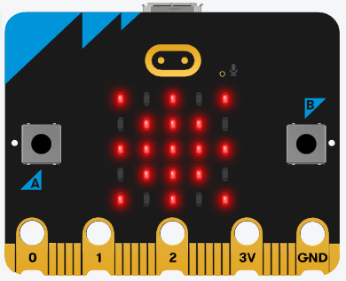

# CIEL1 – CCF MicroPython : Thermomètre à mémoire

## Présentation générale du sujet

L'objectif de ce travail est de développer un programme en MicroPython pour la carte Micro:bit. Le Micro:bit devra se comporter comme un thermomètre à mémoire, capable de :

- mesurer la température ambiante,
- mémoriser les valeurs mesurées (écriture dans un fichier),
- restituer les informations à l'utilisateur à l'aide de la matrice de LED et des boutons intégrés.

Les informations conservées sont : la température minimum, maximum et la liste de toutes les températures mesurées.

### Carte Micro:bit

La **BBC micro:bit** est une petite carte microcontrôleur éducative conçue pour initier à la programmation et à l'électronique de manière ludique et interactive. Elle intègre divers capteurs, afficheurs et interfaces pour permettre la création rapide de projets sans matériel supplémentaire. Compacte et polyvalente, elle se programme en Python, MakeCode ou C++.

**Modules intégrés :**

- **Affichage :** matrice de 25 LED (5×5)
- **Entrées :** 2 boutons programmables (A, B), capteur de luminosité, microphone (v2)
- **Capteurs :** accéléromètre, boussole (magnétomètre), capteur de température
- **Communication :** Bluetooth, radio 2,4 GHz, port micro-USB
- **Audio :** haut-parleur intégré (v2)
- **Connectivité :** broches d'extension (GPIO, I²C, SPI, PWM, alimentation)
- **Autres :** connecteur pour batterie 3 V, LED d'alimentation, processeur ARM Cortex-M0/M4 (selon version).

{ width=40% height=20% }

\pagebreak{}

## Consignes générales

L'usage des documents de cours est autorisé.

L'usage d'internet est restreint aux sites suivants :

- Documentation officiel de Micro:bit via MicroPython : <https://microbit-micropython.readthedocs.io/fr/latest/tutorials/hello.html>
- Fonctionnalités de la carte Micro:bit : <https://microbit.org/fr/get-started/features/overview/>
- La référence francophone de MicroPython : <https://www.micropython.fr/reference/#/>
- Site officiel de Micro:bit : <https://microbit.org/fr/>
- Site officiel de MicroPython : <https://micropython.org/>
- Site français orienté débutant : <https://python.doctor/>
- Documentation officielle des structures de données Python : <https://docs.python.org/fr/3.14/tutorial/datastructures.html>

**L'usage de toute intelligence artificielle ou de tout outil assimilé est strictement interdit et entraînera la note de zéro.**

**Le code devra être lisible, correctement indenté et structuré.**

## Base de code

Le fichier `main.py` contient le code source sur lequel vous devez vous appuyer pour réaliser le travail demandé.

### Fonctions fournies

Les fonctions suivantes vous sont fournies et **ne doivent pas** être modifiées : `is_iterable_not_string`, `read_data_from_file`, `write_data_to_file`.

### Structure des données

Les températures devront être stockées dans un dictionnaire contenant une température minimale, une température maximale et une liste de toutes les valeurs mesurées.

```python
default_temp_info = {
    "max": -1,
    "min": -1,
    "values": []
}
```

\pagebreak{}

## Programmation

Le développement est découpé en **4 étapes**. Si vous bloquez sur une des étapes commentez votre code pour rendre le programme exécutable et passez à l'étape suivante.

### Étape 1 : Acquisition de la température (5 points)

Lire la température actuelle et la stocker lorsque l'utilisateur touche le logo tactile de la carte.

- La mesure est déclenchée lorsque l'utilisateur touche le logo tactile à l'aide de `pin_logo.is_touched()`.<br>

- La température est obtenue via la fonction `temperature()`.

- La valeur mesurée doit être ajoutée dans `default_temp_info["values"]` avec `append()`.<br>
  Les températures minimale et maximale (`default_temp_info["max"]` et `default_temp_info["min"]`) doivent être mises à jour en conséquence.

- Une image indiquant à l'utilisateur que la temperature est plus chaude / froide est affichée avec `display.show()`.

### Étape 2 : Affichage avec le bouton A (4 points)

Afficher les informations actuelles quand l'utilisateur appuie sur le bouton A.

- Le nombre d'appuis sur le bouton A est obtenu avec `button_a.get_presses()`.

  - Un appui simple doit afficher la température minimale.
  - Deux appuis ou plus affichent la température maximale.

- Les messages sont affichés avec `display.scroll()`.

\pagebreak{}

### Étape 3 : Affichage de la dernière température (3 points)

Afficher la dernière mesure de température lorsque l'utilisateur secoue la carte :

- Le geste de secouement est détecté avec `accelerometer.was_gesture("shake")`.

- Les valeurs mesurées sont accessibles dans `default_temp_info["values"]`.

### Étape 4 : Chargement et sauvegarde des données (3 points)

Charger et stocker les informations mesurées dans un fichier sur la carte.

- Les données sont chargées au démarrage à l'aide de `load_from_files()`
- Les données sont sauvegardées régulièrement avec `save_in_file()`.

Vous devez écrire ces deux fonctions en utilisant les fonctions `read_data_from_file()` et `write_data_to_file()`.

Exemple d'utilisation des fonctions `read_data_from_file()` et `write_data_to_file()`:

```python
# --- ÉCRITURE DES DONNÉES ---

# Sauvegarde d'une valeur simple
write_data_to_file("counter", 5)

# Sauvegarde d'une liste de valeurs
numbers = [10, 20, 30]
write_data_to_file("numbers", numbers)

# --- LECTURE DES DONNÉES ---

# Lecture d'une valeur simple
counter = read_data_from_file("counter", 0)

# Lecture d'une liste
numbers_from_file = read_data_from_file("numbers", [])
```
