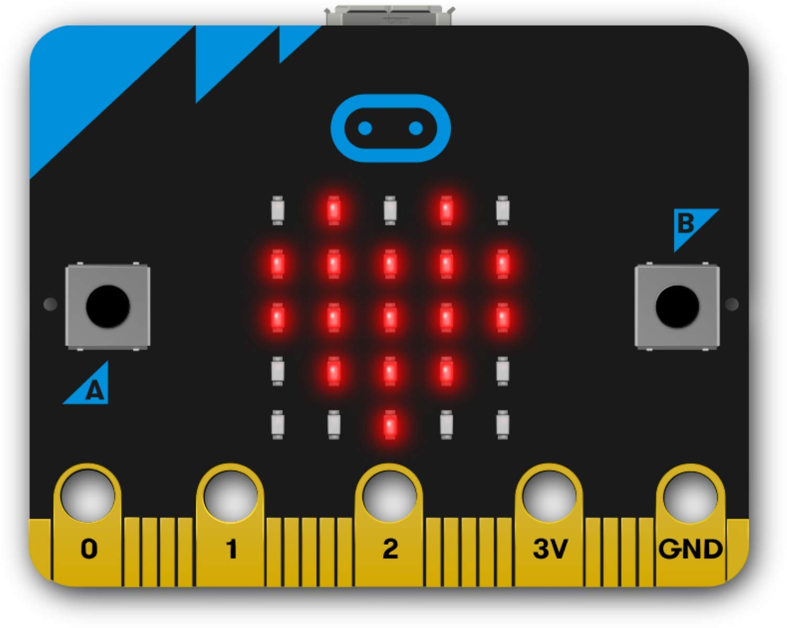

---
title: CIEL 1 - Programmation MicroBit via MicroPython
author: Thomas Le Goff
header: This is fancy
geometry: margin=1in
...

# TP 1 - Python : MicroPython sur carte MicroBit

Ce TP a pour objectif de vous faire pratiquer le langage Python tout en découvrant les différents modules de la carte MicroBit.

La **BBC micro:bit** est une petite carte microcontrôleur éducative conçue pour initier à la programmation et à l'électronique de manière ludique et interactive. Elle intègre divers capteurs, afficheurs et interfaces pour permettre la création rapide de projets sans matériel supplémentaire. Compacte et polyvalente, elle se programme en Python, MakeCode ou C++.

**Modules intégrés :**

- **Affichage :** matrice de 25 LED (5×5)
- **Entrées :** 2 boutons programmables (A, B), capteur de luminosité, microphone (v2)
- **Capteurs :** accéléromètre, boussole (magnétomètre), capteur de température
- **Communication :** Bluetooth, radio 2,4 GHz, port micro-USB
- **Audio :** haut-parleur intégré (v2)
- **Connectivité :** broches d'extension (GPIO, I²C, SPI, PWM, alimentation)
- **Autres :** connecteur pour batterie 3 V, LED d'alimentation, processeur ARM Cortex-M0/M4 (selon version).

{ width=40% height=25%   }

\pagebreak

Dans notre cas nous avons décidé de l'exploiter en utilisant le langage Python. Plus précisement son implémentation MicroPython, spécialement conçue pour s'exécuter sur des microcontrôleurs.

{ width=40% height=25% }

## Outils à votre disposition

### Liens et références utiles pour ce TP

- Documentation officiel de MicroBit via MicroPython <https://microbit-micropython.readthedocs.io/fr/latest/tutorials/hello.html>
- La référence francophone de MicroPython <https://www.micropython.fr/reference/#/>
- Site officiel de MicroBit <https://microbit.org/fr/>
- Site officiel de MicroPython <https://micropython.org/>

### Éditeur de code

Afin de programmer la carte MicroBit via MicroPython plusieurs éditeurs sont disponibles :

- **MakeCode** <https://makecode.microbit.org/> : éditeur en ligne fourni et développé par Microsoft
- **Code With Mu** <https://codewith.mu/> : un éditeur initialement soutenu par la fondation Python, mais, qui n'est aujourd'hui plus maintenu
- **Thonny** <https://thonny.org/> : un éditeur conçu pour les débutant, un peu austère, mais, toujours maitenu et simple d'utilisation.

Pour ce TP nous utiliserons l'éditeur **Thonny** pré-installé sur vos machines. Pour fonctionner avec MicroPython il est **important de configurer l'interpréteur Python** via le menu :

`Tools` > `Options` > `Interpreter` et choisir **"MicroPython (BBC micro:bit)" à la place de "Local Python 3"**. **Enfin, dans l'onglet "General" : cochez "Use Tk file dialogs instead of Zenity".**

\pagebreak

## 1 - Hello MicroBit !

À l'aide des tutoriels de la documentation officielle de MicroBit via MicroPython (<https://microbit-micropython.readthedocs.io/fr/latest/tutorials/hello.html>) mettez en fonctionnement les programmes des modules suivants :

- Hello World!
- Images
- Boutons
- Hasard

Une fois chacun de ces programmes opérationnels, réalisez le programme suivant :

**Serpentin sur la matrice de LED**

L'objectif de cet exercice est de **programmer une animation lumineuse** sur la matrice 5×5 de la carte micro:bit.

**Écrivez un programme qui** :

- Parcourt les **25 LED** de la matrice (de gauche à droite et de haut en bas).
- Pour chaque LED, **inverse son état** :

  - Si elle est éteinte, elle s'allume.
  - Si elle est allumée, elle s'éteint.

- Passe ensuite à la LED suivante.

- Recommence indéfiniment, en formant une animation de serpentin.

**Quelques indications** :

- Utilise une variable `i` qui compte de 0 à 24 pour identifier chaque LED.
- Calcule les coordonnées `x` et `y` de la LED à partir de `i` :

  - `x` correspond à la **colonne**
  - `y` correspond à la **ligne**

- Utilise les fonctions :

  - `display.get_pixel(x, y)` pour savoir si la LED est allumée.
  - `display.set_pixel(x, y, valeur)` pour changer son état.

- Ajoutez une petite pause entre chaque changement avec `sleep(100)`.

\pagebreak

## 2 - From C to Python

Pour faire le rapprochement entre le langage C et le langage Python, vous allez réécrire le programme du jeu du plus ou du moins.

**Jeu du « Plus ou Moins » (version solo)**

1. **Choix du nombre secret**

  - Utilisez le module `random` pour choisir un nombre aléatoire **entre 0 et 100** (inclus).
  - Le nombre choisi n'est pas affiché : il est gardé secret dans une variable.

2. **Choix du joueur (avec le bouton B)**

  - Le joueur choisit un nombre en l'augmentant petit à petit.
  - À chaque appui sur le **bouton B**, incrémentez la valeur proposée (par exemple de 1 en 1).
  - La valeur proposée est affichée sous forme de **texte qui défile** (scroll) sur l'écran.

3. **Validation de la proposition (bouton A)**

  - Lorsque le joueur est satisfait de son choix, il appuie sur le **bouton A**.
  - La carte compare alors la proposition au nombre secret.

4. **Indication « plus » ou « moins »**

  - Si le nombre secret est **plus grand** que la proposition du joueur : 

    - Affichez un **signe plus** (`+`) sur la matrice de LED.

  - Si le nombre secret est **plus petit** que la proposition du joueur : 

    - Affichez un **signe moins** (`-`) sur la matrice de LED.

5. Si le joueur trouve exactement le nombre secret, affichez un **smiley** et (optionnel) proposez de recommencer une partie.

\pagebreak

## 2 bis - From C to Python and beyond (en binôme)

**Jeu du « Plus ou Moins » (version multijoueur avec radio)**

Le principe est le même que le jeu du « plus ou moins », mais cette fois **à deux micro:bit** :

- Un étudiant est le **maître du jeu**.
- Un deuxième étudiant est le **joueur**.
- Les deux cartes communiquent grâce au **module radio**.

### Côté maître du jeu

1. La carte du maître du jeu choisit un **nombre aléatoire** (entre 0 et 100) avec `random`.
2. Ce nombre est **affiché sur la carte du maître** (par exemple en texte défilant) afin qu'il le connaisse.
3. La carte du maître **reçoit par radio** les propositions envoyées par le joueur.

  - La proposition reçue est affichée sur la matrice (en texte qui défile).

4. Le maître du jeu décide alors :

  - Appui sur **A** : le nombre secret est **plus grand** que la proposition.
  - Appui sur **B** : le nombre secret est **plus petit** que la proposition.
  - Il **secoue** la carte si le joueur **a trouvé le bon nombre** (le joueur gagne).

5. En fonction de son action (A, B ou secouer), la carte du maître envoie un **message par radio** au joueur :

  - Si « plus » : envoyer un message correspondant à **+**.
  - Si « moins » : envoyer un message correspondant à **-**.
  - Si « gagné » : envoyer un message pour signaler la victoire.

### Côté joueur

1. Le joueur choisit son nombre (par exemple avec le même système que dans l'exercice 2 : bouton B pour incrémenter, bouton A pour valider) qui est **envoyée par radio**.

3. La carte du joueur **reçoit les réponses du maître** :

  - Si le maître envoie « plus » : afficher un **+** sur la matrice.
  - Si le maître envoie « moins » : afficher un **-** sur la matrice.
  - Si le maître envoie « gagné » : afficher un **smiley** sur la matrice.