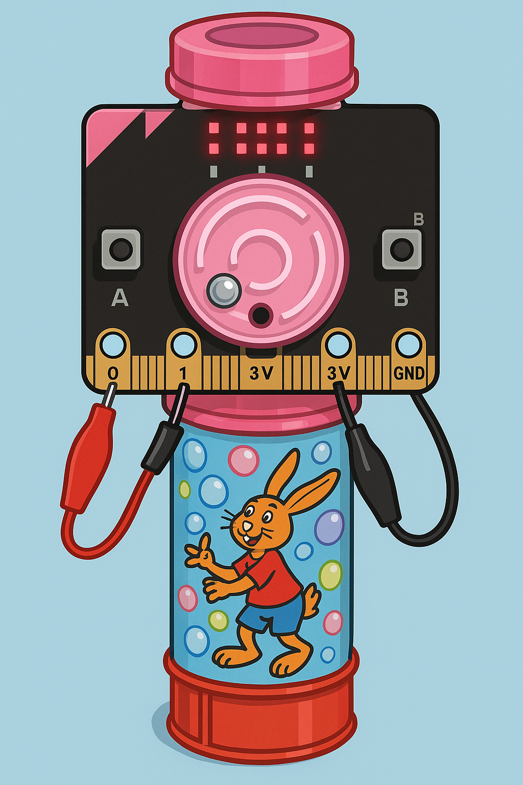

---
title: CIEL 1 - Programmation MicroBit via MicroPython
author: Thomas Le Goff
header: This is fancy
geometry: margin=1in
...

# TP 1 - Python : MicroPython sur carte MicroBit (suite)

Ce TP a pour objectif de vous faire pratiquer le langage Python tout en découvrant les différents modules de la carte MicroBit.

## Outils à votre disposition

### Liens et références utiles pour ce TP

- Documentation officiel de MicroBit via MicroPython <https://microbit-micropython.readthedocs.io/fr/latest/tutorials/hello.html>
- La référence francophone de MicroPython <https://www.micropython.fr/reference/#/>
- Site officiel de MicroBit <https://microbit.org/fr/>
- Site officiel de MicroPython <https://micropython.org/>

{ width=40% height=35% }

\pagebreak

## 1 - Visualisation d'un tri

Les ordinateurs trient des données en permanence : scores, prix, dates, fichiers, etc. Un tri est donc une opération fondamentale en informatique.

Dans cet exercice, vous allez :

- Générer une liste de nombres
- Afficher graphiquement ces nombres sur l'écran du Micro:bit
- Appliquer un algorithme de tri (tri à bulles dans un premier temps)
- Observer visuellement les étapes du tri

**Visualiseur de tri à bulles**

1. Créer une liste de 5 nombres aléatoirs compris entre 0 et 5 (inclus).
2. Afficher la liste sur l'écran LED, en représentant chaque nombre sous forme de colonne :

  - La 1re valeur → colonne tout à gauche
  - La 5e valeur → colonne tout à droite
  - Plus la valeur est grande, plus la colonne est haute

3. Implémenter un algorithme de tri (au choix) :

  - Tri à bulles (recommandé)
  - Tri par sélection
  - Tri par insertion

4. Lors de l'appuie sur le bouton A :
  - Exécuter une étape du tri (un mouvement) 
  - Mettre à jour la matrice de LED pour visualiser progrès

5. À la fin, les colonnes doivent être ordonnées du plus petit au plus grand.
6. L'appuie sur le bouton B permet de réinitialiser le programme

\pagebreak

## 2 - Tube à bulles

Vous allez programmer sur Micro:bit un petit jeu inspiré des tubes à bulles pour enfants : une bille se déplace sur l’écran 5×5 en fonction de l’inclinaison de la carte grâce à l’accéléromètre, et votre objectif est de la faire tomber dans un trou placé à un endroit aléatoire de l’écran. Chaque fois que la bille atteint le trou, vous marquez un point et le Micro:bit joue un son de victoire.

**Étape 1 – Accéléromètre**

1. Lire `accelerometer.get_x()` et `get_y()` dans une boucle.
2. Afficher les valeurs (avec `display.scroll()` ou équivalent).
3. Vérifier que les valeurs varient en inclinant la carte dans différentes directions.

**Étape 2 – Déplacement de la bille**

1. Convertir les valeurs X et Y (entre environ -1024 et 1024) en coordonnées entre 0 et 4\.
2. Afficher une seule LED représentant la bille à la position `(ball_x, ball_y)`.
3. Tester que la bille suit bien l'inclinaison.

**Étape 3 – Le trou**

1. Générer une position aléatoire `(hole_x, hole_y)` avec `randrange(5)`.
2. Afficher le trou.
3. Afficher en même temps la bille et le trou (utilisez l'intensité pour différentier le trou et la bille).

**Étape 4 – Victoire, score et sons**

1. Tester si la bille est sur le trou, si oui :
  - effacer le trou,
  - recréer un nouveau trou à une position aléatoire,
  - augmenter le score,
  - jouer un son.

3. Bouton A : afficher le score avec `display.scroll(score)`.

**Bonus**

- Ajouter un temps limite,
- varier la luminosité selon la vitesse,
- ajouter une animation quand un score est atteint,
- d'autres idées ?
