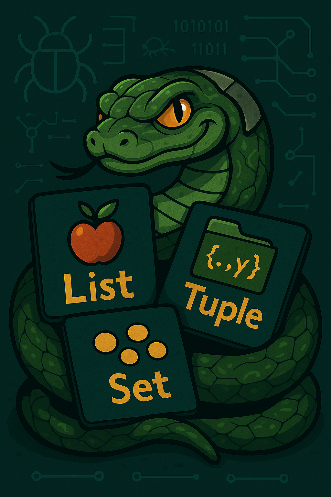

# Python - structure de données

_BTS CIEL_



--------------------------------------------------------------------------------

## Sommaire

- Algorithmes & SDD
- Structure de données simples

  - Liste
  - N-uplet
  - Dictionnaire
  - Ensemble

- Parcours à l'aide d'une boucle
- Exercices


--------------------------------------------------------------------------------

# Algorithmes & structure de données

Les algorithmes et les structures de données sont les **deux piliers fondamentaux** de la programmation.

Ils ne peuvent pas être pensés séparément : **l'un influence directement l'efficacité de l'autre.**

Le choix de la structure de données détermine :

- la rapidité des traitements (temps d'accès, insertion, suppression),

- la mémoire utilisée,

- la lisibilité et la modularité du code.

> ℹ️ Un algorithme bien conçu peut devenir inefficace s'il repose sur une mauvaise structure de données.

--------------------------------------------------------------------------------

# Liste

Une liste permet de stocker une suite d'éléments de même type (ou non !)

```python
couleurs = ["rouge", "vert", "bleue"]
notes = [10, 12, 12, 18]

# Contrairement aux tableaux du langage C la liste n'a pas de taille fixe
notes.append(20)
```

Les éléments sont accesibles via leur index

```python
rouge = couleurs[0]
notes = notes[2]
derniere_note = notes[-1]  # indexation négative

print(rouge)
# Résultat : "rouge"
print(derniere_note)
# Résultat : 20
```

--------------------------------------------------------------------------------

## Liste - opérations non destructives

Opération      | Définition
-------------- | -----------------------------------------------
`lst[i]`       | Accède à l'élément d'indice `i`
`len(lst)`     | Renvoie le nombre d'éléments
`x in lst`     | Vérifie si `x` est présent dans la liste
`lst.index(x)` | Donne l'indice de la première occurrence de `x`
`lst.count(x)` | Compte le nombre d'occurrences de `x`
`lst.copy()`   | Renvoie une copie **indépendante** de la liste
`sorted(lst)`  | Renvoie une **nouvelle** liste triée

> ℹ️ Une opération non destructives ne modifie pas la liste originale (ici `lst`).

--------------------------------------------------------------------------------

## Liste - opérations destructives

Opération          | Définition
------------------ | -------------------------------------------
`lst[i] = x`       | Remplace l'élément à l'indice `i` par `x`
`lst.append(x)`    | Ajoute `x` à la fin de la liste
`lst.insert(i, x)` | Insère `x` à l'indice `i`
`lst.remove(x)`    | Supprime la première occurrence de `x`
`lst.pop(i)`       | Supprime et retourne l'élément d'indice `i`
`lst.sort()`       | Trie la liste en place
`lst.reverse()`    | Inverse l'ordre des éléments
`lst.clear()`      | Supprime tous les éléments de la liste

--------------------------------------------------------------------------------

# N-uplet

Comme une liste, un n-uplet (tuple) permet de stocker une suite d'éléments

```python
personne = (56, 35, "Jean Dupont")

departement = personne[0]
age = personne[1]
```

Les éléments sont aussi accessibles par destructuration

```python
personne = (56, 35, "Jean Dupont")

departement, age, nom = personne
```

--------------------------------------------------------------------------------

## N-uplet VS liste

Les tuples et les listes offrent des possibilités proches, mais leurs usages diffèrent :

- Les tuples sont **immuables** et servent souvent à stocker des éléments de types variés, accédés via leur position.
- Les listes sont **mutables**, contiennent en général des éléments de même type, et sont souvent à l'aide d'une boucle.

> ℹ️ **Immuable** signifie qui ne peut pas être modifié après sa création

--------------------------------------------------------------------------------

## N-uplet - opérations non-desctructives

Opération    | Définition
------------ | -----------------------------------------------
`t[i]`       | Accès à l'élément à l'indice `i`
`len(t)`     | Renvoie le nombre d'éléments
`x in t`     | Vérifie si `x` est présent
`t.count(x)` | Compte le nombre d'occurrences de `x`
`t.index(x)` | Donne l'indice de la première occurrence de `x`
`t1 + t2`    | Concatène deux tuples
`t * n`      | Répète le tuple `n` fois

--------------------------------------------------------------------------------

# Dictionnaire

Le dictionnaire est un ensemble de paires _clé-valeur_ au sein duquel les clés doivent être uniques.

```python
personne = {"nom": "Jean Dupont", "age": 35, "departement": 56, "couleur_preferee": "rouge"}
```

L'accès à une valeur se fait en utilisant la clé

```python
nom = personne["nom"]
couleur = personne["couleur_preferee"]

print(nom)
# Résultat : "Jean Dupont"

print(couleur)
# Résultat : "rouge"
```

--------------------------------------------------------------------------------

## Dictionnaire - opérations non-desctructives

Opération    | Description
------------ | ------------------------------------------------------
`d[k]`       | Accède à la valeur associée à la clé `k`
`k in d`     | Vérifie si la clé `k` existe dans le dictionnaire
`len(d)`     | Renvoie le nombre de paires clé/valeur
`d.get(k)`   | Renvoie la valeur associée à `k`, ou `None` si absente
`d.keys()`   | Renvoie une vue des clés
`d.values()` | Renvoie une vue des valeurs
`d.items()`  | Renvoie une vue des paires `(clé, valeur)`
`dict(d)`    | Crée une **copie** du dictionnaire

--------------------------------------------------------------------------------

## Dictionnaire - opérations desctructives

Opération            | Description
-------------------- | -------------------------------------------------------------------------------------
`d[k] = v`           | Ajoute ou modifie une paire clé/valeur
`del d[k]`           | Supprime la clé `k` et sa valeur associée
`d.pop(k)`           | Supprime et retourne la valeur associée à `k`
`d.popitem()`        | Supprime et retourne une paire clé/valeur (aléatoire avant Python 3.7, dernier après)
`d.clear()`          | Vide complètement le dictionnaire
`d.update(other)`    | Ajoute ou remplace des éléments à partir d'un autre dictionnaire
`d.setdefault(k, v)` | Ajoute la clé `k` avec valeur `v` si elle n'existe pas

--------------------------------------------------------------------------------

# Ensemble

Un ensemble (set) est une collection **non ordonnée** d'éléments sans doublons.

```python
panier = {'pomme', 'orange', 'pomme', 'poire', 'orange', 'banane'}

print(panier)
# Résultat = {'orange', 'banane', 'poire', 'pomme'}
```

--------------------------------------------------------------------------------

<style scoped="">section{font-size:22px;}</style>

## Ensemble - opérations non-desctructives

Opération                              | Description
-------------------------------------- | --------------------------------------------------------
`x in s`                               | Vérifie si `x` est dans l'ensemble
`len(s)`                               | Renvoie le nombre d'éléments
`s.copy()`                             | Renvoie une copie de l'ensemble
`s.union(t)`                           | Nouvel ensemble contenant les éléments de `s` et `t`
`s.intersection(t)` ou `s & t`         | Nouvel ensemble contenant les éléments communs
`s.difference(t)` ou `s - t`           | Nouvel ensemble avec les éléments de `s` mais pas de `t`
`s.symmetric_difference(t)` ou `s ^ t` | Nouvel ensemble des éléments exclusifs à `s` ou `t`

--------------------------------------------------------------------------------

## Ensemble - opérations desctructives

Opération      | Description
-------------- | ------------------------------------------
`s.add(x)`     | Ajoute `x` à l'ensemble
`s.remove(x)`  | Supprime `x` (erreur si absent)
`s.discard(x)` | Supprime `x` (sans erreur si absent)
`s.pop()`      | Supprime et retourne un élément arbitraire
`s.clear()`    | Vide complètement l'ensemble
`s.update(t)`  | Ajoute tous les éléments de l'itérable `t`

--------------------------------------------------------------------------------

<style scoped="">section{font-size:20px;}</style>

## Comment choisir ?

Structure        | Ordonnée | Mutable | Doublons autorisés | Accès par clé/indice | Types d'éléments     | Remarques principales
---------------- | -------- | ------- | ------------------ | -------------------- | -------------------- | -----------------------------------------------------
**Liste**        | ✅ Oui    | ✅ Oui   | ✅ Oui              | ✅ Indice             | Souvent homogènes    | Structure de base, très flexible
**Tuple**        | ✅ Oui    | ❌ Non   | ✅ Oui              | ✅ Indice             | Souvent hétérogènes  | Léger, immuable, utilisable comme clé de dictionnaire
**Ensemble**     | ❌ Non    | ✅ Oui   | ❌ Non              | ❌ Pas d'indice       | Homogènes conseillés | Pas de doublons, très rapide pour `in`
**Dictionnaire** | ❌ Non    | ✅ Oui   | ❌ Non (clés)       | ✅ Clé                | Valeurs libres       | Association clé → valeur

--------------------------------------------------------------------------------

## Instruction `in`

Structure | Ce que fait `in`     | Complexité moyenne | Remarques
--------- | -------------------- | ------------------ | ------------------------------------------------
`set`     | Table de hachage     | O(1) (Constant)    | Très rapide, pas de doublons, éléments hachables
`dict`    | Table de hachage clé | O(1)               | Vérifie uniquement les **clés**
`list`    | Parcours linéaire    | O(n) (Linéaire)    | Compare chaque élément un à un
`tuple`   | Parcours linéaire    | O(n)               | Comme une liste, mais immuable

> ℹ La complexité évalue le coût d'un algorithme en fonction de quantité de données.

--------------------------------------------------------------------------------

# Parcours à l'aide d'une boucle

Ces structures de données contiennent plusieurs éléments et sont dites **itérables**. Il est donc possible de les parcourir **élément par élément** à l'aide d'une boucle.

> ℹ️ La structure `for x in s` est particulièrement adaptée pour manipuler ce type d'objet.


--------------------------------------------------------------------------------

## Parcours à l'aide d'une boucle - liste

```python
ma_liste = [5, 2, 4, 8, 9]

for i in ma_liste:
    print(i)

# Résultat : 5, 2, 4, 8, 9

ma_liste.sort()

for i in ma_liste:
    print(i)

# Résultat : 2, 4, 5, 8, 9


for i in reversed(ma_liste):
    print(i)

# Résultat : 9, 8, 5, 4, 2
```

--------------------------------------------------------------------------------

## Parcours à l'aide d'une boucle - n-uplet

```python
mon_tuple = (5, 2, 4, 8, 9)

for i in mon_tuple:
    print(i)

# Résultat : 5, 2, 4, 8, 9

for i in reversed(mon_tuple):
    print(i)

# Résultat : 9, 8, 4, 2, 5
```

--------------------------------------------------------------------------------

## Parcours à l'aide d'une boucle - dictionnaire

```python
mon_dict = {"a": 5, "b": 2, "c": 4}

for cle in mon_dict:
    print(cle)

# Résultat : a, b, c (dans l’ordre d’insertion)

for cle, valeur in mon_dict.items():
    print(cle, "→", valeur)

# Résultat : a → 5, b → 2, c → 4

# Parcours des valeurs uniquement
for valeur in mon_dict.values():
    print(valeur)

# Résultat : 5, 2, 4
```

--------------------------------------------------------------------------------

## Parcours à l'aide d'une boucle - ensemble

```python
mon_ensemble = {5, 2, 4, 8, 9}

for i in mon_ensemble:
    print(i)

# Résultat (ordre non garanti) : par exemple 2, 4, 5, 8, 9
```

-------------------------------------------------------------------------------- 

<!-- _class: lead -->

 # Exercices


--------------------------------------------------------------------------------

# Liens et sources

- <https://docs.python.org/3/tutorial/datastructures.html#tuples-and-sequences>

--------------------------------------------------------------------------------
