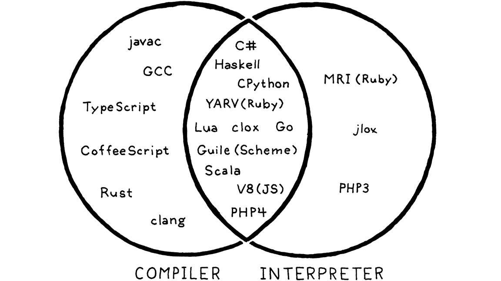
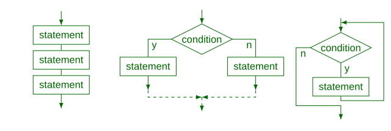
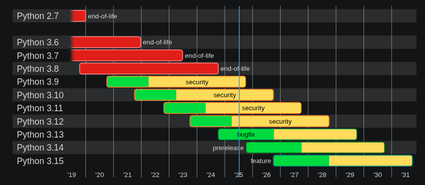
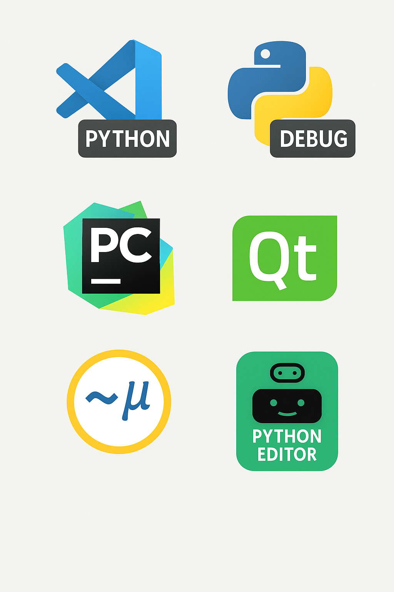

# Introduction au langage Python

_BTS CIEL_


--------------------------------------------------------------------------------

## Sommaire

- Pourquoi apprendre Python ?
- Programmation structurée

  - Instructions, variables et blocs
  - Séquence
  - Sélection
  - Itération

- Liste

- Chaîne de charactères

- Fonctions

- Autres capacités du langage


--------------------------------------------------------------------------------

# Pourquoi apprendre le Python ?

- **GPL** (**G**eneral-purpose **P**rogramming **L**anguage) :

  - Web : Django, Flask, FastAPI
  - IA et data : Numpy, Panda, PyTorch
  - Administration Système : cross-platform, pré-installé sur Linux, interprété
  - Programmation embarqué : MicroPython, CircuitPython, MicroBit

- Simplicité d'apprentissage

  - Syntaxe allégée pour se concentrer sur la logique
  - Peu de "cérémonie" / pas de compilation

- Populaire dans les milieux professionel et scolaire :

  - N°1 sur l'Index [Tiobe (27% des parts)](https://www.tiobe.com/tiobe-index/) et sur [PYPL (31%)](https://pypl.github.io/PYPL.html)
  - En France : langage de la recherche et l'éducation nationale

--------------------------------------------------------------------------------

# Pourquoi apprendre le Python ?


Python fourni environ ~300 modules :

- Fichiers / OS : `os`, `pathlib`, `shutil`, `tempfile`, `subprocess`
- Réseau : `http`, `socket`, `asyncio`, `ssl`
- Données : `csv`, `json`, `sqlite3`, `pickle`
- Math : `math`, `random`, `decimal`, `fractions`, `statistics`
- Web / formats : `html`, `xml`, `email`, `cgi`

--------------------------------------------------------------------------------

# Pourquoi apprendre le Python ?

```python
from datetime import datetime

import http.server, socketserver, json, random, logging

logging.basicConfig(level=logging.INFO)

class Handler(http.server.SimpleHTTPRequestHandler):
    def do_GET(self):
        data = {"time": datetime.now().isoformat(), "value": random.randint(1, 100)}
        self.send_response(200)
        self.send_header("Content-Type", "application/json")
        self.end_headers()
        self.wfile.write(json.dumps(data).encode())

with socketserver.TCPServer(("", 8000), Handler) as httpd:
    logging.info(f"Serving on port 8000")
    httpd.serve_forever()
```

> 🎯 Permettrent de construire un **logiciel** complet sans ajouter de bibliothèques tiers.

--------------------------------------------------------------------------------

# Langage interprété (CPython)

## Interprété VS compilé


--------------------------------------------------------------------------------

# Langage interprété

## La réalité



--------------------------------------------------------------------------------

# Programmation structurée

La programmation structurée définie les primitives suivantes

- 🔽 La séquence
- 🔀 La sélection
- 🔁 L'itération



--------------------------------------------------------------------------------

# 🔽 Séquence - point d'entrée du programme

En Python il n'est pas nécessaire d'écrire le code dans une fonction principale (`main`).

Cependant vous **pouvez** :

- Préciser l'interpréteur à utiliser pour votre script (shebang) en positionnant l'instruction suivante en début de fichier :

```python
#!/usr/bin/env python3
```

- Différencier l'usage que l'on fait de votre script (execution ou import) :

```python
if __name__ == "__main__":
    print("Ce code sera executé uniquement si le script est executé.")

print("Ce code sera executé dans tout les cas.")
```

--------------------------------------------------------------------------------

# 🔽 Séquence - point d'entrée du programme

Si l'on veut copier la structure d'un programme C :

```python
#!/usr/bin/env python3

def main():
    print("Hello World!")

if __name__ == "__main__":
    main()
```

--------------------------------------------------------------------------------

# 🔽 Séquence - variable

```python
ma_variable = 10  # integer
mon_autre_variable = "du texte"  # string
mon_bool = True  # boolean
```

--------------------------------------------------------------------------------

# 🔽 Séquence - typage

Types natifs du langage :

- Numériques `int`, `float`, `complex`
- Séquences
- Dictionnaires
- Classes, instances et exceptions

> ℹ️ Natif signifie qu'ils sont fourni par l'interpréteur Python.

> ℹ️ D'autres types peuvent être fournis par des bibliothèques (Numpy, Panda, etc.)

--------------------------------------------------------------------------------

# 🔽 Séquence - typage

Python utilise un typage dit **dynamique** et **strique**.

```python
points = 3.2  # points est du type float
print("Tu as " + points + " points !")  # Génère une erreur de typage

points = int(points)  # points est maintenant du type int (entier), sa valeur est arrondie à l'unité inférieure (ici 3)
print("Tu as " + points + " points !")  # Génère une erreur de typage

print("Tu as " + str(points) + " points !")  # Plus d'erreur de typage, affiche 'Tu as 3 points !'
```

Le C utilise un typage dit **statique** et **faible**.

```c
float points = 3.2; // Typage statique : points est un float
points = (int) points; // Erreur points est de type float elle ne peut pas recevoir un int

int pts = (int) points; // Conversion explicite : float → int
printf("Tu as %s points !\n", pts); // Typage faible : conversion implicite
```

> ⚠️ En Python l'erreur sera levée lors de l'exécution du programme

--------------------------------------------------------------------------------

# 🔽 Séquence - typage

`Définition`

**Typage Dynamique / statique** Est-ce qu'une variable de type **A** peut contenir une valeur de type **B** sans être rédéfinie.

**Typage faible / fort** Est-ce qu'une variable de type **A** peut-être utilisée en tant que type **B** (sans cast explicite)

--------------------------------------------------------------------------------

# 🔽 Séquence - opérations mathématiques

Python défini trois types numériques : `int`, `float`, `complexe`

La liste des opérations de bases possibles sur ces types :

Opération | Définition
--------- | -------------------------
`x + y`   | somme de x et y
`x - y`   | différence de x et y
`x * y`   | produit de x et y
`x / y`   | quotient de x et y
`x // y`  | quotient entier de x et y
`x % y`   | reste de x / y
`-x`      | l'opposé de x

--------------------------------------------------------------------------------

# 🔽 Séquence - instruction et bloc

En Python il n'est pas nécessaire de terminer une instruction par un `;`.

Les blocs sont représentés en utilisant le charactère `:` suivi de l'indentation.

(en lieu et place de `{}`) :

```python
x = int(input("Entrez un nombre : "))

if x > 2:
    print("X est supérieur à 2.")
else:
    print("X n'est pas supérieur à 2.")
```

--------------------------------------------------------------------------------

# 🔽 Séquence - appel de fonction

L'appel de fonction se fait via le nom de la fonction suivi de la liste des arguments entre parenthèses :

```python
print("Hello world !")
le_max = max(10, 15)
```

Fonctions équivalentes à `printf` et `scanf` :

```python
x = int(input("Entrez un nombre :"))

print(f'Vous avez saisi le nombre {x}')
```

--------------------------------------------------------------------------------

# 🔀 Sélection - if / elif / else

```python
ma_variable = 10
if ma_variable == 11:
    print("foo")
elif ma_variable == 12:
    print("or")
else:
    print("bar")
```

--------------------------------------------------------------------------------

# 🔀 Sélection - opérations de comparaison

Opération | Définition
--------- | -----------------------
`<`       | strictement inférieur
`<=`      | inférieur ou égal
`>`       | strictement supérieur
`>=`      | supérieur ou égal
`==`      | égal
`!=`      | différent
`is`      | identité d'objet
`is not`  | contraire de l'identité

--------------------------------------------------------------------------------

# 🔀 Sélection - véridicité des types

Considérés comme étant **faux** :

- Les constantes `None` et `False`
- zéro de tout type numérique : `0`, `0.0`, `0j`
- les chaînes et collections vides : `''`, `()`, `[]`, `{}`

Tout le reste est considéré comme étant **vrai**.

--------------------------------------------------------------------------------

# 🔀 Sélection - opérations booléennes

Opération | Définition
--------- | -----------------------------------------
`x or y`  | si x est vrai alors x, sinon y
`x and y` | si x est faux, alors x sinon y
`not x`   | si x est faux, alors `True` sinon `False`

--------------------------------------------------------------------------------

# 🔀 Sélection - pattern matching

Equivalent du `switch` en langage C :

```python
match status:
    case 400:
        print("Bad request")
    case 404:
        print("Not found")
    case 418:
        print("I'm a teapot")
    # Cas par défaut
    case _:
        print("Code erreur inconnu")
```

--------------------------------------------------------------------------------

# 🔀 Sélection - pattern matching

Permet aussi de faire des opérations plus élaborées :

```python
match point:
    case (0, 0):
        print("Origin")
    case (0, y):
        print(f"Y={y}")
    case (x, 0):
        print(f"X={x}")
    case (x, y):
        print(f"X={x}, Y={y}")
```

--------------------------------------------------------------------------------

# 🔁 Itération - while loop

```python
i = 0

while i < 10:
    print(i)
    i += 1

# Résultat: 0, 1, 2, 3, 4, 5, 6, 7, 8, 9

animals = ["chien", "chat", "souris"]
i = 0

while i < 3:
    print(animals[i])
    i += 1

# Résultat: "chien", "chat", "souris"
```

--------------------------------------------------------------------------------

# 🔁 Itération - for loop

```python
animals = ["chien", "chat", "souris"]

for animal in animals:
    print(animal)

# Résultat: "chien", "chat", "souris"
```

--------------------------------------------------------------------------------

# 🔁 Itération - fonction range

```python
ma_liste = list(range(5, 10))
# [5, 6, 7, 8, 9]

for e in ma_liste:
    print(e)

# Résultat: 5, 6, 7, 8, 9

for i in range(1, 10):
    print(i)

# Résultat: 1, 2, 3, 4, 5, 6, 7, 8, 9
```

--------------------------------------------------------------------------------

# Liste

La structure qui se rapproche le plus d'un tableau (langage C) est la liste :

```python
fruits = ['orange', 'pomme', 'poire', 'banane', 'kiwi']

fruits[0] # orange
```

à l'inverse d'un tableau, une liste Python peut contenir des éléments de différents types :

```python
fruits_et_code = ['orange', 22, 'poire', 40, 'kiwi', 42]
```

La taille d'une liste n'est pas fixe (on peut ajouter des éléments) :

```python
fruits.append("mangue")
```

--------------------------------------------------------------------------------

# Chaîne de charactères (string)

à la différence du langage C, Python propose un type natif `string` permettant de manipuler les chaînes de charactères :

```python
un_string = "LEIC STB"
un_deuxieme = 'BTS SNIR'

# un string se manipule comme une séquence
resultat = ''.join(reversed(un_string))  + f' anciennement {un_deuxieme[3:]}.'

print(resultat) # BTS CIEL anciennement SNIR.
```

--------------------------------------------------------------------------------

# Chaîne de charactères (string)

Cet exemple nous montre que :

- Python ne différencie par une chaîne de charactère et un charactère simple (`''` peut-être utilisé à la place de `""`)
- Il est possible de concaténer deux `string` via l'opérateur `+`
- Les `string` se manipule comme des séquences (`reversed` et `[3:]`)

--------------------------------------------------------------------------------

# Fonctions en Python

## Principe

Le principe de fonction en Python et C sont équivalent :

- Une fonction est un **bloque de code** (nommé) **qui est éxecuté lorsqu'il est appelé**
- Une fonction peut avoir des **arguments** et retourner un **résultat**
- Une fonction sert à éviter la **duplication de code**.

--------------------------------------------------------------------------------

# Fonctions en Python

## Définition et appel de fonction

Le mot clé `def` permet de définir une fonction

```python
def affiche_un_texte():
    print("Ma super fonction")

def somme(x, y):
    # On peut appeller une autre fonction
    affiche_un_texte()

    # Retourner un résultat
    return x + y

print("Résultat = " + str(somme(10, 12)))

# Ma super fonction
# Résultat = 22
```

--------------------------------------------------------------------------------

# Encore beaucoup de chose ...

**35** mots clés contre **32** en C (19 si on retire les mots clés en lien avec le typage) :

False   | None     | True     | and    | as   | assert | async  | await
------- | -------- | -------- | ------ | ---- | ------ | ------ | ------
break   | class    | continue | def    | del  | elif   | else   | except
finally | for      | from     | global | if   | import | in     | is
lambda  | nonlocal | not      | or     | pass | raise  | return | try
while   | with     | yield

> Certains mot clés permettent d'utiliser des mécanismes très avancés : `raise`, `class`, `yield`, `with`.

--------------------------------------------------------------------------------

# Langage multi-paradigme

En programmation, un paradigme correspond à une manière de formuler la réponse à un problème.

- Langage C : programmation impérative (structurée et procédurale)

- Python : programmation impérative, **fonctionnelle** et **orientée objet**.

> Python vous offre plusieurs manières de décrire un programme : à vous de choisir celle qui convient le mieux à votre besoin.

--------------------------------------------------------------------------------

# Env de développement - versions de Python

Pour connaître la version de python (3) installée

```shell
python3 --version
```



--------------------------------------------------------------------------------

# Env - éditeurs

- Visual Studio Code

  - Python
  - Python Debugger

- PyCharm

- Qt Creator

- Mu et Micro:bit Python Editor



--------------------------------------------------------------------------------

# Suite du cours

- Structure avancées (liste, dictionnaire, ...)
- Gestion des exceptions
- Intéraction avec l'environnement (lecture de fichiers, programmation réseau, IHM, ...)
- **P**rogrammation **O**rienté **O**bjet


