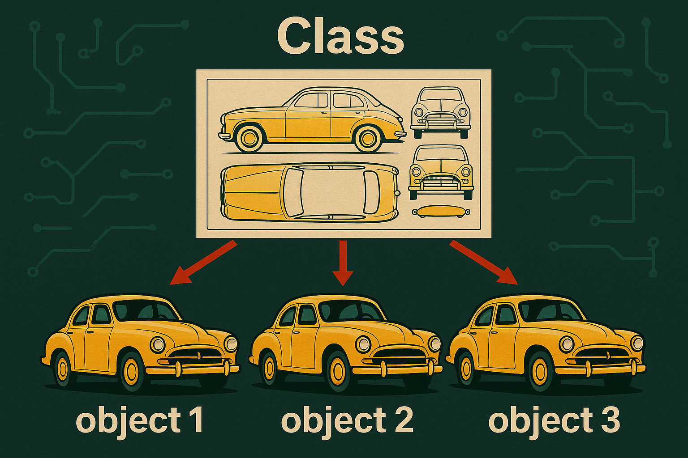

# Python - Programmation orientée objet

_BTS CIEL_


---

## Sommaire

- Le paradigme objet
- La POO en Python
- Classe et instance
- Encapsulation
- Héritage et polymorphisme
- Todo: propriété dérivée (single state)


---

<style scoped>section{font-size:24px;}</style>

# Le paradigme objet

La programmation orienté objet est un **paradigme de programmation** càd une manière de formaliser une solution logique dans un programme informatique.

Les principaux langages orienté objet (par ordre d'apparition):

- Simula (1967)
- Smalltalk (1972)
- C++ (1979)
- Python (1991)
- Java (1995)
- C#, Swift, Kotlin etc. (> 2000)

> Ce paradigme est devenu un standard de l'industrie. 
> Attention cependant, aujourd'hui beaucoup de langage sont multi-paradigme.

---

<style scoped>section{font-size:24px;}</style>

# Le paradigme objet

### Principe

La POO consiste à structurer le code autour d’objets qui représentent des **entités**, combinant **données** et **comportements**, et qui **interagissent** entre eux au travers de messages pour réaliser les fonctionnalités du programme.

### Objectifs

> Plus de détail : https://en.wikipedia.org/wiki/Object-oriented_programming (de préférence en anglais)

---

<style scoped>section{font-size:24px;}</style>

# Le paradigme objet

### Principe

La POO consiste à structurer le code autour d’objets qui représentent des **entités**, combinant **données** et **comportements**, et qui **interagissent** entre eux au travers de messages pour réaliser les fonctionnalités du programme.

### Objectifs

> Plus de détail : https://en.wikipedia.org/wiki/Object-oriented_programming (de préférence en anglais)

---

# La POO en Python

Python est langage multi-paradigme, cependant, il met la POO au coeur de son fonctionnement :

- Tout est un objet (un entier, une liste, une fonction, etc.)
- Python permet de définir des **classes** qui permettent de décrire le **comportement des objets**
- Héritage et le polymorphisme est possible par **rédéfinition de méthodes**

---

# La POO en Python

## Exemple de classe

```python
class Voiture:
    def __init__(self, marque, modele):
        self.marque = marque      # attribut
        self.modele = modele      # attribut

    def demarrer(self):           # méthode
        print(f"La {self.marque} {self.modele} démarre.")

# Création d'un objet (instance)
ma_voiture = Voiture("Toyota", "Corolla")

# Appel d'une méthode
ma_voiture.demarrer()
```

---

# Classe et instance

Une classe permet de définir les données et le comportement d'un objet.
En Python la définition d'une classe se fait en utilisant le mot clé `class`

Vous en connaissez déjà :

| Classe              | Description courte                                                                        |
| ------------------- | ----------------------------------------------------------------------------------------- |
| `str`               | Chaîne de caractères (ex. `"bonjour".upper()` utilise une méthode OOP).                   |
| `list`              | Liste modifiable (ex. `append`, `pop`, etc.).                                             |
| `dict`              | Dictionnaire clé-valeur, avec des méthodes (`get`, `items`, etc.).                        |
| `file` (via `open`) | Fichier ouvert, instance de `TextIOWrapper`, avec méthodes comme `.read()` ou `.write()`. |

---

# Classe et instance

```python
with open("exemple.txt", "r", encoding="utf-8") as fichier:
    contenu = fichier.read()
```

- `open` permet de récupérer **une instance** de la classe `TextIOWrapper`
- `TextIOWrapper` est la **classe** dédiée à la manipulation de fichier
- `fichier` est **une** instance de `TextIOWrapper` pour manipuler `exemple.txt` en lecture
- `.read()` est une **méthode** de `TextIOWrapper` appelée sur l'instance `fichier`

---
# Classe et instance

La classe peut-être vu comme un schéma / une recette. L'instance est une version / réalisation de ce schéma.

La classe permet d'isoler dans un même endroit les données et le traitement (comportement) associé tout en évitant qu'ils soient perturbé par d'autre éléments du programme (principe d'encapsulation).

 