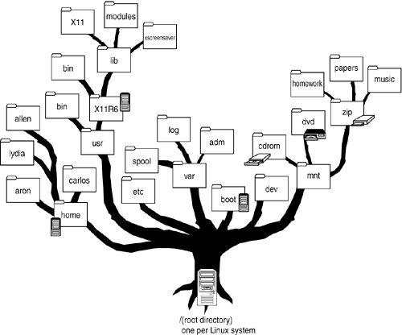

# Gestion des fichiers en Python

_BTS CIEL_


--------------------------------------------------------------------------------

## Sommaire

- Qu'est-ce qu'un fichier ?
- Modules de gestion des fichiers en Python

  - Fonction native `open`
  - Module `os`
  - Module `shutil`
  - Module `pathlib`


--------------------------------------------------------------------------------

## Qu'est-ce qu'un fichier ?

Il s'agit d'un **ensemble de données** identifié par un nom et stocké sur un **support de stockage permanent**.

Une partie des fichiers contiennent des **données utilisateurs**, mais la majeur partie contient des **données de fonctionnement** des logiciels.

> Cela permet de conserver des données même lorsque le système n'est pas en tension.


--------------------------------------------------------------------------------

## Qu'est-ce qu'un fichier ?

Dans un système d'exploitation moderne ; les fichiers sont **hiérarchisés** sous forme d'arbre composé de **dossiers** (branches) et de **fichiers** (les feuilles).

Python met à disposition une **collection d'outils** permettant de manipuler les branches et les feuilles de l'arbre.



## > Source : <https://flylib.com/books/en/1.295.1.47/1/>

--------------------------------------------------------------------------------

## Everything is a file

"Everything is a file" fait parti de la philosophie du système Unix :

Plutôt que de représenter certains éléments du système comme des concepts abstraits, les concepteurs du système Unix ont decidés de les représenter en utilisant **la notion de fichier**.

Celui qui maîtrise la gestion des fichiers **peut tout faire** sur un système Unix.


--------------------------------------------------------------------------------

<style scoped="">section{font-size:20px;}</style>

## Everything is a file

Fichier                   | Utilité
------------------------- | ----------------------------
`/dev/zero`               | Remplissage par des zéros
`/dev/random` / `urandom` | Générer de l'aléatoires
`/dev/tty`                | Terminal actuel
`/dev/shm`                | RAM partagée super rapide
`/dev/fuse`               | FS en user-space
`/dev/kmsg`               | Messages kernel
`/dev/sdX`, `/dev/nvme*`  | Disques
`/dev/loopX`              | Fichier monté comme disque
`/dev/net/tun/tap`        | Interfaces réseau virtuelles
`/proc/*`                 | État système
`/sys/*`                  | Périphériques & kernel

--------------------------------------------------------------------------------

## Qu'est-ce qu'un fichier ?

On retiendra qu'un fichier est un objet / une ressource :

- Mis à disposition de l'OS aux applications
- Stocké sur un **stockage permanent**
- Organisé dans un **système hiérarchisé** (généralement un arbre)
- Possédant un contenu accessible en **lecture ou écriture**


--------------------------------------------------------------------------------

## Opération CRUD

Le sigle **CRUD** signifie : **C**reate **R**ead **U**pdate **D**elete.

Il s'agit des **4 principales opérations** que l'on souhaite faire sur la plupart des systèmes.

Dans notre cas :

- Créer un fichier / dossier.
- Lire un fichier, lister le contenu d'un dossier.
- Modifier le contenu d'un fichier, déplacer un fichier d'un dossier à un autre.
- Supprimer un fichier / dossier.

Python vous donne accès à ces opérations au travers de ses **modules** `os`, `pathlib`, `shutil` et de sa **fonction** `open`.


--------------------------------------------------------------------------------

## Pourquoi manipuler des fichiers avec Python ?

La plupart des applications doivent **lire ou écrire des données** :

- fichiers texte
- CSV, logs
- fichiers de configuration (JSON, XML, ...)
- données reçues depuis un autre logiciel ou une autre machine

Savoir lire / écrire un fichier permet de :

- **analyser** des données (mesures, journaux, exports...)
- **automatiser** des traitements (tri, nettoyage, extraction)
- **échanger** des informations entre programmes
- **persister** des données entre deux exécutions


--------------------------------------------------------------------------------

## La fonction `open`

`open` permet l'**accès simple** à un fichier pour y effectuer les **opérations de base** (écriture / lecture) de manière efficace et robuste.

La fonction `open` permet d'obtenir un `File Object` à partir d'un chemin de fichier :

```python
with open("file.txt", "r", encoding="utf-8") as f:
    # f est un File Object
    contenu = f.read()
    print(contenu)

# f n'est plus accessible en dehors du with
```

> Nous reviendrons bientôt sur l'intérêt de l'instruction `with`.

> Retenez pour le moment qu'elle est nécessaire pour la bonne gestion du `File Object`

--------------------------------------------------------------------------------

## La fonction `open`

```python
open(file, mode='r', buffering=-1, encoding=None, errors=None, newline=None, closefd=True, opener=None)
```

Généralement vous utiliserez les paramètres 1, 2 et 3 :

- `file` : le chemin du fichier sur le système de fichier (simili-chemin)
- `mode` : le mode d'ouverture, en fonction de ce que vous souhaitez faire avec le fichier
- `encoding` : l'encodage utilisé par le fichier (par défaut celui de l'OS)

--------------------------------------------------------------------------------

## La fonction `open`

### Notion de Simili-chemin

Dans un système de fichier il y a **plusieurs manières de représenter** un chemin vers un fichier :

- Relatif : le chemin utilisé **dépend de l'endroit** où se trouve le processus.
- Absolu : le chemin est exprimé **à partir de la racine** de l'arbre du système de fichier.

Ouverture d'un fichier via un chemin absolu :

```python
with open("/home/ciel11/Documents/file.txt", "r") as f:
    contenu = f.read()
    print(contenu)
```

> Sur Linux un chemin commençant par `/` est absolu (exprimé depuis la racine).

--------------------------------------------------------------------------------

## La fonction `open`

### Mode d'ouverture d'un fichier

Caractère | Signification
--------- | -------------------------------------------------------------------
**`r`**   | ouvre en lecture (par défaut)
**`w`**   | ouvre en écriture, en effaçant le contenu du fichier
**`x`**   | ouvre pour une création exclusive, échoue si le fichier existe déjà
**`a`**   | ouvre en écriture, ajoutant à la fin du fichier s'il existe
**`b`**   | mode binaire
**`t`**   | mode texte (par défaut)
**`+`**   | ouvre en modification (lecture et écriture)

--------------------------------------------------------------------------------

## La fonction `open`

### Mode d'ouverture d'un fichier

La lecture en mode binaire permet de travailler directement avec une suite d'octets.

Ce mode est nécessaire pour les fichiers qui ne contiennent pas du texte.

Exemple de fichier          | Mode recommandé          | Effet
--------------------------- | ------------------------ | ----------------------------------------------
`.txt` `.csv` `json`        | Texte (`"r"`, `"w"`)     | Contenu lisible + gestion encodage
`.jpg` `.png` `.pdf` `.exe` | Binaire (`"rb"`, `"wb"`) | Contenu brut, non interprétable comme du texte
Communication réseau        | Binaire                  | On envoie des octets, pas du texte interprété

--------------------------------------------------------------------------------

## La fonction `open`

### Encodage

- En Python, **l'encodage par défaut dépend du système** (UTF-8 sur Linux/macOS, parfois CP1252 sur Windows).
- Pour éviter les problèmes (accents, caractères spéciaux...), **il faut toujours préciser l'encodage** :

  ```python
  open("fichier.txt", "r", encoding="utf-8")
  ```

--------------------------------------------------------------------------------

## La fonction `open`

<style scoped="">section{font-size:20px;}</style>

### Opération du `File Object`

Méthode            | Description                                                                   | Exemple d'utilisation
------------------ | ----------------------------------------------------------------------------- | -----------------------
`read()`           | Lit tout le contenu du fichier.                                               | `data = f.read()`
`read(n)`          | Lit les `n` premiers caractères/bytes.                                        | `chunk = f.read(1024)`
`readline()`       | Lit une ligne du fichier.                                                     | `line = f.readline()`
`readlines()`      | Lit toutes les lignes et retourne une liste.                                  | `lines = f.readlines()`
`write(s)`         | Écrit la chaîne `s` dans le fichier.                                          | `f.write("Hello")`
`writelines(list)` | Écrit une liste de chaînes sans ajouter de retour à la ligne automatiquement. | `f.writelines(lines)`
`seek(offset)`     | Déplace le curseur à la position `offset`.                                    | `f.seek(0)`
`close()`          | Ferme le fichier.                                                             | `f.close()`

--------------------------------------------------------------------------------

## Modules `os`, `shutil` et `pathlib`

En plus de la fonction `open` Python met à disposition 3 modules :

- `os` : permet d'effectuer des **opérations dîtes "bas niveau"**, sur **un fichier ou un dossier**.
- `shutil` : permet d'effectuer des **opérations dîtes "bas niveau"**, sur des ensembles **de fichiers / dossiers** (opérations plus avancés que `os`).
- `pahtlib` : permet une gestion sécurisé et portable des chemins de fichiers (remplace `os.path`)

--------------------------------------------------------------------------------

<style scoped="">section{font-size:24px;}</style>

## Module `os`

### Ouvrir un fichier avec `os.open`

**os.open** permet d'obtenir un **F**ile **D**escriptor.

Un **F**ile **D**escriptor (généralement **FD**) est un identifiant représentant un accès au système de fichier par un programme (processus).

```python
import os

fd = os.open("exemple.txt", os.O_RDONLY)

contenu = os.read(fd, 100) # 100 octets

print(contenu.decode())

os.close(fd)
```

> Attention de ne pas mélanger la fonction native `open` et la fonction du module `os` `os.open`.

--------------------------------------------------------------------------------

<style scoped="">section{font-size:18px;}</style>

## Module `os` - Quelques fonctions utiles

Fonction                           | Rôle
---------------------------------- | --------------------------------------------
`os.listdir(path)`                 | Lister les fichiers/dossiers d'un répertoire
`os.open()` / `os.close(fd)`       | Ouvrir / fermer (à utiliser en duo)
`os.getcwd()`                      | Récupérer le dossier courant
`os.chdir(path)`                   | Changer de répertoire
`os.mkdir(path)`                   | Créer un dossier
`os.makedirs(path, exist_ok=True)` | Créer un dossier et ses parents
`os.remove(path)`                  | Supprimer un fichier
`os.rmdir(path)`                   | Supprimer un dossier vide
`os.rename(src, dst)`              | Renommer/déplacer un fichier ou dossier
`os.path.exists(path)`             | Vérifier l'existence
`os.path.isfile(path)`             | Est-ce un fichier ?
`os.path.isdir(path)`              | Est-ce un dossier ?


--------------------------------------------------------------------------------

<style scoped="">
  section {
    display: grid;
    grid-template:
      "title title" auto
      "resume resume" auto
      "left   right" auto
      "bq bq" auto
      / 1fr 1fr;
    gap: 0 1rem;
    align-items: start;
  }

  section > h2 {
    grid-area: title;
  }

  section > p {
    grid-area: resume;
  }

  section > pre:nth-of-type(1) {
    grid-area: left;
  }

  section > pre:nth-of-type(2) {
    grid-area: right;
  }

  section > blockquote {
    grid-area: bq;
  }
</style>

## Module `os`

`os.open` VS `open`

```python
import os

flags = os.O_WRONLY | os.O_CREAT | os.O_TRUNC

fd = os.open("fichier_os.txt", flags, 0o644)

os.write(fd, b"Hello depuis os.open() !\n")

os.close(fd)
```

```python
with open("fichier_open.txt", "w") as f:
    f.write("Hello depuis open() !\n")
```

> À retenir : n'utilisez le module `os` que si vous ne pouvez **pas** accomplir l'opération avec `open` et le `File Object`.

--------------------------------------------------------------------------------

## Quelques exemples

Lire un fichier ligne par ligne :

```python
with open("data.txt", "r", encoding="utf-8") as f:
    for ligne in f:
        ligne = ligne.strip()
        print("→", ligne)
```

--------------------------------------------------------------------------------

## Quequels exemples

Lire un fichier ligne par ligne (v2) :

```python
with open("data.txt", "r") as f:
    lignes = f.readlines()
    for ligne in lignes:
        ligne = ligne.strip()
        print("→", ligne)
```

> Quelle différence ?

--------------------------------------------------------------------------------

## Quelques exemples

Ouvrir un fichier et le créer s'il n'éxiste pas :

```python
with open("log.txt", "a", encoding="utf-8") as f:
    f.write("Nouvelle entrée dans le fichier.\n")
```

--------------------------------------------------------------------------------

## Quelques exemples

Lire un fichier **CSV** :

```python
with open("donnees.csv", "r", encoding="utf-8") as f:
    for ligne in f:
        cellules = ligne.strip().split(",")
        print(cellules)
```

Encore mieux : le module `csv` :

```python
import csv

with open("donnees.csv", "r", newline="", encoding="utf-8") as f:
    lecteur = csv.reader(f)
    for ligne in lecteur:
        print(ligne)
```

--------------------------------------------------------------------------------

## Quelques exemples

Charger un fichier par défaut :

```python
import os

fichier_principal = "config.txt"
fichier_defaut = "config_default.txt"

if os.path.exists(fichier_principal):
    chemin = fichier_principal
else:
    chemin = fichier_defaut

with open(chemin, "r", encoding="utf-8") as f:
    contenu = f.read()

print(contenu)
```

--------------------------------------------------------------------------------

## Quelques exemples

Passer en majuscule toutes les lignes d'un fichier :

```python
with open("entree.txt", "r", encoding="utf-8") as fin:
    with open("sortie.txt", "w", encoding="utf-8") as fout:
        for ligne in fin:
            fout.write(ligne.upper())
```
