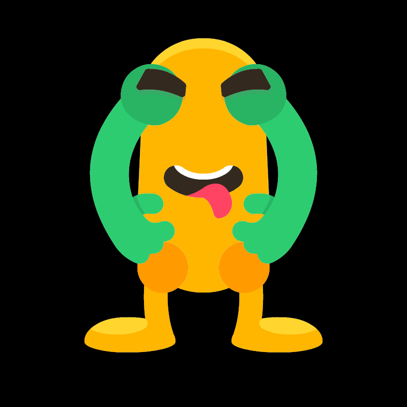
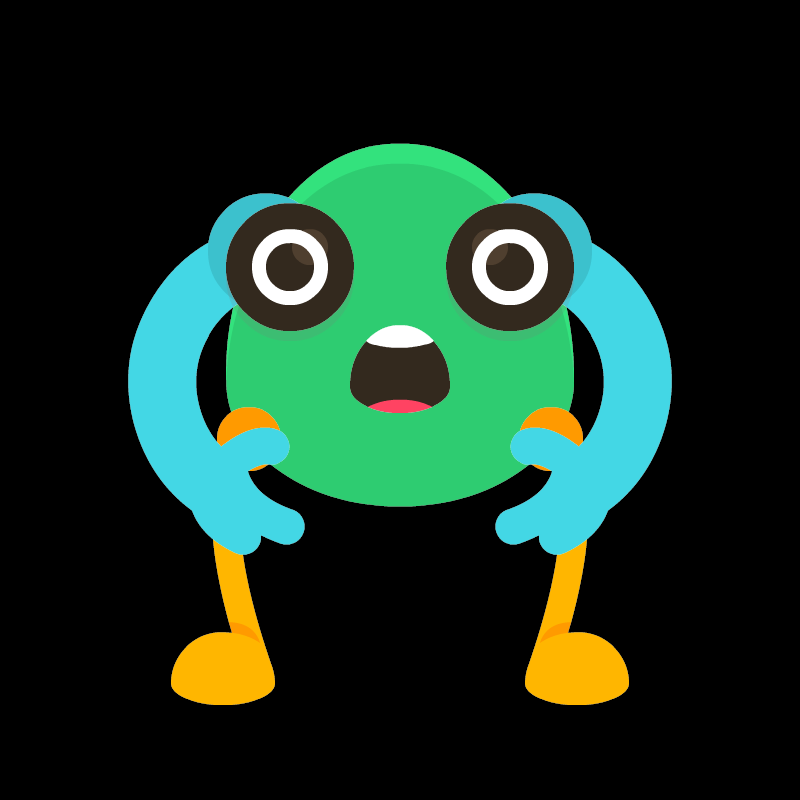
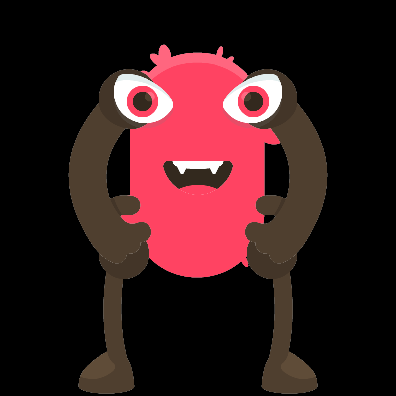

# CryptoMonsters

## Avant de commencer

// Le projet doit compiler et s'executer sans erreur.

## Introduction
Ce TP a pour objectif d’introduire le concept de programmation orientée objet en langage C++.

L’idée est de réaliser un programme de génération de monstres dont la forme et la couleur sont basées sur une séquence ADN générée aléatoirement. Ce principe de génération a récemment pris de l’ampleur avec la mise en place de *smart contracts* pour les [NFT (Non-Fungible Tokens)](https://fr.wikipedia.org/wiki/NFT) sur la blockchain Ethereum. Ce TP s’inspire librement du tutoriel [CryptoZombies](https://cryptozombies.io/) et des [CryptoKitties](https://www.cryptokitties.co/).

> **Attention** : Le principe des NFT repose sur l’utilisation d’un système blockchain pour certifier la propriété d’un actif numérique. Ici, nous ne reprenons que le mécanisme de génération aléatoire. Pour aller plus loin dans la découverte des blockchains et des NFT, des ressources comme [NaiveCoin](https://lhartikk.github.io/jekyll/update/2017/07/15/chapter0.html) sont recommandées.

---

## CryptoMonster

### ADN de monstre
Voici des exemples de monstres générés par le programme final, avec leur ADN associé :

- **ADN : 133484642967201967**
  

- **ADN : 328765965610937671**
  

- **ADN : 389579223599235987**
  

Chaque segment de la séquence ADN est composé de **2 chiffres** et encode une caractéristique du monstre. Par exemple, pour la séquence **13 34 84 64 29 67 20 19 67** :
- **13** → Type de bras (fichier `arm_13.png` dans le dossier `resources`).
- **34** → Type de corps.
- **84** → Type d’yeux.
- **64** → Type de jambes.
- **29** → Type de bouche.
- Les 4 derniers segments (**67 20 19 67**) sont libres pour des extensions futures.

> Le dossier `resources` contient toutes les images des membres et leurs variantes (`arm_1.png` à `arm_30.png`, etc.).

Le programme final permettra :
- De générer un nouveau monstre en appuyant sur la touche **Espace**.
- D’exporter le monstre actuel au format PNG avec la touche **Entrée**.

## Générer des monstres

### Code de rendu
Afin de visualiser les monstres générés, la bibliothèque **Raylib** est utilisée pour dessiner chaque membre du monstre via le code suivant :

```cpp
my_monster.describe();

// Dessin du monstre
// Corps
Texture body_texture = part_manager.getPartTexture("body", my_monster.getBodyType());
Vector2 monster_origin = {RENDER_TEXTURE_WIDTH / 2 - (float)body_texture.width / 2, RENDER_TEXTURE_HEIGHT / 2 - (float)body_texture.height / 2 - 75};

DrawTextureV(body_texture, monster_origin, WHITE);

// Jambes
Texture leg_texture = part_manager.getPartTexture("leg", my_monster.getLegType());
float y_leg_offset = body_texture.height - 100;
DrawTextureV(leg_texture, Vector2Add(monster_origin, Vector2{+(float)body_texture.width - leg_texture.width / 2, y_leg_offset}), WHITE);
DrawTextureRec(leg_texture, Rectangle{0, 0, -(float)leg_texture.width, (float)leg_texture.height}, Vector2Add(monster_origin, Vector2{-(float)leg_texture.width / 2, y_leg_offset}), WHITE);

// Bras
Texture arm_texture = part_manager.getPartTexture("arm", my_monster.getArmType());
float y_arm_offset = 50;
DrawTextureV(arm_texture, Vector2Add(monster_origin, Vector2{(float)body_texture.width - arm_texture.width / 2, y_arm_offset}), WHITE);
DrawTextureRec(arm_texture, Rectangle{0, 0, -(float)arm_texture.width, (float)arm_texture.height}, Vector2Add(monster_origin, Vector2{-(float)arm_texture.width / 2, y_arm_offset}), WHITE);

// Yeux
Texture eye_texture = part_manager.getPartTexture("eye", my_monster.getEyeType());
float y_eye_offset = 60;
DrawTextureV(eye_texture, Vector2Add(monster_origin, Vector2{(float)body_texture.width - eye_texture.width, y_eye_offset}), WHITE);
DrawTextureRec(eye_texture, Rectangle{0, 0, -(float)eye_texture.width, (float)eye_texture.height}, Vector2Add(monster_origin, Vector2{0, y_eye_offset}), WHITE);

// Bouche
Texture mouth_texture = part_manager.getPartTexture("mouth", my_monster.getMouthType());
DrawTextureV(mouth_texture, Vector2Add(monster_origin, Vector2{(float)body_texture.width / 2 - mouth_texture.width / 2, (float)body_texture.height / 2}), WHITE);
```

_🖥️ Copiez-collez ce code à la ligne 63 dans `main.cpp`, en lieu et place du commentaire `// TODO`._

Comme vous pouvez le constater, le code précédent utilise une variable nommée `my_monster` qui n’est déclarée nulle part ailleurs.

Cette variable est ce qu’on appelle **une instance/un objet** de la classe `CryptoMonster`, définie dans le fichier `crypto_monster.cpp`.

_🖥️ Déclarez une variable `my_monster` de type `CryptoMonster`, au bon endroit pour qu’elle soit utilisable par le code de rendu du monstre._

Une fois cette variable déclarée, le programme ne compile toujours pas (en théorie). En effet, il manque certaines **méthodes** à la classe `CryptoMonster`.

_🖥️ En vous appuyant sur le diagramme de classe suivant**, ajoutez les méthodes manquantes à la classe `CryptoMonster` :_

[](https://mermaid.live/edit#pako:eNp1kstOwzAQRX8lGrFoRajyImm8g5YdBYRYoWzceppaqu3IdlDTKnw7TlpQi5pZeXzm3hk_DrBSDIHAakuNmXNaaioK6bnod7yZbiqrFkoai9o7HFEXd5IKJJ6xjBBjNZflGWOSDqDbC8PR-Ix8D6MS7YMWH02Fo7HHpb1Ej4o1Q-ypwSH0jOUQWqjabobgSy2WqF_Xztpc5e5i3P714zM0K82XXcGX4uzszpxyLukb1XbkLJ0tw53fuXuG7_FfH1ctUVOL71QyJcLpnJf8NNll75ujqC0k-FBqzoBYXaMPArWgXQr9qxZgNyiwAOKWDNe03toCCtk6WUXlp1LiV6lVXW6ArOnWuKyumJvj9HX-StCNr2eqlhZI3jsAOcAOSJyGkzSKgjiP4ijPwjTxoQGShZMgjqP7MI-SMEjSaevDvu8ZTLI8zaf3DkSJU2XtD8Tu0YM)

_🖥️ Modifiez la méthode `describe` pour afficher dans la console l’ensemble des informations qui vous semblent utiles._

> Chacune de ces méthodes retourne le numéro de la variante du membre correspondant. Dans un premier temps, vous pouvez retourner **1**. Nous mettrons en place une génération aléatoire dans la suite du TP.

> À cette étape, vous devriez avoir un programme fonctionnel qui ne génère qu’un seul type de monstre.

### Classe CryptoMonster

Maintenant que le code de rendu est opérationnel, nous allons nous concentrer sur la génération de la séquence ADN. Étant donné que le code de rendu utilise des méthodes pour accéder aux morceaux d’ADN du monstre, aucune modification ne sera nécessaire dans le programme de rendu. Ce principe s’appelle **l’encapsulation** : la classe `CryptoMonster` expose des méthodes permettant de connaître chaque membre du monstre. On peut modifier la manière dont les membres sont générés sans « casser » le code qui utilise ces méthodes.

La fonction `static` dans la classe `CryptoMonster` permet de générer une séquence d’ADN.

_🖥️ Ajoutez un attribut dans la classe `CryptoMonster` nommé `dna`. Cet attribut doit être **privé** (il ne sera utilisé que depuis l’intérieur de `CryptoMonster`)._

Les attributs doivent être initialisés lors de la construction/création de l’objet. Pour ce faire, une méthode spéciale nommée **« constructeur »** est présente dans la classe. Cette méthode sera automatiquement appelée lors de la création d’une instance. En C++, plusieurs syntaxes permettent d’initialiser les attributs d’un objet :

```cpp
CryptoMonster::CryptoMonster() : dna(generateRandom18DigitNumber())
{
}

// OU
CryptoMonster::CryptoMonster()
{
  this->dna = generateRandom18DigitNumber();
}

// OU encore
CryptoMonster::CryptoMonster() : dna {generateRandom18DigitNumber()}
{
}
```

_✍️ Cherchez les différences entre ces 3 syntaxes._


_🖥️ Utilisez la syntaxe qui vous semble la plus adaptée à notre cas._


Maintenant que notre classe `CryptoMonster` possède un attribut `dna`, il est nécessaire d’adapter les méthodes `getXXXType` pour utiliser le morceau d’ADN correspondant au membre. Elles deviendront alors des **propriétés dérivées** de l’attribut `dna`.


_🖥️ Complétez la méthode `int getDnaPart(int index, int size) const;`_.


> **Indice** : `dna` est de type `std::string`. Certaines méthodes de cette classe peuvent vous aider.


_🖥️ Modifiez les méthodes `getXXXType` pour utiliser la méthode privée `getDnaPart` avec le bon morceau d’ADN. **Vérifiez leur bon fonctionnement** à l’aide des informations fournies par la méthode `describe`._


Si la méthode `describe` vous affiche des informations correctes, mais que le monstre généré est toujours le même, **c’est normal**. En effet, le constructeur de la classe `PartManager` dans le fichier `part.cpp` possède un bug.


_🖥️ Identifiez ce bug et corrigez-le._


_✍️ Essayez de comprendre en quoi cette classe illustre le principe RAII._


> Si le bug est correctement corrigé, vous devriez avoir un monstre différent à chaque démarrage du programme.

## Générer des nouveaux monstres

TODO

## Exporter un monstre

TODO

## Améliorations orientées objets

TODO

