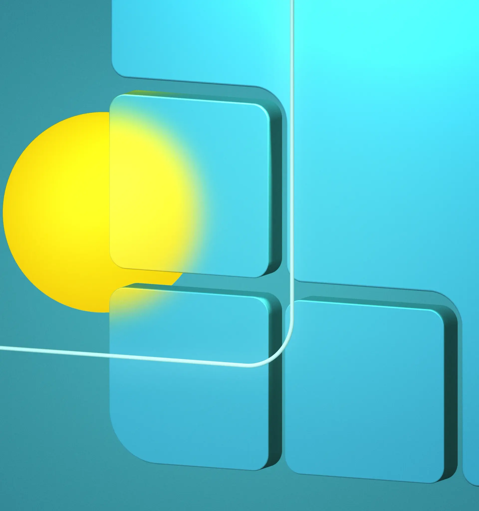
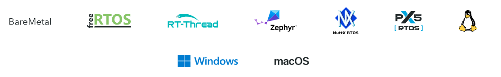
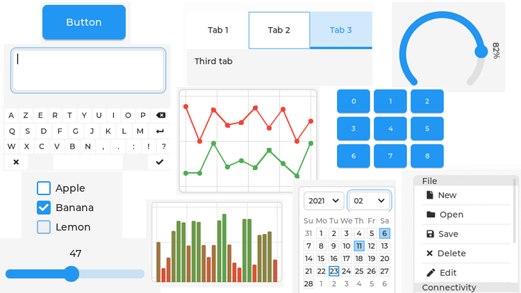
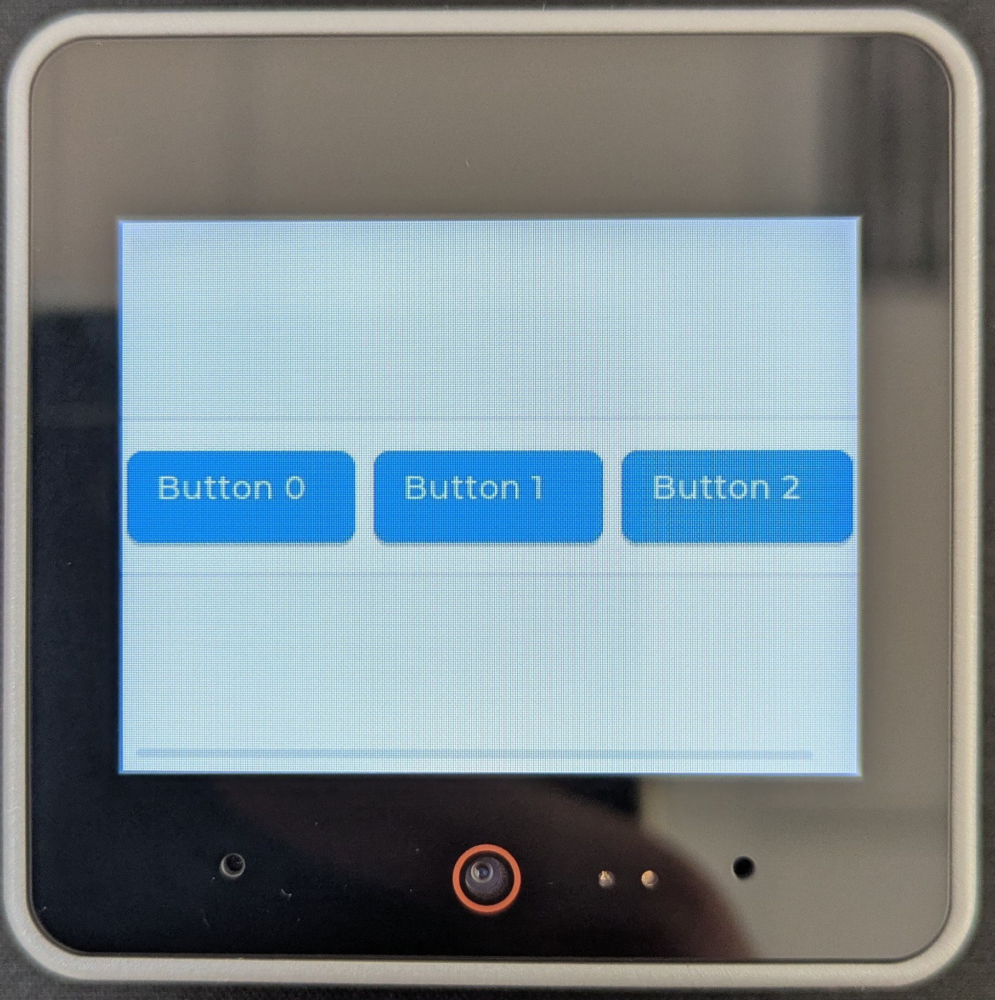

# C/C++ - Introduction à LVGL

> LVGL : Light and Versatile Graphics Library

_BTS CIEL_



--------------------------------------------------------------------------------

## Versatile



Cartes et MCU supportés (officiellement) : <https://lvgl.io/boards>

--------------------------------------------------------------------------------

## Programmation déclarative


--------------------------------------------------------------------------------

## Programmation déclarative

HTML

```html
<!DOCTYPE html>
<html lang="fr">
<head>
    <meta charset="UTF-8">
    <title>Page de démonstration</title>
</head>
<body>
    <h1>Programmation déclarative</h1>
    <p>Ce paragraphe est déclaré en HTML.</p>

    <ul>
        <li>Élément de liste 1</li>
        <li>Élément de liste 2</li>
    </ul>
</body>
</html>
```

--------------------------------------------------------------------------------

## Programmation déclarative

XAML

```xml
<Window
    x:Class="DemoApp.MainWindow"
    Title="Fenêtre de démonstration"
    Width="400"
    Height="200">

    <Grid Margin="10">
        <StackPanel>
            <TextBlock Text="Hello World!" 
                       FontSize="24" 
                       Margin="0,0,0,10" />

            <Button Content="Clique-moi"
                    Width="120"
                    HorizontalAlignment="Left" />
        </StackPanel>
    </Grid>
</Window>
```

--------------------------------------------------------------------------------

## Programmation déclarative

YAML

```yaml
server:
  host: "localhost"
  port: 8080

database:
  engine: "postgresql"
  host: "db.example.com"
  port: 5432
  username: "app_user"
  password: "secret"

features:
  logging: true
  cache:
    enabled: true
    ttl_seconds: 300
```

--------------------------------------------------------------------------------

## Programmation impérative

Un **langage déclaratif** décrit l'état souhaité.

Un ordinateur ne comprend que des **ordres (instructions)**. Il faut lui dire **comment** passer à l'état souhaité.


1. Lire la description ("parsing") et créer **la suite d'instructions nécessaire**
2. Appliquer la suite d'instructions sur la machine (changer son état)

> Déclaratif **=** Quoi | Impératif **=** Comment

--------------------------------------------------------------------------------

## Programmation impérative


--------------------------------------------------------------------------------

## Programmation impérative


--------------------------------------------------------------------------------

## Programmation impérative

## 

--------------------------------------------------------------------------------

## Programmation impérative

### LVGL

## 

--------------------------------------------------------------------------------

## Programmation impérative

### LVGL

LVGL ne propose **pas de langage déclaratif** : c'est à vous de préciser ce que vous souhaitez voir à l'écran à l'aide d'instructions.

```c++
lv_obj_t * arc = lv_arc_create(lv_screen_active());
lv_obj_set_size(arc, 200, 200);
lv_obj_center(arc);

lv_obj_set_style_arc_opa(arc, LV_OPA_50, LV_PART_MAIN);
lv_obj_set_style_arc_color(arc, lv_color_hex(0xffffff), LV_PART_INDICATOR);
lv_obj_set_style_bg_color(arc, lv_color_hex(0xffffff), LV_PART_KNOB);
lv_obj_set_style_shadow_width(arc, 15, LV_PART_KNOB);
lv_obj_set_style_shadow_opa(arc, LV_OPA_40, LV_PART_KNOB);
lv_obj_set_style_shadow_offset_y(arc, 5, LV_PART_KNOB);
```

> LVGL Pro (licence payante) permet d'utiliser du XML pour décrire un écran.

--------------------------------------------------------------------------------

## Composants de LVGL

- Écrans et widgets

  - Organisation en **pages** (objets racine)
  - Large bibliothèque de **widgets** : boutons, labels, listes, graphiques...
  - Système **hiérarchique** : chaque widget peut contenir des enfants

- Événements

  - Basés sur un **système de callbacks**
  - Réactions aux interactions : appui, swipe, clic long...

- Modules

  - **Input drivers** (touchscreen, clavier, souris...)
  - **File System** (gestion de fichiers cross-platform)
  - ...

--------------------------------------------------------------------------------

## Notion de widget

Un widget est un **élément d'interface**, voici une liste non-exhaustive :

**Catégorie**                | **Exemples de widgets**
---------------------------- | -----------------------
**Contenu et texte**         | Label, Span, Image
**Interaction et entrée**    | Button, Slider
**Conteneurs**               | Tabview, List, Grid
**Visualisation de données** | Chart, Bar

> La liste des widgets disponibles : <https://docs.lvgl.io/master/widgets/index.html>

--------------------------------------------------------------------------------

## Notion de widget



--------------------------------------------------------------------------------

## Un widget pour les gouverner tous

Dans LVGL, une seule structure existe pour représenter tout les types de widgets : `lv_obj_t`.

```c++
lv_obj_t * btn1 = lv_button_create(lv_screen_active());
lv_obj_center(btn1);

lv_obj_t * label = lv_label_create(btn1);
lv_label_set_text(label, "Button");
lv_obj_center(label);
```

Ce fonctionnement permet de **mutualiser certaines opérations** ["Common Widget Features"](https://docs.lvgl.io/master/common-widget-features/index.html).

Certaines fonctions permettent d'effectuer des **opérations spécifiques** à un type de widget.

--------------------------------------------------------------------------------

## Construire un écran


--------------------------------------------------------------------------------

## Widgets

### Screen

Le widget **`screen`** correspond à la **racine** de l'arbre.

La notion d'**écran** dans LVGL est utile pour structurer son application en **pages**.

Chaque écran contient ses propres widgets et on peut naviguer de l'un à l'autre.

```c++
// Création d’un nouvel écran (page)
lv_obj_t* screen2 = lv_obj_create(NULL);

// Ajout d’un widget sur cet écran
lv_obj_t* label = lv_label_create(screen2);
lv_label_set_text(label, "Bienvenue sur l'écran 2");
lv_obj_center(label);

// Affichage de l’écran
lv_scr_load(screen2);
```

--------------------------------------------------------------------------------

## Widgets

### Containers


--------------------------------------------------------------------------------

## Widgets

### Containers

Les conteneurs sont des widgets utilisés pour définir le comportement d'autres widgets.

Certains permettent de définir des contraintes pour l'affichage (layout) :

- Flex : le même principe que les flexbox CSS
- Grid : le même principe qu'une grille CSS

--------------------------------------------------------------------------------

## Widgets

### Containers

Exemple de conteneur avec un layout Flex (code) :

```c++
// Création du conteneur (il s'agit d'un widget classique)
lv_obj_t * container = lv_obj_create(lv_scr_act());
lv_obj_set_size(container, , 120);
lv_obj_center(container);

// Active le layout flex en direction horizontale
lv_obj_set_flex_flow(container, LV_FLEX_FLOW_ROW);

// Ajoute 3 boutons en enfants du conteneur
for(int i = 0; i < 3; i++) {
    lv_obj_t * btn = lv_btn_create(container);
    lv_obj_set_size(btn, 50, 40);

    lv_obj_t * label = lv_label_create(btn);
    lv_label_set_text_fmt(label, "Button %d", i);
}
```

--------------------------------------------------------------------------------

## Widgets

### Containers

Exemple de conteneur avec un layout Flex (rendu) :



--------------------------------------------------------------------------------

## Widgets

### Containers

Exemple de conteneur avec un layout Flex (arbre) :

```


```

--------------------------------------------------------------------------------

## Événements

Les **événements** permettent de réagir aux interactions utilisateur et aux changements d'état des widgets.

- Chaque widget peut **envoyer** des événements
- Des **callbacks** (fonctions de rappel) sont attachées pour y **réagir**
- Un même widget peut gérer **plusieurs événements**

Type        | Exemple d'événement
----------- | -------------------------------------------------------------
Interaction | `LV_EVENT_CLICKED`, `LV_EVENT_PRESSED`
Saisie      | `LV_EVENT_VALUE_CHANGED`, `LV_EVENT_READY`
Affichage   | `LV_EVENT_DRAW_MAIN_BEGIN`
État        | `LV_EVENT_FOCUSED`, `LV_EVENT_DEFOCUSED`, `LV_EVENT_DISABLED`

--------------------------------------------------------------------------------

## Événements

### Exemple

```c++
lv_obj_t * btn = lv_button_create(lv_screen_active());
lv_obj_add_event_cb(btn, my_event_cb, LV_EVENT_CLICKED, user_data);

...

static void my_event_cb(lv_event_t * event)
{
    printf("Clicked\n");
}
```

> La callback s'exécute dans la tâche de gestion d'événements de LVGL : attention aux traitements bloquants.

--------------------------------------------------------------------------------

## Un peu de C++

--------------------------------------------------------------------------------

## Pour aller plus loin

- La documentation officielle <https://docs.lvgl.io/master/index.html>
- Bien lire cette page pour être efficace concernant le positionnement : <https://docs.lvgl.io/master/common-widget-features/coordinates.html>
