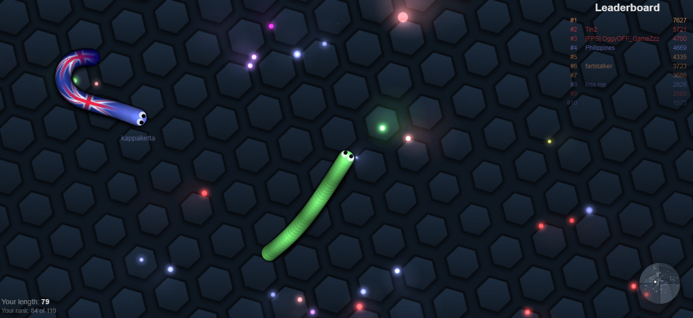

# Introduction au langage C

_BTS CIEL_


--------------------------------------------------------------------------------

## Sommaire

- Notions de bases

  - Langage compilé
  - Programmation structurée

    - Instructions, variables et blocs
    - Séquence
    - Sélection
    - Itération

- Tableaux et pointeurs

- Fonctions et procédures

- Structure et types avancés


--------------------------------------------------------------------------------

## Langage compilé

--------------------------------------------------------------------------------

## Programmation structurée

La programmation structurée définit les primitives suivantes

- 🔽 La séquence
- 🔀 La sélection
- 🔁 L'itération


--------------------------------------------------------------------------------

## 🔽 Séquence - variable

```c
int ma_variable = 10  // integer
char * mon_autre_variable = "du texte"  // char *
bool mon_bool = true  // boolean

int ma_variable; // Attention, comportement non prédictible si non initialisé
```

--------------------------------------------------------------------------------
<style scoped="">section{font-size:22px;}</style>

## 🔽 Séquence - typage

Types fondamentaux :

- Numériques entiers : (et variantes `signed` / `unsigned`)

  - `short` (16 bits)
  - `int` (32 bits)
  - `long` (32/64 bits)

- Numériques réels : `float`, `double`, `long double`

- Caractères : `char` (`char *`)

Structures de données :

- Tableaux : `int tab[10];`
- Structures : `struct`

> ℹ️ Ces types sont directement supportés par le langage C (sans bibliothèques externes).

--------------------------------------------------------------------------------

<style scoped="">section{font-size:24px;}</style>

## 🔽 Séquence - typage

Python utilise un typage dit **dynamique** et **strict**.

```python
points = 3.2  # points est du type float
print("Tu as " + points + " points !")  # Génère une erreur de typage

points = int(points)  # points est maintenant du type int (entier), sa valeur est arrondie à l'unité inférieure (ici 3)
print("Tu as " + points + " points !")  # Génère une erreur de typage

print("Tu as " + str(points) + " points !")  # Plus d'erreur de typage, affiche 'Tu as 3 points !'
```

Le C utilise un typage dit **statique** et **faible**.

```c
float points = 3.2; // Typage statique : points est un float
points = (int) points; // Erreur points est de type float elle ne peut pas recevoir un int

int pts = (int) points; // Conversion explicite : float → int
printf("Tu as %s points !\n", pts); // Typage faible : conversion implicite
```

> ⚠️ En C l'erreur sera levée lors de la compilation du programme.

--------------------------------------------------------------------------------

## 🔽 Séquence - typage

`Définition`

**Typage Dynamique / statique** Est-ce qu'une variable de type **A** peut contenir une valeur de type **B** sans être redéfinie.

**Typage faible / fort** Est-ce qu'une variable de type **A** peut-être utilisée en tant que type **B** (sans cast explicite)

--------------------------------------------------------------------------------

<style scoped="">section{font-size:22px;}</style>

## 🔽 Séquence - opérations mathématiques

En C, les types numériques de base sont :

- `int` (entier)
- `float` (réel simple précision)
- `double` (réel double précision)

Opération | Définition
--------- | -----------------------------------------
`x + y`   | somme de x et y
`x - y`   | différence de x et y
`x * y`   | produit de x et y
`x / y`   | quotient de x et y
`x % y`   | reste de la division (entiers uniquement)
`-x`      | opposé de x

--------------------------------------------------------------------------------

## 🔽 Séquence - instruction et bloc

```c
int x = 10;
{
    int y = 5;
    printf("%d\n", x + y);
}
return 0;
```

--------------------------------------------------------------------------------

## 🔽 Séquence - appel de fonction

```c
printf("Hello world !\n");

int a = 10, b = 15;
int le_max = (a > b) ? a : b;
printf("Max = %d\n", le_max);

double r = sqrt(16.0);
printf("Racine carrée = %.2f\n", r);
```

--------------------------------------------------------------------------------

## 🔀 Sélection - if / else if / else

```c
int ma_variable = 10;

if (ma_variable == 11) {
    printf("foo\n");
} else if (ma_variable == 12) {
    printf("or\n");
} else {
    printf("bar\n");
}

return 0;
```

--------------------------------------------------------------------------------

## 🔀 Sélection - opérations de comparaison

Opération | Définition
--------- | ---------------------
`<`       | strictement inférieur
`<=`      | inférieur ou égal
`>`       | strictement supérieur
`>=`      | supérieur ou égal
`==`      | égal
`!=`      | différent

> ⚠️ Pas d'opérateur `is` en C. On compare les adresses mémoire pour les pointeurs (`ptr1 == ptr2`).

--------------------------------------------------------------------------------

## 🔀 Sélection - véridicité des valeurs

En C :

- `0` (zéro) est considéré comme **faux**.
- Toute autre valeur entière est **vraie**.

```c
if (0) {
    printf("faux\n");
}
if (42) {
    printf("vrai\n");
}
```

--------------------------------------------------------------------------------

## 🔀 Sélection - opérations booléennes

Opération | Définition
--------- | -------------------------
`x \      | \                         | y` | vrai si x ou y est vrai
`x && y`  | vrai si x et y sont vrais
`!x`      | vrai si x est faux

--------------------------------------------------------------------------------

## 🔀 Sélection - switch / case

```c
int status = 404;

switch (status) {
    case 400:
        printf("Bad request\n");
        break;
    case 404:
        printf("Not found\n");
        break;
    case 418:
        printf("I'm a teapot\n");
        break;
    default:
        printf("Code erreur inconnu\n");
}
```

--------------------------------------------------------------------------------

## 🔁 Itération - while loop

```c
#include <stdio.h>

int main(void) {
    int i = 0;

    while (i < 10) {
        printf("%d\n", i);
        i++;
    }

    char *animals[] = {"chien", "chat", "souris"};
    i = 0;
    while (i < 3) {
        printf("%s\n", animals[i]);
        i++;
    }

    return 0;
}
```

--------------------------------------------------------------------------------

## 🔁 Itération - for loop

```c
char *animals[] = {"chien", "chat", "souris"};

for (int i = 0; i < 3; i++) {
    printf("%s\n", animals[i]);
}

return 0;
```

--------------------------------------------------------------------------------

## Les tableaux en C

Un **tableau** est une zone mémoire contiguë contenant plusieurs éléments du **même type**.

```c
int tab1[5];               
int tab2[5] = {0};         
int tab3[5] = {1, 2, 3};
int tab4[]  = {10, 20, 30};

printf("%d\n", tab3[0]);
printf("%d\n", tab4[2]);
```

--------------------------------------------------------------------------------

## Les tableaux en C

### Dimension d'un tableau

La dimension d'un tableau (sa taille) doit être une valeur **constante**.

```c
#define N 5

// Valide
int tab1[5]; // Valide
int tab2[N]; // Valide

// Invalide
int n = 5;
int tab3[n];

const int s = 5;
int tab4[s]; // Sauf en C99 (dans un contexte local) !
```

--------------------------------------------------------------------------------

## Les tableaux en C

### Dimension d'un tableau

Dans une fonction :

```c
void ma_fonction(int n) {
    int tab[n];
}
```

> ℹ️ Ce principe est appelé **V**ariable **L**ength **A**rray.

> ⚠️ Le tableau sera alloué sur la pile.

--------------------------------------------------------------------------------

## Les tableaux en C

### Calculer la taille d'un tableau

`sizeof()` permet d'obtenir l'espace mémoire occupé par un élément.

```c
int tab[10] = {0, 1, 2, 3, 4, 5, 6, 7, 8, 9};

printf("Taille mémoire occupée : %zu", sizeof(tab)) // 4 octets * 10 => 40 octets
printf("Taille du tableau (dimension) : %zu", sizeof(tab) / sizeof(int)) // 4 octets * 10 / 4 octets => 10
```

--------------------------------------------------------------------------------

## Les tableaux en C

### Multi-indice

```c
int matrice[3][4] = {{0, 1, 3, 4}, {0, 1, 3, 4}, {0, 1, 3, 4}}
```

Exemples d'utilisation :

- Pixels d'une image
- Plateau d'un jeu d'échecs
- Algèbre linéaire
- Données tabulaires (classeur)

--------------------------------------------------------------------------------

## Chaînes de caractères

### null-terminated

Une chaîne de caractères (`string`) peut-être représentée en utilisant un tableau de `char`.

```c
char chaine[] = "BTS";
```

Les chaînes de caractères se manipulent donc comme des tableaux.

> ℹ️ Le langage ajoute lui-même le caractère de fin de chaîne `\0`. La taille mémoire réelle utilisée par la variable est de `3 + 1 = 4 octets`

--------------------------------------------------------------------------------

## Chaînes de caractères

### string.h

La bibliothèque `string.h` définit des fonctions permettant de manipuler les chaînes de caractères.

```c
#include <string.h>

size_t length = strlen("ma chaine de caractères");

printf("la chaîne est de taille : %zu \n", length); // 24
```

--------------------------------------------------------------------------------

## Chaînes de caractères

### string.h

Fonction                              | Définition
------------------------------------- | ----------------------------------------------------------
`char * strcat(char * s1, char * s2)` | concaténation de `s1` et `s2`                              |
`char * strchr(char * s1, int c)`     | recherche un caractère `c` dans `s1`                       |
`int strcmp(char *s1, char *s2)`      | `-1` si `s1` est < `s2`, `1` si `s2` est > `s1`, `0` sinon |
`char *strcpy(char * s1, char *s2)`   | copie `s2` dans `s1` (attention **buffer overflow**)       |
`size_t strlen(char *s)`              | nombre d'octets qui composent la chaîne                    |

> ℹ️ Plus de détails ici : <https://en.wikibooks.org/wiki/C_Programming/String_manipulation>

> ⚠️ Ces fonctions ont des comportements particuliers, bien lire la documentation.

--------------------------------------------------------------------------------

## Chaînes de caractères

### string.h

Les fonctions de `string.h` sont écrites pour l'encodage ASCII (ISO-8859-1).

Si vous souhaitez manipuler d'autres types d'encodage `wchar.h` est plus adapté.

> ℹ️ Table de référence de ISO-8859-1 <https://fr.wikipedia.org/wiki/ISO/CEI_8859-1>

--------------------------------------------------------------------------------

## Les pointeurs en C

Un pointeur est une variable qui contient **l'adresse mémoire** d'une autre variable.

```c
#include <stdio.h>

int main(void) {
    int valeur = 42;
    int *ptr = &valeur;

    printf("Adresse = %p\n", ptr);
    printf("Valeur via ptr = %d\n", *ptr);

    *ptr = 99;
    printf("Nouvelle valeur = %d\n", valeur);

    return 0;
}
```

--------------------------------------------------------------------------------

## Les pointeurs en C

### Incrémentation de pointeur

L'incrémentation d'un pointeur permet de le décaler de la taille mémoire du type de la variable pointée.

```c
int b = 10;
int *a = &b;

// Incrémente la valeur de b de 1
(*a)++; 

// Incrémente l'adresse de sizeof(int) (car il s'agit d'un pointeur vers un int)
a++;

// a contient désormais l'adresse de l'entier qui suit b
```

> ⚠️ Attention à la priorité de l'opérateur `*`

## 

--------------------------------------------------------------------------------

## Les pointeurs en C

- déclaration d'un pointeur : `type *ptr;`
- récupérer l'adresse d'une variable `var` : `&var;`
- déréférencement (accède à la valeur pointée) : `*ptr`

Les pointeurs permettent :

- de manipuler des **tableaux** et des **chaînes**
- de gérer la **mémoire dynamique** (`malloc`, `free`)
- de passer des paramètres **par adresse** aux fonctions

--------------------------------------------------------------------------------

## Exercice 1 - copier une chaîne

```c
#include <stdio.h>

int main(void) {
    const char msg[] = "Hello";

    char copie[_];

    int i = 0;

    while (___________) {
        copie[i] = _______;
        i++;
    }
    copie[i] = _______;

    printf("%s\n", copie);
    return 0;
}
```

--------------------------------------------------------------------------------

## Exercice 2 - échange avec des pointeurs

```c
#include <stdio.h>

int main(void) {
    int x = 42;
    int y = 12;

    echange(__, __);

    printf("Valeur de x = %d\n", x);
    printf("Valeur de y = %p\n", y);

    return 0;
}

void echange(___ _x, ___ _y)
{
    int temp = __;
    _x = _y;
    _y = temp;
}
```

--------------------------------------------------------------------------------

## Exercice 3 - tableau ou pointeur ?

```c
#include <stdio.h>

int main(void) {
    int tab[3] = {10, 20, 30};
    int *p = ____;

    for (int i = 0; i < 3; i++) {
        printf("%d\n", ____);
        ___;
    }
    return 0;
}
```

--------------------------------------------------------------------------------

## Exercice 4 - recherche du plus grand

```c
#include <stdio.h>
#include <limits.h>

int main(void) {
    int tab[] = {0, -6, 8, 10, 20, 30, 400};
    int max = ______;
    int maxPos = -1;

    for (int i = _____; i < _____; i++) {

        if (_____________) {
            max = ____;
        }

    }

    printf("Max : %d à la position : %d", max, maxPos);

    return 0;
}
```

--------------------------------------------------------------------------------

## Les fonctions et procédures en C

### Définition

Les fonctions permettent de **regrouper** plusieurs instructions sous forme d'un bloc **nommé et réutilisable**.

--------------------------------------------------------------------------------

## Les fonctions et procédures en C

### Fonction / procédure / sous-routine

- **Fonction** : au sens mathématique, une fonction associe une ou plusieurs valeurs d'entrée à une ou plusieurs valeurs de sortie.
- **Procédure** : en informatique, il s'agit d'un ensemble d'instructions regroupées pour réaliser une tâche précise, sans forcément produire un résultat.
- **Sous-routine** : terme générique désignant une portion de code réutilisable, qu'il s'agisse d'une fonction ou d'une procédure.

--------------------------------------------------------------------------------

## Les fonctions et procédures en C

En général, on utilise le terme **fonction** lorsqu'une sous-routine n'a d'impact que sur ses valeurs de sortie.

Si une sous-routine modifie d'autres éléments en dehors de son résultat (**effets de bord**), on parle plutôt de **procédure**.

> ℹ️ Une fonction sans effet de bord est beaucoup plus simple à tester.

> ℹ️ Cette propriété fait partie des fondements de la programmation fonctionnelle.

--------------------------------------------------------------------------------

## Les fonctions et procédures en C

### Exemple: `divide`


--------------------------------------------------------------------------------

## Les fonctions et procédures en C

### Exemple: `divide`


> ℹ️ Divide ne modifie pas ses entrées et ne produit pas d'effet de bord, il s'agit d'une fonction pure.

--------------------------------------------------------------------------------

## Les fonctions et procédures en C

### Exemple: `list_add`


--------------------------------------------------------------------------------

## Les fonctions et procédures en C

### Exemple: `list_add`


--------------------------------------------------------------------------------

## Les fonctions et procédures en C

### Exemple: `list_add`


> Cette version de `list_add` **modifie la liste passée en entrée**, elle n'est donc pas pure. On parle de fonction impure ou bien de procédure.

--------------------------------------------------------------------------------

## Les fonctions et procédures en C

### Exemple: `malloc`


--------------------------------------------------------------------------------

## Les fonctions et procédures en C

### Exemple: `malloc`


--------------------------------------------------------------------------------

## Les fonctions et procédures en C

### Syntaxe

Déclaration :

```c
float divide(float a, float b)
{
    return a / b;
}
```

Appel d'une fonction :

```c
float result = divide(10.0, 2.0);
```

--------------------------------------------------------------------------------

## Les fonctions et procédures en C

### Paramètres & arguments

- Paramètre : variable déclarée dans la définition d'une fonction.
- Argument : valeur passée lors de l'appel de la fonction.

```c
float divide(float a, float b)
{
    return a / b;
}

divide(10.0, 2.0);
```

> ℹ️ Dans l'exemple ci-dessus `a` et `b` sont des **paramètres** et `10.0` et `2.0` sont des exemples **d'arguments**.

--------------------------------------------------------------------------------

<style scoped="">section{font-size:20px;}</style>

## Les fonctions et procédures en C

### Passage par valeur

En langage C, lors de l'appel d'une fonction il est uniquement possible de passer la **valeur** d'une variable et **non pas la variable elle-même**.

La fonction n'ayant pas accès à la variable d'origine **elle ne peut pas la modifier**.

La fonction peut uniquement écrire dans **l'espace mémoire qui lui est réservée**.

### Passage de l'adresse

Il est possible de **passer l'adresse d'une variable** en argument d'un appel de fonction.

Dans ce cas la fonction a accès à l'espace mémoire "extérieur" et peut **modifier la variable d'origine**.

> ℹ️ On appelle ça un **passage par référence**.

> ⚠️ Dans le cas du passage par valeur, une **copie** de la variable est créée.

--------------------------------------------------------------------------------

## Les fonctions et procédures en C

### Passage par valeur

```c
float divide(float a , float b)
{
    return a / b;
}

divide(10.0, 2.0);

float a = 2.0 ; 
float b = 10.0;

divide(a, b); // Ce sont les valeurs des variables a et b qui sont passées et non pas les variables elles-mêmes
```

--------------------------------------------------------------------------------

## Les fonctions et procédures en C

### Passage de l'adresse

```c
void reset(int *n) 
{
    *n = 0;
}

int a = 10;

reset(&a);

// a = 0
```

--------------------------------------------------------------------------------

## Les fonctions et procédures en C

### Quelques pièges :

```c
void fillArray(int tab[], int length, int value) 
{
    for (int i = 0; i < length; i++) 
    {
        tab[i] = value;
    }
}

int array[10] = {0};

fillArray(array, 10, 2);
```

--------------------------------------------------------------------------------

## Les fonctions et procédures en C

### Quelques pièges :

```c
typedef struct {
    int x, y;
} Point;

void move(Point p) {
    p.x += 10;
    p.y += 10;
}

Point p = {
    .x = 10,
    .y = 2
};

move(p);
```

--------------------------------------------------------------------------------

## Les fonctions et procédures en C

### Quelques pièges :

```c
void displayArray(const int tab[], int length) 
{
    for (int i = 0; i < length; i++) 
    {
        printf("%d, ",  tab[i]);
    }
}

int array[10] = {0};

displayArray(array, 10);
```

--------------------------------------------------------------------------------

## Les fonctions et procédures en C

### Quelques pièges :

```c
void pointer_to_pointer(int **p) 
{
    int b = 10;

    *p = &b; // Attention : correspond à un espace mémoire éphémère (local à la fonction) 
}

int a = 10;

pointer_to_pointer(&(&a));
```

--------------------------------------------------------------------------------

## Structures en langage C

La structure est un type de données **composite** :

- il est construit à partir d'autres **types de données** (variable, structure, tableau, enum, etc.)
- il rassemble un ensemble d'informations en une unité ayant une **signification** et un **nom**

En C le mot clé `struct` est utilisé pour déclarer une structure.

--------------------------------------------------------------------------------

## Structures en langage C

Exemple de définition d'une structure :

```c
// Définition
struct Point {
    int x;
    int y;
};

// Création de variable de type "struct Point"
struct Point pointA;
struct Point pointB;
```

La structure `Point` permet de modéliser un point sur un plan 2D, ses coordonnées sont représentées par ses membres `x` et `y` de type entier.

--------------------------------------------------------------------------------

## Structures en langage C

### Opérateur `.`

La structure se manipule comme un seul élément **composite** :

```c
struct Point {
    int x;
    int y;
}

int dot(struct Point a, struct Point b)
{
    return a.x * b.x + b.x * b.y;
}
```

L'opérateur `.` permet d'accéder aux membres (**composants**) de la structure.

--------------------------------------------------------------------------------

## Structures en langage C

### Opérateur `->`

```c
void scale(struct Point *a, int s)
{
    a->x * s;
    a->y * s;
}
```

L'opérateur `->` permet de déférencer le pointeur et d'accéder directement au membre, c'est l'équivalent de : `(*p).membre`.

--------------------------------------------------------------------------------

<style scoped="">section{font-size:24px;}</style>

## Alias avec `typedef`

Le mot clé `typedef` permet de créer un alias (définition de type).

```c
struct Point {
    int x;
    int y;
};

typedef struct Point Point;
```

Ou en abrégé :

```c
typedef struct {
    int x;
    int y;
} Point;
```

Cela permet de déclarer des variables de type `Point` plutôt que de devoir préciser `struct Point`.

--------------------------------------------------------------------------------

## Structures en langage C

### Initialisation

```c
Point a;

a.x = 10;
a.y = 20;

// one-shot

Point b = {10, 20}
Point c = {.x = 10, .y = 20}
```

--------------------------------------------------------------------------------

## Structures en langage C


