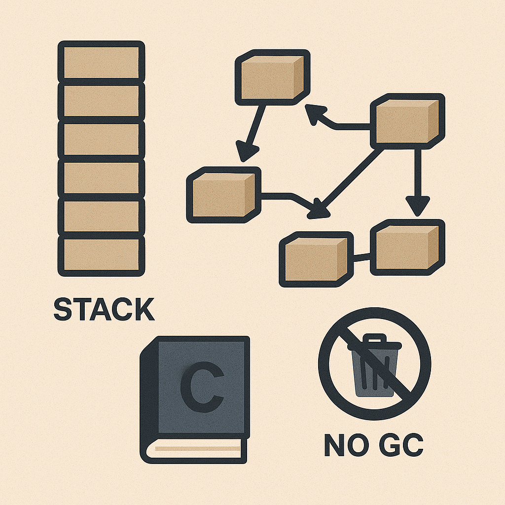
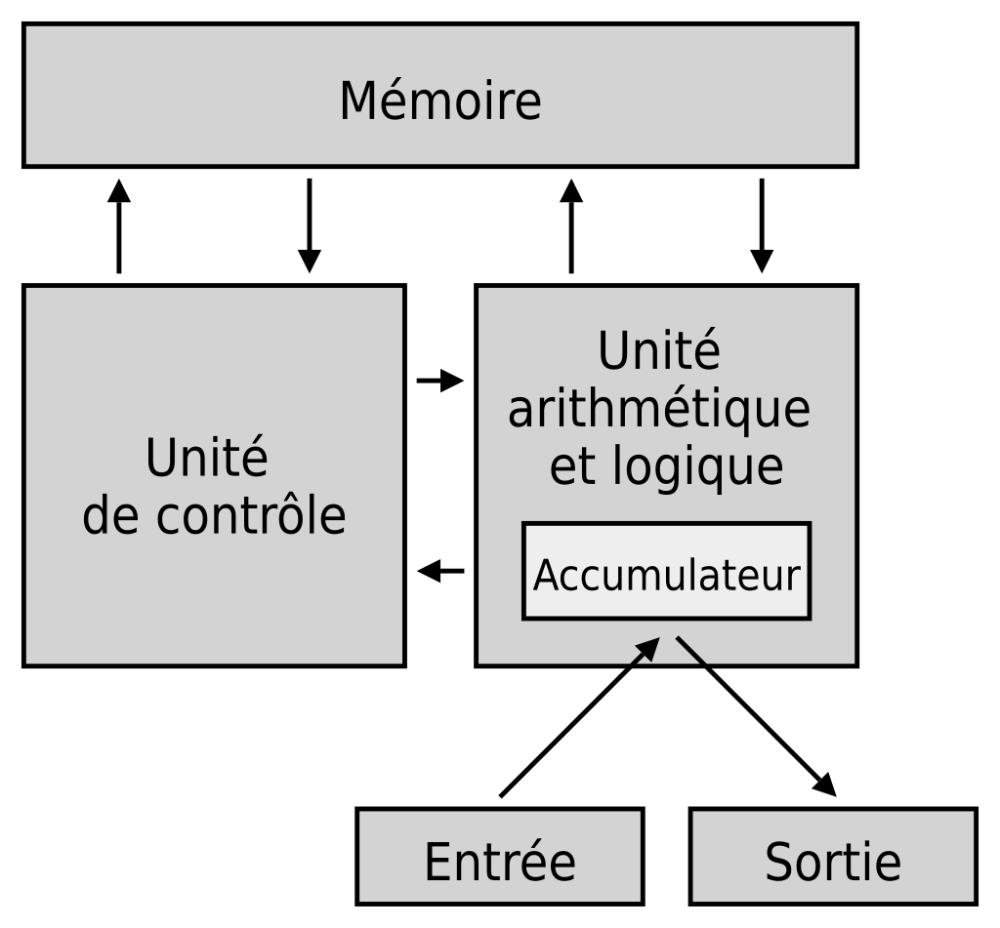
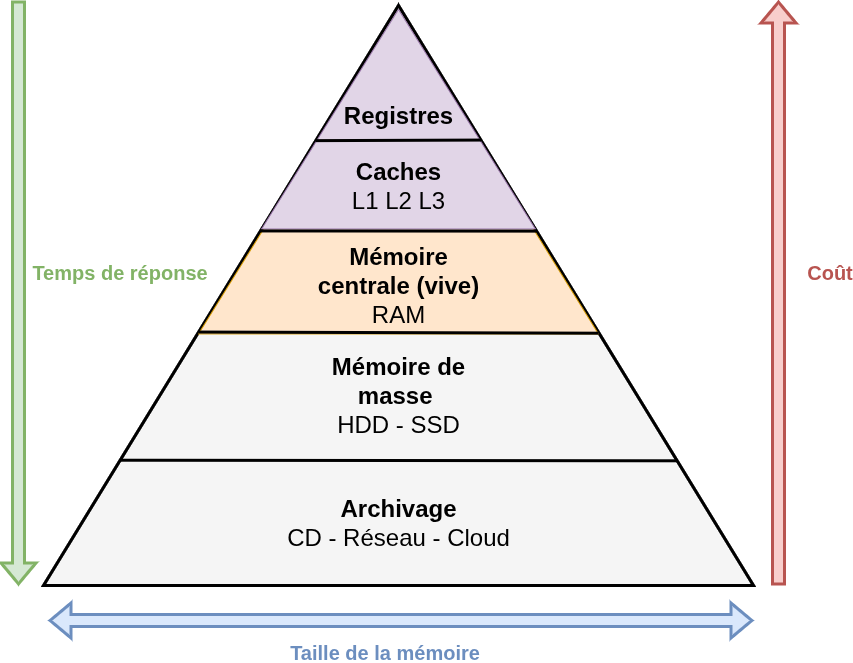
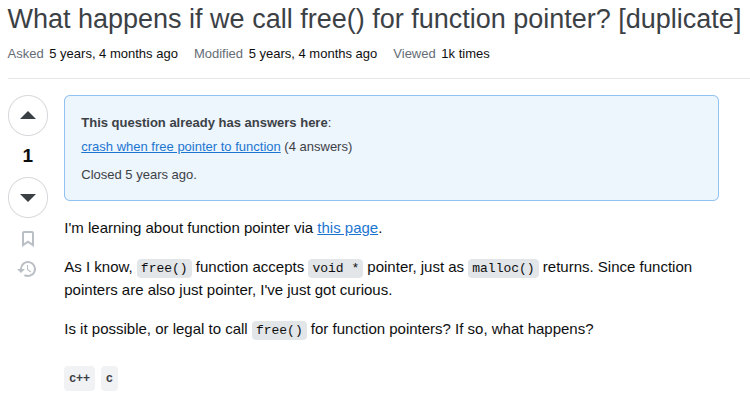
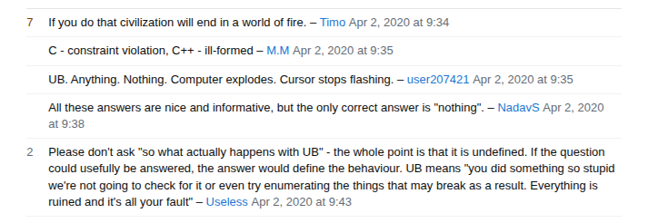

# Langage C - Gestion de la mémoire

_BTS CIEL_


--------------------------------------------------------------------------------

## Sommaire

- Rappel sur la mémoire
- Allocation mémoire en C

  - Allocation statique
  - Allocation automatique
  - Allocation dynamique

- Null References: The Billion Dollar Mistake



--------------------------------------------------------------------------------

## Rappel sur la mémoire

### Architecture de Von Neumann



--------------------------------------------------------------------------------

## Rappel sur la mémoire

### Différentes mémoires



--------------------------------------------------------------------------------


--------------------------------------------------------------------------------

## Allocation mémoire en C

Un ordinateur a une quantité de mémoire limitée. Le rôle de l'OS est d'accorder (**allouer**) une certaine quantité de mémoire à chaque programme et de récupérer cette quantité pour la réutiliser ailleurs (**recyclage**).

Le compilateur C offre deux manières d'allouer de la mémoire :

- **allocation statique**
- **allocation automatique**

Une autre forme d'allocation est possible via API: l'**allocation dynamique**

> ℹ️ L'allocation dynamique se fait via une API standardisée (libc) mais son comportement peut varier d'un OS à un autre.

> Voir <https://en.wikipedia.org/wiki/C_standard_library>

--------------------------------------------------------------------------------

## Allocation statique

L'allocation statique de la mémoire est la forme la plus simple d'allocation.

Elle est utilisée pour les variables dites **statiques ou globales**.

Ces variables conservent leur espace mémoire pendant **toute la durée de vie du programme**, et celui-ci n'est libéré par le système d'exploitation qu'à la fin de l'exécution.

--------------------------------------------------------------------------------

## Allocation statique

### Exemple

```c
int count = 0; // Cette variable n'est déclarée dans aucune fonction.
               // Elle est donc globale et restera allouée pendant toute la durée de vie du programme.
int global_counter(){
    count++;
    return count;
}

int main(){
    printf("%d ", global_counter()); // 1
    printf("%d ", global_counter()); // 2
    return 0;
}
```

--------------------------------------------------------------------------------

## Allocation statique

### Exemple

```c
int global_counter(){
    static int count = 0; // static permet d'obtenir une variable allouée dans l'espace mémoire statique.
                          // Elle perdurera donc à la sortie de la fonction.
    count++;
    return count;
}

int main(){
    printf("%d ", global_counter()); // 1
    printf("%d ", global_counter()); // 2
    return 0;
}
```

--------------------------------------------------------------------------------

## Allocation automatique

L'allocation automatique concerne les **arguments de fonction** ainsi que les **variables locales**.

Ces variables sont déclarées à l'intérieur d'un **bloc**, et l'espace mémoire qu'elles occupent est **libéré automatiquement** à la sortie de ce bloc.

Ce mode d'allocation permet au programme d'utiliser efficacement la mémoire tout en garantissant que celle-ci sera restituée dès que les variables ne sont plus nécessaires.

--------------------------------------------------------------------------------

## Allocation automatique

### Stack

L'allocation automatique repose sur une structure de données appelée pile (stack).

La pile suit une organisation de type **LIFO** (**L**ast **I**n, **F**irst **O**ut), ce qui signifie que le dernier élément ajouté sera le premier à être retiré.

Dans ce modèle, une variable récemment allouée sera donc libérée en premier, imposant une proximité **temporelle et logique** entre la donnée et les instructions qui la manipulent.


--------------------------------------------------------------------------------

## Allocation automatique

### Stack frame

La stack est découpée en stack frame créée lors de l'invocation/activation de fonction :

```c
void hello(char * name)
{
  printf("Hello %s !\n", name); // 3 - stack frame pour printf
}

int main(void) // 1 - stack frame pour main
{
  char * name = "CIEL";
  hello(name); // 2 - stack frame pour hello
}
```

--------------------------------------------------------------------------------

## Allocation automatique

### Stack frame en détail


--------------------------------------------------------------------------------

## Allocation automatique

### Stack frame en détail


--------------------------------------------------------------------------------

## Allocation automatique

### Stack frame en détail


--------------------------------------------------------------------------------

## Allocation automatique

### Exemple

```c
int global_counter(){
  int count = 0; // count sera "effacée" lors de la sortie de la fonction puis re-déclarée lors des prochains appels.
  count++;
  return count;
}

int main(){
    printf("%d ", global_counter()); // 1
    printf("%d ", global_counter()); // 1
    return 0;
}
```

> ⚠️ Le comportement de la méthode `global_counter` a changé !

--------------------------------------------------------------------------------

## Allocation automatique

### Exemple

```c
int global_counter(int count){
  count++; // count est un argument de la fonction donc il sera effacé lors de la sortie de la fonction
  return count;
}

int main(){
    int count = 0; // local à la fonction main (mais main est la fonction racine)
    printf("%d ", global_counter(count)); // 1
    printf("%d ", global_counter(count)); // 1
    return 0;
}
```

> ⚠️ Le comportement de la méthode `global_counter` reste toujours incorrect ! Les appels à `global_counter` modifient **l'argument** `count` et non pas la **variable locale** de la fonction `main`. C'est ce qu'on appelle un passage par **valeur**.

--------------------------------------------------------------------------------

## Allocation automatique

### Exemple

```c
int global_counter(int count){
  count++;
  return count;
}

int main(){
    int count = 0;
    count = global_counter(count); printf("%d ", count); // 1
    count = global_counter(count); printf("%d ", count); // 2
    return 0;
}
```

> ℹ️ Le comportement de la méthode `global_counter` est corrigé, mais, la fonction ne se suffit plus à elle-même. Une fonction (ici `main`) est la seule à pouvoir écrire dans son propre **espace local**.

--------------------------------------------------------------------------------

## Allocation automatique

### Exemple

```c
int global_counter(int *count){
  (*count)++;
  return *count; // pas nécessaire en soi
}

int main(){
    int count = 0;
    printf("%d ", global_counter(&count)); // 1
    printf("%d ", global_counter(&count)); // 2
    return 0;
}
```

> `main` peut "partager" l'accès à son espace local par le biais d'un **pointeur**. C'est ce qu'on appelle un passage d'**adresse**.

--------------------------------------------------------------------------------

## Passage de paramètre

- Passage par valeur

  - une copie de la variable est transmise à la fonction
  - La fonction modifie uniquement la copie → la variable d'origine reste inchangée
  - sécurisé (pas de modification externe)
  - plus coûteux si les données sont volumineuses (copie)

- Passage de l'adresse (via pointeur)

  - l'adresse de la variable est transmise à la fonction
  - la fonction peut modifier directement la variable d'origine
  - évite les copies (performant)

--------------------------------------------------------------------------------

## Allocation dynamique

### Un peu de contexte

Cas d'usage : charger le contenu d'un fichier (ex: `mon_export_canva.pdf`) en mémoire pour l'afficher à l'écran (lecteur de PDF).

Comment savoir l'espace mémoire occupé par le contenu du fichier ?


--------------------------------------------------------------------------------

## Allocation dynamique

### Un peu de contexte

Cas d'usage : charger le contenu d'un fichier (ex: `mon_export_canva.pdf`) en mémoire pour l'afficher à l'écran (lecteur de PDF).

Comment savoir **l'espace mémoire occupé** par le contenu du fichier ?

_Deux solutions possibles :_

- Pré-allouer (allocation statique ou automatique) un volume suffisament important pour espérer contenir la plus part des PDF ...

--------------------------------------------------------------------------------

## Allocation dynamique

### Un peu de contexte

Cas d'usage : charger le contenu d'un fichier (ex: `mon_export_canva.pdf`) en mémoire pour l'afficher à l'écran (lecteur de PDF).

Comment savoir **l'espace mémoire occupé** par le contenu du fichier ?

_Deux solutions possibles :_

- Pré-allouer (allocation statique ou automatique) **Problèmes** : espace mémoire gaspillé, espace mémoire insuffisant, etc.

--------------------------------------------------------------------------------

## Allocation dynamique

### Un peu de contexte

Cas d'usage : charger le contenu d'un fichier (ex: `mon_export_canva.pdf`) en mémoire pour l'afficher à l'écran (lecteur de PDF).

Comment savoir **l'espace mémoire occupé** par le contenu du fichier ?

_Deux solutions possibles :_

- Pré-allouer (allocation statique ou automatique)

  - _Problèmes_ : espace mémoire gaspillé, espace mémoire insuffisant, etc.

- Allouer au fur et à mesure la mémoire nécessaire (**allocation dynamique**)

--------------------------------------------------------------------------------

## Allocation dynamique

### Un peu de contexte

Cas d'usage : charger le contenu d'un fichier (ex: `mon_export_canva.pdf`) en mémoire pour l'afficher à l'écran (lecteur de PDF).

Comment savoir **l'espace mémoire occupé** par le contenu du fichier ?

_Deux solutions possibles :_

- Pré-allouer (allocation statique ou automatique)

  - _Problèmes_ : espace mémoire gaspillé, espace mémoire insuffisant, etc.

- Allouer au fur et à mesure la mémoire nécessaire (**allocation dynamique**)

  - _Problèmes_ : "error-prone", performance.

--------------------------------------------------------------------------------

## Allocation dynamique

L'allocation dynamique est une technique qui permet au programme de **modifier l'espace mémoire** qu'il occupe **pendant son exécution**.

**4 fonctions** standardisées sont mises à disposition par la **libc** permettant de demander à l'OS des blocs mémoires de tailles précises.

--------------------------------------------------------------------------------

## Allocation dynamique

Les principales fonctions pour la gestion de l'allocation dynamique :

- `malloc` :

  - allouer un bloc de mémoire en précisant sa taille totale

- `realloc` :

  - redimensionner un bloc mémoire déjà alloué

- `free` :

  - libérer un bloc mémoire alloué, nécessaire si l'on veut éviter d'occuper inutilement de la mémoire (fuite)

> ℹ️ Ces fonctions utilisent un espace mémoire nommé le tas (heap). ⚠️ C'est la responsabilité du développeur de s'assurer que cet espace mémoire est correctement géré.

--------------------------------------------------------------------------------

## Allocation dynamique - malloc

### Définition

- `malloc` (**m**emory **alloc**ation) permet de réserver **dynamiquement** un bloc de mémoire dans le _heap_.
- Prototype dans **`<stdlib.h>`** :

  ```c
  void* malloc(size_t size);
  ```

### Fonctionnement

- Alloue `size` octets en mémoire.

- Retourne l'adresse du bloc alloué (pointeur).

- En cas d'échec, retourne `NULL`.

--------------------------------------------------------------------------------

## Allocation dynamique - realloc

### Définition

- `realloc` (**re**size **alloc**ation) permet de **redimensionner** un bloc de mémoire déjà alloué avec `malloc`.
- Prototype dans **`<stdlib.h>`** :

  ```c
  void* realloc(void* ptr, size_t new_size);
  ```

### Fonctionnement

- Redimensionne le bloc pointé par `ptr` à `new_size` octets.

- Retourne l'adresse du nouveau bloc ou `NULL` en cas d'échec.

- ⚠️ Si `NULL` est renvoyé, l'ancien bloc reste valide (et doit être libéré si non utilisé).

--------------------------------------------------------------------------------

## Allocation dynamique - free

### Définition

- `free` libère un bloc de mémoire précédemment alloué par `malloc` / `realloc`.
- Prototype dans **`<stdlib.h>`** :

  ```c
  void free(void* ptr);
  ```

### Fonctionnement

- Libère l'espace mémoire pointé par `ptr`.

- ⚠️ Ne modifie pas la valeur de `ptr` (le pointeur devient **dangling**).

- ⚠️ Appeler `free()` deux fois sur le même pointeur → comportement indéfini.

- ⚠️ Après un `free()`, il est recommandé de mettre `ptr = NULL;`.

--------------------------------------------------------------------------------

## Allocation dynamique

### void *

Le type `void *` en C est un pointeur générique capable de référencer n'importe quel type de donnée. Il est utile pour écrire du code générique (comme `malloc` ou `qsort`), mais il faut le caster avant utilisation, car le compilateur ne connaît pas le type réel pointé.

--------------------------------------------------------------------------------

## Allocation dynamique

### Exemple d'utilisation de `malloc` et `free` (liste chaînée)

```c
typedef struct Node {
    int value;
    struct Node *next;
} Node;

int main(void) {
    Node *head = malloc(sizeof(Node));
    Node *second = malloc(sizeof(Node));

    if (head == NULL || second == NULL) return 1; // vérifier si l'allocation a réussi

    head->next = second;
    second->next = NULL;

    free(second);
    free(head);

    return 0;
}
```

--------------------------------------------------------------------------------

## Allocation dynamique

### Quand y faire appel ?

L'allocation dynamique est généralement plus coûteuse et plus complexe à gérer que les deux autres techniques d'allocation.

Cette technique est **uniquement nécessaire s'il est impossible de connaître l'occupation mémoire d'un élément avant que le programme soit exécuté**.

--------------------------------------------------------------------------------

## Allocation dynamique

### Savoir ce que je fais

<div class="columns">
  <div>
  
</div>
  <div>
  
</div>
  <p>
</p>
</div>

--------------------------------------------------------------------------------

## Allocation (en bref)

En langage C il existe **3** possibilités :

- **Allocation statique** : la mémoire est réservée dans une **zone globale du programme** et reste disponible pendant toute la durée de son exécution (elle n'est jamais libérée automatiquement).

- **Allocation automatique** : la mémoire est réservée sur la pile (stack) et est **libérée automatiquement** à la fin du bloc ou de la fonction dans lequel elle a été allouée.

- **Allocation dynamique** : la mémoire est réservée dans le tas (heap) et doit être **gérée explicitement par le développeur** (allocation et libération).

--------------------------------------------------------------------------------

## Null References: The Billion Dollar Mistake

L'expression "Null References: The Billion Dollar Mistake" vient de Tony Hoare, l'inventeur du concept de **null reference** dans les années 1960 (Algol 60).

Il considère que l'introduction de la valeur null dans les langages de programmation a **causé innombrables bugs, pannes, failles de sécurité et pertes financières**.

--------------------------------------------------------------------------------

## Null References: The Billion Dollar Mistake

### Alternatives

Catégorie                                 | Exemples                              | Philosophie                                    | Sécurité
----------------------------------------- | ------------------------------------- | ---------------------------------------------- | -------------
🟥 **Permissifs**                         | C, C++, Java, Python, Go              | `null` libre, vérifications manuelles          | ⚠️ Faible
🟨 **Encadrés / Nullabilité déclarative** | C# 8+, Kotlin, Swift, TypeScript, Ada | `?` ou `not null`, contrôlé par le compilateur | ✅ Bonne
🟩 **Optionnels explicites**              | Rust, Haskell, F#, OCaml, Elm, Scala  | `Option` / `Maybe`, absence = type             | 🟢 Excellente
🟦 **Alternatifs / Spécialisés**          | Erlang, Elixir, Prolog, SPARK, Coq    | Pas de `null` dans le modèle, tout est valeur  | 🧠 Totale

--------------------------------------------------------------------------------

## Sources

- Manuel de GNU C Library (glibc) : <https://www.gnu.org/software/libc/manual/html_node/Memory-Allocation-and-C.html>
