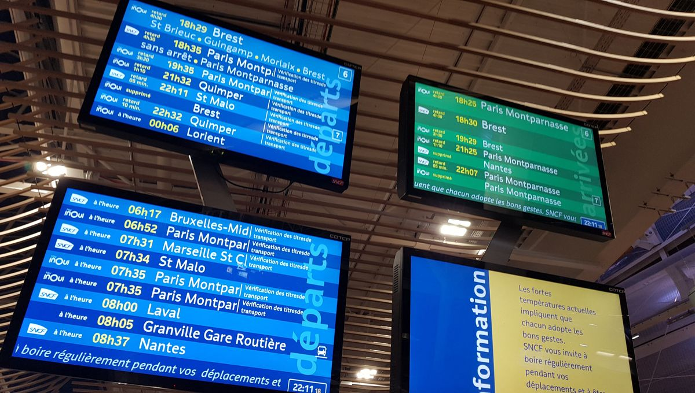

# CIEL2 - Affichage des trains en temps réel

**Épreuve pratique - Durée : 2 heures**



## Contexte

Vous venez d'être missioné en urgence sur un projet en cours dans une entreprise spécialisée en systèmes embarqués pour le transport public. Votre collègue développeur, actuellement en congé maladie, travaillait sur une démonstration pour un client important : **la SNCF**.

Le projet consiste en un **affichage dynamique des départs de trains** sur une base ESP32, avec **un système d'alertes visuelles** lors d'un passage de train sur une voie. La démonstration doit avoir lieu cet après-midi, et votre responsable vous charge de finaliser le travail.

## Consignes générales

**Ressources** :

- Vous avez le droit d'utiliser **Internet** pour consulter la documentation officielle de LVGL, FreeRTOS, Arduino ou tout autre site qui vous semble pertinent.
- **L'usage d'outils à base d'IA générative type : ChatGPT, Copilot, BlackBoxAI, MistralAI, Gemini, Grok etc. est strictement interdit**.

**Critères d'évaluation** :

- **Fonctionnalité** : Le programme doit compiler et doit correspondre au cahier des charges.
- **Qualité du code** : Lisibilité, respect des bonnes pratiques vues en cours (gestion des erreurs, pas de fuite mémoire, mutualisation du code, usage limité des variables globales).
- **Respect des consignes** : Compléter uniquement les parties demandées.

**Matériel nécessaire** :

- Carte **M5Stack Core2** ou **CoreS3**
- Un cable USB **Type-C**

## Structure du programme

### Code déjà en place :

- **Initialisation de LVGL et FreeRTOS** : Configuration de l'affichage, création des queues et des sémaphores.
- **Affichage du tableau des départs** : La tâche `taskDeparturesRender` gère l'affichage des horaires.
- **Genération de fausses alertes de voies** : La tâche `taskTrackUpdateMock` génère une alerte de voie toutes les minutes.
- **Gestion des alertes visuelles** : La fonction `create_alert_msgbox` crée une boîte de dialogue pleine écran.
- **Mise à jour de LVGL** : La tâche `taskLvglUpdate` s'occupe des rafraîchissements graphiques.

**Vous ne devez pas modifier ces parties (en théorie)**.

### Descriptions des tâches

**Gestion des horaires des trains** : Le système simule et affiche les horaires des trains via deux tâches FreeRTOS qui communiquent via une file d'attente.

- **`taskDeparturesUpdateMock`** génère un jeu de données test avec 5 trains (ex: TER 89569 à destination de Rennes à 15h15) et met à jour aléatoirement un départ toutes les 10 secondes (ajout de 10 minutes) pour simuler des retards, puis envoie ces informations dans la queue `departure_queue`

- **`taskDeparturesRender`** récupère ces données via la queue `departure_queue` et les affichent dans un tableau LVGL stylisé (alternance bleu clair/bleu foncé SNCF), assurant une présentation claire et lisible des identifiants, destinations et horaires des trains.

**Gestion des alertes des voies** : Le système simule et affiche les alertes des trains via deux tâches FreeRTOS qui communiquent via une file d'attente.

- **`taskTrackUpdateMock`** simule la détection de passages de trains en envoyant un numéro de voie dans la queue `track_alert_queue` toutes les minutes.

- **`taskTrackRender`** affiche une alerte pleine écran pendant 10 secondes si un message correspondant au numéro de voie est présent dans la queue `track_alert_queue`. Elle ne fait rien le reste du temps.

## Travail à finaliser

Heureusement, nous avons pu récupérer la base de code de votre collègue. Il semble que 80% du programme soit déjà fait.

Des notes ont été laissées pour vous guider et voici le travail restant :

### 1\. Implémenter la tâche de simulation des mise à jour des départs (`taskDeparturesUpdateMock`)

**Objectif** : Simuler des mises à jour des horaires (en attendant les accès à l'API de la SNCF). La simulation se contente d'ajouter du retard à certains départs.

**Étapes** :

- Créer un jeu de données de test (un tableau en C) avec 5 trains (ex: TER 89569 à destination de Rennes départ à 14h46).
- Initialiser l'afficheur avec ces données (envoi d'un message par horaire dans la queue).
- Simuler des retards aléatoires (ajout de 10 minutes toutes les 10 secondes à un train au hasard).
- Envoyer ces retards dans la queue pour mise à jour de l'affichage.

> Vous pouvez bien entendu adapter ce traitement pour le rendre plus proche de la realité.

Détail de la structure `Departure`

```c
typedef struct
{
  int id; // Identifiant du départ (0, 1, 2, 3, 4, etc.)
  char train_id[16]; // Identifiant du train (TER 7890, etc. sur 15 charactères)
  char destination[32]; // Destination du train (un nom de ville sur 31 charactères)
  time_t time; // Heure et minute : (h * 3600) + (m * 60) Exemple pour 15h30 : (15 * 3600) + (30 * 60) 
} Departure;
```

### 2\. Implémenter la tâche de gestion des alertes (affichage) (`taskTrackRender`)

**Objectif** : Afficher des alertes visuelles lors des passages de trains. L'écran affiche uniquement les alertes qui concernent sa voie.

**Étapes** :

- Lire la queue des alertes envoyées par le système de détection (lui aussi simulé).
- Afficher une alerte en plein écran pendant 10 secondes s'il s'agit d'une alerte qui concerne la voie actuelle.

Les fonctions `ui_show_alert_cb` et `ui_close_alert_cb` permettent d'afficher/cacher une alerte en plein écran.

Exemple d'utilisation des fonctions `ui_show_alert_cb` et `ui_close_alert_cb` :

```c
// Pour afficher l'alerte 
lv_async_call(ui_show_alert_cb, NULL);


// Pour cacher l'alerte 
lv_async_call(ui_close_alert_cb, NULL);
```

Vous retrouverez les notes, détaillants les étapes 1 et 2, sous la forme de commentaires dans le code.

Les modifications à effectuer concernent uniquement le fichier `src/main.cpp` et sont dans la zone délimitée par les commentaires `// DEBUT DU CODE A COMPLETER` et `// FIN DU CODE A COMPLETER`. Cependant, il est fortement recommandé de lire le reste du code pour s'en inspirer et être sûr de bien comprendre le travail demandé.

## Livrables attendus

**Code source complet** :

- Un fichier `.cpp` avec les fonctions `taskDeparturesUpdateMock` et `taskTrackUpdateMock` implémentées.
- Le code doit compiler sans erreur sur PlatformIO.

**Rendu** : À la fin de la séance, déposez votre code dans le dépôt Microsoft Teams (nom du fichier : `main_NOM_Prenom.cpp`).

**Démonstration fonctionnelle** :

- Une démonstration de votre programme avant de quitter la salle.

## Barème de notation (sur 20)

Note sur 20 | Niveau d'exigence associé
----------- | ------------------------------------------------------------------------------------------------------------------------------------------------------------------------------------------------------------------------------------------
0 à 9       | Code incomplet ou non fonctionnel ; Erreurs de compilation ou d'exécution bloquantes
10 à 14     | Une tâche principale correctement implémentée ; L'autre tâche partiellement implémentée ou avec des bugs mineurs ; Structure correcte mais peu optimisée
15 à 17     | Les deux fonctions principales sont implémentées et fonctionnelles ; Pas d'erreurs d'exécution ; Code commenté et lisible ; Respect des bonnes pratiques (gestion des erreurs, mutualisation du code, usage limité des variables globales)
18 à 20     | Toutes les fonctionnalités sont implémentées et opérationnelles ; Gestion robuste des cas limites ; Code parfaitement commenté et documenté ; Correction des éventuels écarts entre le cahier des charges et le code existant

## Ressources utiles

- [Documentation officielle LVGL](https://docs.lvgl.io/master/)
- [Documentation FreeRTOS](https://www.freertos.org/)
- [Référence Arduino/M5Stack](https://docs.m5stack.com/)
