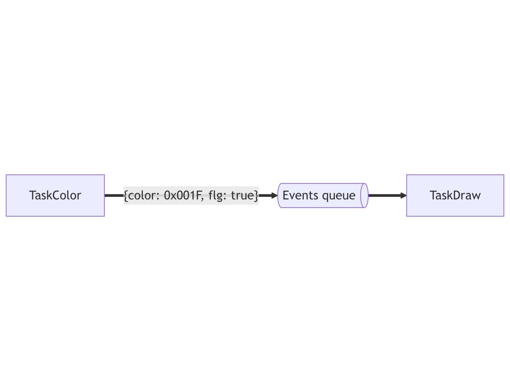

# TP - From Super Loop to FreeRTOS

L'objectif de ce TP est de montrer l'intérêt d'un **RTOS** pour gérer plusieurs tâches sur un système embarqué.

## 1\. Gestion du temps sans RTOS

> Ce TP se réalise en utilisant l'outil PlatformIO (si vous ne savez plus créer un projet : [s2-1-1_TP_hello_m5stack](/CIEL2/S2-1_LangageC/s2-1-1_TP_hello_m5stack) {.is-info}

***1.1** - À partir du programme ci-dessous, faites en sorte que le carré **bleu** clignote toutes les **secondes** et le carré **rouge** toutes les **trois secondes**.*

```c++
#include <Arduino.h>
#include <M5GFX.h>
#include <M5Unified.h>

M5GFX display;

bool flg_red = false;
bool flg_blue = false;

void setup(void) {
  auto cfg = M5.config();

  M5.begin(cfg);

  display = M5.Display;
  display.begin();
  display.clear();
}

void loop(void) {
  M5.update();

  flg_red = !flg_red;
  flg_blue = !flg_blue;

  display.startWrite();

  display.fillRect(50, 50, 50, 50, flg_red ? TFT_RED : TFT_BLACK);
  display.fillRect(100, 50, 50, 50, flg_blue ? TFT_BLUE : TFT_BLACK);

  display.display();
  display.endWrite();

  delay(1000);
}
```

Deux approches possibles :

- **Time slicing** : cadencer la superloop (ex. 100 ms) et compter le temps écoulé.
- **Non‑blocking timing** : utiliser `millis()` pour déclencher sans bloquer avec `delay()`.

***1.2** - Quels sont les inconvénients de cette méthode ? Donnez des cas où cette approche n'est pas possible.*

***1.3** - Que se passe‑t‑il si on appelle la fonction suivante dans la boucle principale ?*

```c++
void http_task_with_delay() {
  if (WiFi.status() == WL_CONNECTED) {
    HTTPClient http;
    http.begin("https://httpbin.org/delay/5");
    int code = http.GET();

    if (code > 0) {
      String payload = http.getString();
      Serial.printf("[HTTP] Code: %d, Réponse: %.50s...\n", code, payload.c_str());
    } else {
      Serial.printf("[HTTP] Erreur: %s\n", http.errorToString(code).c_str());
    }

    http.end();
  } else {
    Serial.println("[HTTP] WiFi non connecté");
  }
}
```

Si pas de WiFi disponible :

```c++
void http_task_with_delay_sadder() {
  unsigned long d = random(10, 10000);
  delay(d);
}
```

> **Observation :** tant qu'une fonction bloquante s'exécute, **tout** le programme est gelé. À mesure que le projet grandit, la logique devient difficile à maintenir et certains cas non‑triviaux peuvent mettre le système en défaut. {.is-info}

--------------------------------------------------------------------------------

## 2\. Passage au temps réel

L'ajout d'une tâche dépendante d'un élément extérieur (ici une attente réseau) risque de rendre notre programme non déterministe. En effet, la fréquence de mise à jour de l'état des rectangles ne dépend plus uniquement du temps qui s'écoule, mais aussi du temps de traitement de la requête.

L'utilisation d'un OS temps réel est alors nécessaire pour garantir le respect des temps d'exécution de chaque tâche.

> Un système déterministe est un système qui réagit toujours de la même façon à un événement.

***2.1** - Avant de rendre le code compatible FreeRTOS, listez les tâches à accomplir par le système (3 attendues) :*

- ...
- ...
- ...

### Création d'une tâche FreeRTOS

Dans FreeRTOS, une tâche est une fonction avec une boucle infinie :

```c++
void TaskRed(void* pv) {
  // Initialisation
  for (;;) {
    // Code de la tâche
  }
}
```

> En fait il s'agit de l'architecture superloop, mais, dédiée à une tâche spécifique. {.is-info}

Une fois la tâche écrite, il faut demander à FreeRTOS de créer une instance de cette tâche (l'exécuter) à l'aide de la fonction `xTaskCreate`:

```c++
#include <Arduino.h>
#include <M5GFX.h>
#include <M5Unified.h>

M5GFX display;

void TaskRed(void* pv) {

  for (;;) {
  }
}

void setup(void) {
    auto cfg = M5.config();
    M5.begin(cfg);

    display = M5.Display;

  display.begin();
  display.clear();

  xTaskCreate(TaskRed,  "RedTask",  8192, nullptr, 2, nullptr);
}

void loop(void) {
    M5.update();
  // loop est aussi vu comme une "tâche" on peut l'ignorer pour le moment 
}
```

> Documentation utile : [xTaskCreate (FreeRTOS API Reference)](https://www.freertos.org/Documentation/02-Kernel/04-API-references/01-Task-creation/00-TaskHandle) {.is-info}

***2.2** - En partant du squelette ci-dessus, implémentez la logique pour faire clignoter **et** dessiner le carré rouge.*

***2.3** - Ajoutez une seconde tâche pour faire clignoter **et** dessiner le carré bleu.*

***2.4** - Qu'est‑ce qui vous semble problématique dans ce code ? Qu'est‑ce qui ne vous plaît pas ?*

> Piste : collisions d'accès à l'écran (I²C/SPI), besoin de sérialiser l'affichage, etc. {.is-info}

### Partage de ressource

Lorsque deux tâches partagent la même ressource (ici l'écran), des accès concurrents peuvent provoquer :

- artefacts (transactions SPI entremêlées),
- blocages si l'API n'est pas thread‑safe,
- tearing si des écritures se chevauchent.

Quand ce genre de cas se présente, on peut utiliser un mécanisme de **mutex** pour "privatiser" l'accès à la ressource ou, plus simple ici :

**Une unique tâche dédiée à l'affichage**.

On obtient, alors, la liste de tâches suivante :

1. une tâche qui change l'état du carré rouge
2. une tâche qui change l'état du carré bleue
3. une tâche qui fait la requête HTTP très lente
4. une tâche qui dessine les deux carrés

***2.5** - Adaptez les tâches 1 et 2 pour ne plus dessiner directement et écrivez une tâche 4 `TaskDraw` qui affiche les deux carrés en lisant leurs états.*

--------------------------------------------------------------------------------

## 3\. Améliorer son code à l'aide des tâches paramétrables

Un des principes fondamental en qualité logicielle, est le principe DRY (**D**on't **R**epeat **Y**ourself) : l'idée est de mutualiser et de réutiliser un maximum le code pour éviter d'augmenter la charge de travail de maintenance.

***3.1** - Selon-vous, lesquels des tâches précentes peuvent être fusionnées en une seule tâche ?*

Sur FreeRTOS il est possible de passer des arguments à une tâche pour modifier un peu son comportement.

***3.2** - Quels sont les paramètres nécessaires ? Définissez une structure de données permettant de contenir ces paramétres.*

Exemple de tâche paramétrable avec FreeRTOS :

```c++
#include <Arduino.h>
#include <M5Unified.h>

typedef struct TaskColorParams
{
  unsigned int period;
  String message;
} TaskColorParams_t;

TaskColorParams_t paramsBlue;
TaskColorParams_t paramsRed;

void TaskColor(void *pvParameters)
{
  TaskColorParams_t *params = (TaskColorParams_t *)pvParameters;
  int periodInTicks = pdMS_TO_TICKS(params->period);

  for (;;)
  {
    Serial.println(params->message);
    vTaskDelay(periodInTicks);
  }
}

void setup()
{
  auto cfg = M5.config();

  M5.begin(cfg);

  Serial.begin(115200);

  paramsBlue.period = 1000;
  paramsBlue.message = "I'm blue";

  paramsRed.period = 3000;
  paramsRed.message = "I'm red";

  xTaskCreate(TaskColor, "La tâche bleue", 1000, &paramsBlue, 1, NULL);
  xTaskCreate(TaskColor, "La tâche rouge", 1000, &paramsRed, 1, NULL);
}

void loop()
{
  M5.update();

  vTaskDelay(1000);
}
```

Une deuxième recommandation, en qualité logicielle, est **d'utiliser au minimum les variables globales**

***3.3** - Modifier le code précedent pour ne pas utiliser de variables globales. Attention, n'oubliez pas les règles associées à la gestion de la mémoire ...*

> Pour rappel : en langage C, une variable définie en dehors de tout bloc est une variable globale. {.is-info}

## 4\. Producteur et consommateur

L'objectif de cette partie et de mettre en place une structure "producteur-consommateur" afin de :

- Normaliser la manière dont les données sont échangées entre les différentes tâches.
- Eviter la dépendance entre les paramètres de `TaskDraw` et les paramètres de `TaskColor`.

Pour la mise en place de cette structure il est nécessaire de créer une file d'attente partagée entre la tâche `TaskColor` et la tâche `TaskDraw`.



***4.1** - Avant de commencer à coder, demandez-vous quelles données vont transiter dans la file d'attente (quelle sera la structure d'un message)*

Voici un exemple de pseudo-code FreeRTOS permettant la mise en place d'une file d'attente :

```c
static QueueHandle_t xTempQueue;

static void vTaskTempSensor(void *pvParameters) {
    float temp;

    for (;;) 
    {
      temp = PollTempSensor();

      xQueueSend(
        xTempQueue, 
        &temp, 
        pdMS_TO_TICKS(10)
      );

      vTaskDelay(pdMS_TO_TICKS(2000));
    }
}

static void vTaskSendTemp(void *pvParameters)
{
    float temp;

    for (;;) 
    {
      BaseType_t result = xQueueReceive(
        xTempQueue, 
        &temp, 
        portMAX_DELAY
      );

      if (result == pdPASS) {
        SendTempToCloud(temp);
      }
    }
}

void setup(void) 
{    
  auto cfg = M5.config();

  M5.begin(cfg);

  Serial.begin(115200);

  xTempQueue = xQueueCreate(10, sizeof(float));

  xTaskCreate(vTaskTempSensor, "TempRead",  256, NULL, 2, NULL);
  xTaskCreate(vTaskSendTemp,"TempSend", 256, NULL, 1, NULL);
}

void loop(void)
{
  M5.update();

  vTaskDelay(1000);
}
```

***4.2** - Adaptez votre programme pour que `TaskColor` et `TaskDraw` communiquent par le biais d'une file d'attente en lieu et place de variables partagées. Faites en sorte que la file d'attente utilise le moins d'espace mémoire possible.*

***4.3** - Adaptez la vitesse de consommation de `TaskDraw` pour que l'affichage ne soit mis à jour que lors d'un changement d'état.*

--------------------------------------------------------------------------------

## 5\. Arrêt d'urgence

Les tâches que nous avons vu jusqu'a présent sont similaires :

- elles s'executent périodiquement ;
- elles ont la même priorité.

Nous allons ajouter une troisième tâche qui a pour objectif de piloter l'activation du carré bleue.

On souhaiterait implémenter cette tâche "d'arrêt d'urgence" avec deux fonctionnement possibles :

- Une tâche périodique qui scrute l'appuie sur un bouton tactile.
- Une tâche déclenchée via une interruption, lorsqu'un bouton est appuyé (tactile ou non).

> Avec la carte M5 StickC on pourra utiliser le bouton principal en lieu et place de l'écran tactile. {.is-info}

_Version bouton tactile scruté_

***5.1** - Ajoutez une tâche `TaskControl` qui affiche un message sur la liaison serie lorsqu'un bouton tactile est appuyé.*

> Documentation du module "Touch" de la carte M5Stack Core 2 : <https://docs.m5stack.com/en/arduino/m5unified/touch_class> {.is-info}

***5.2** - Maintenant que le bouton est opérationnel, utiliser les fonctions `vTaskResume` et `vTaskSuspend` pour activer ou désactiver la tâche bleue.*

> Référez-vous à la documentation officielle de FreeRTOS pour comprendre le fonctionnement de ces deux nouvelles fonctions : <https://www.freertos.org/Documentation/02-Kernel/04-API-references/02-Task-control/06-vTaskSuspend> {.is-info}

_Version bouton tactile via interruption_

Cette version doit utiliser le principe d'interruption : <https://fr.wikipedia.org/wiki/Interruption_(informatique>).

***5.3** - Sur quel GPIO devez-vous brancher une interruption pour déclencher une ISR lorsque l'écran tactile est touché ?*

***5.4** - FreeRTOS ne propose de solution standardisée pour brancher une interruption. En vous appuyant sur la documentation du framework Arduino, branchez une interruption sur le bon GPIO et validez le fonctionnement de l'ISR.*

Pour garantir le respect des **règles d'ordonnancement** lors de l'utilisation d'une interruption, il est nécessaire de mettre en place une structure de "Deferred interrupt handling" : <https://www.freertos.org/Documentation/02-Kernel/02-Kernel-features/11-Deferred-interrupt-handling>.

***5.4** - Mettez en place cette structure et faites en sorte que le code de traitement de l'appui reste dans la tâche `TaskControl`.*
