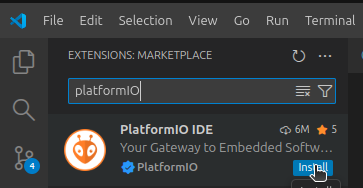
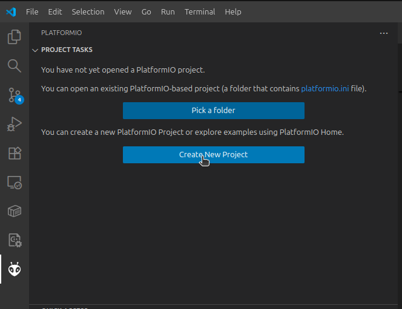
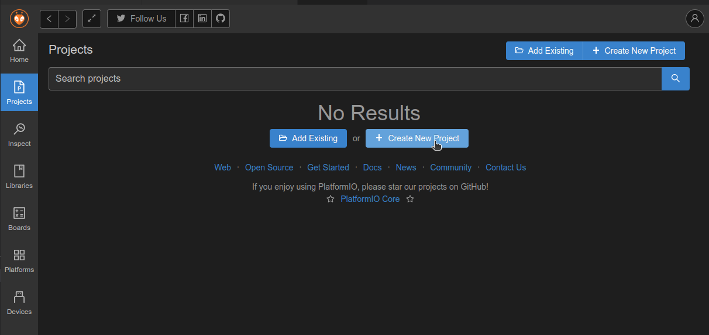
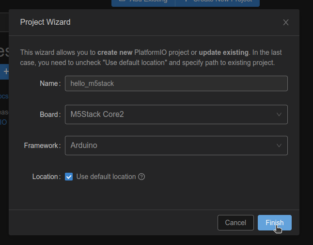
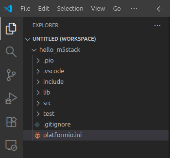
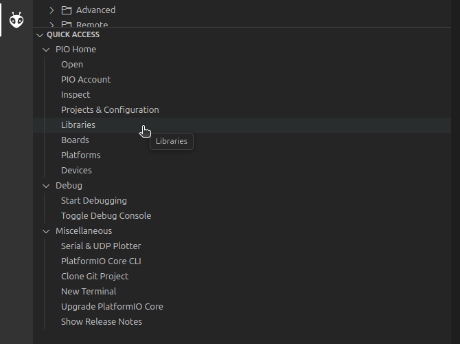
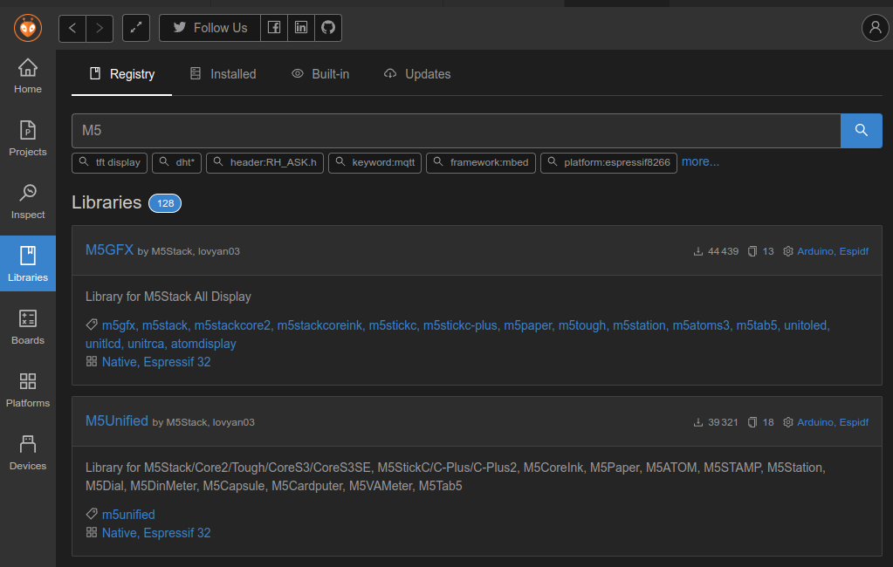
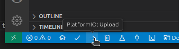
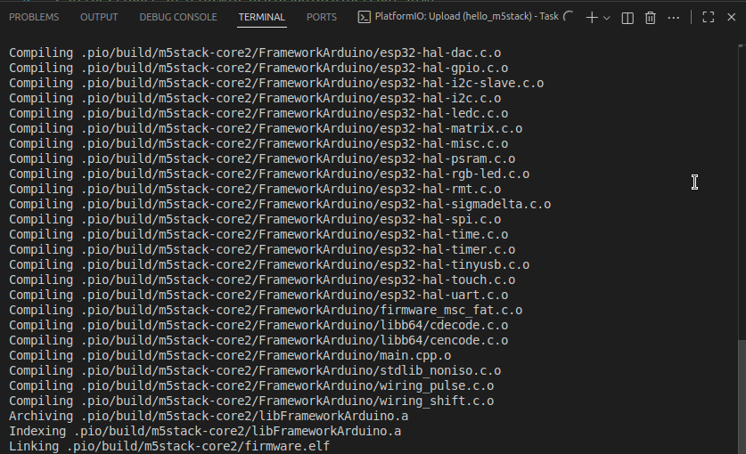
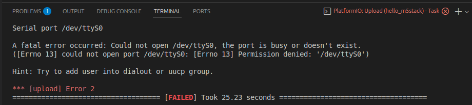

# Découverte de PlatformIO et de M5Stack

{.align-center}

## Présentation des outils

Nous utilisons PlatformIO intégré à Visual Studio Code comme environnement de développement. PlatformIO facilite la programmation embarquée en gérant automatiquement la compilation, le téléversement du code et les bibliothèques nécessaires.

Le projet s’appuie sur le framework Arduino, qui simplifie l’accès au matériel grâce à une interface de programmation claire et des fonctions prêtes à l’emploi comme digitalWrite() ou delay(). Ce framework est ici adapté au microcontrôleur ESP32, un composant puissant et économe en énergie fabriqué par Espressif, intégrant le Wi-Fi et le Bluetooth.

La carte M5Stack, utilisée dans ce TP, repose sur un ESP32 et regroupe dans un boîtier compact un écran, des boutons et des connecteurs. La librairie M5Stack permet de contrôler facilement ces éléments depuis le code Arduino.

### Installation de PlatformIO

PlateformeIO est fourni sous forme d'extension à l'IDE Visual Studio Code. Cette formule permet, à l'équipe de développement de PlatformIO, de se concentrer sur  le développement d'outils pour l'embarqué et de laisser la partie édition de code à une équipe spécialisée (principe DRY).

{.align-center}

Une fois l'extension installée, vous devez cliquer sur la tête d'alien sur la barre latérale gauche pour initialiser l'extension :

{.align-center}

> la première fois l'initialisation peut prendre un peu de temps, elle se termine par un rédémarrage de VSCode. {.is-info}

## Hello World!

Avant de commencer à développer, vous devez créer un nouveau projet. Cliquez sur la tête d'alien sur la barre latérale gauche puis cliquez sur "Create New Project" et enfin "Create New Project" dans le menu "Projects" :

{.align-center}

{.align-center}


Utilisez la configuration suivante : 

- Nom du projet : `hello_m5stack`
- Board (carte) : `M5Stack Core 2`
- Framework : `Arduino`

{.align-center}

Une fois le projet créé il devrait s'ouvrir automatiquement dans l'espace de travail de VSCode (workspace, sur la gauche) : 

{.align-center}

> Par défaut, PlatformIO créer les projets dans le dossier : `~/Documents/PlatformIO/` {.is-info}

### Structure d'un projet PlatformIO

**Arborescence d’un projet PlatformIO :**

- *src/*
    - Contient le code source principal du projet (ex. `main.cpp`).
    - C'est principalement dans ce dossier que vous interviendrez.
    - C’est ici que l’on écrit les fonctions setup() et loop() dans un projet Arduino.

- *include/*
    - Regroupe les fichiers d’en-tête (.h) pour déclarer fonctions, constantes ou classes partagées.

- *lib/*
    - Contient les bibliothèques locales propres au projet.
    - Chaque sous-dossier correspond à une librairie indépendante.

- *test/*
    - Dossier optionnel pour les tests unitaires.
    - Permet de valider automatiquement certaines parties du code.

- *.pio/*
    - Dossier généré et géré automatiquement par PlatformIO.
    - Contient les fichiers de build, binaires et dépendances.
    - Ne doit pas être modifié manuellement.

- *platformio.ini*
    - Fichier de configuration du projet.
    - Définit la carte, le framework, la plateforme matérielle et les options de compilation.
    - Exemple :

```ini
[env:m5stack-core2]
platform = espressif32
board = m5stack-core2
framework = arduino
```

> Pour le moment, ce fichier contient la configuration par défaut. En fonction de l'évolution de nos besoins, il sera nécessaire de modifier certains paramètres. {.is-info}

### Installation de la bibliothèque M5Unified

Pour utiliser des fonctions spécifiques à la carte M5Stack Core 2, il est nécessaire d'ajouter au projet la bibliothèque fournie par le fabricant : 

{.align-center}

Cherchez `M5` et installez `M5GFX` et `M5Unified` : 

{.align-center}

> M5 a regroupé les bibliothèques de ses différentes cartes dans une seule et même bibliothèque nommée `M5Unified` qui elle-même dépend de `M5GFX`. Faites attention de bien installer ces deux bibliothèques et non pas `M5Stack` ou `M5Core2` {.is-warning}

| Bibliothèque  | Statut                  | Rôle principal                                                                             | Cible                                               |
| ------------- | ----------------------- | ------------------------------------------------------------------------------------------ | --------------------------------------------------- |
| **M5Stack**   | Ancienne / remplacée | Support initial des premières cartes M5Stack (Basic, Gray, Fire)                           | ESP32 (anciens modèles)                             |
| **M5Core2**   | Ancienne / remplacée | Ajout du support spécifique du modèle Core2                                                | M5Stack Core2                                       |
| **M5GFX**     | Active               | Gestion graphique (affichage, polices, sprites, etc.) ultra-optimisée                      | Tous les appareils M5                               |
| **M5Unified** | Active               | Framework unifié qui gère automatiquement l’écran, les boutons, le son, les capteurs, etc. | Tous les modèles récents (Core, Core2, Tough, etc.) |


Recopiez le programme suivant dans le fichier `main.cpp` du dossier `src`:

```cpp
#include <M5Unified.h>

void setup() {
    auto cfg = M5.config();

    M5.begin(cfg);

    auto &disp = M5.Display;

    disp.setTextSize(2);
    disp.setTextColor(TFT_YELLOW);
    disp.setCursor(80, 0);
    disp.println("Hello World !");
}

void loop() {
    M5.update();
}
```

Pour compiler et téléverser le programme (le déposer sur la carte) utilisez les actions rapides en bas à gauche : 

{.align-center}

Lors du premier lancement, PlatformIO doit compiler les bibliothèques tiers, cela peut prendre un peu de temps : 

{.align-center}

## Troubleshooting

Me solliciter si vous avez l'erreur suivante lors de la compilation : 

{.align-center}

## Liens 

- Documentation de PlatformIO [https://docs.platformio.org/en/latest/what-is-platformio.html](https://docs.platformio.org/en/latest/what-is-platformio.html)