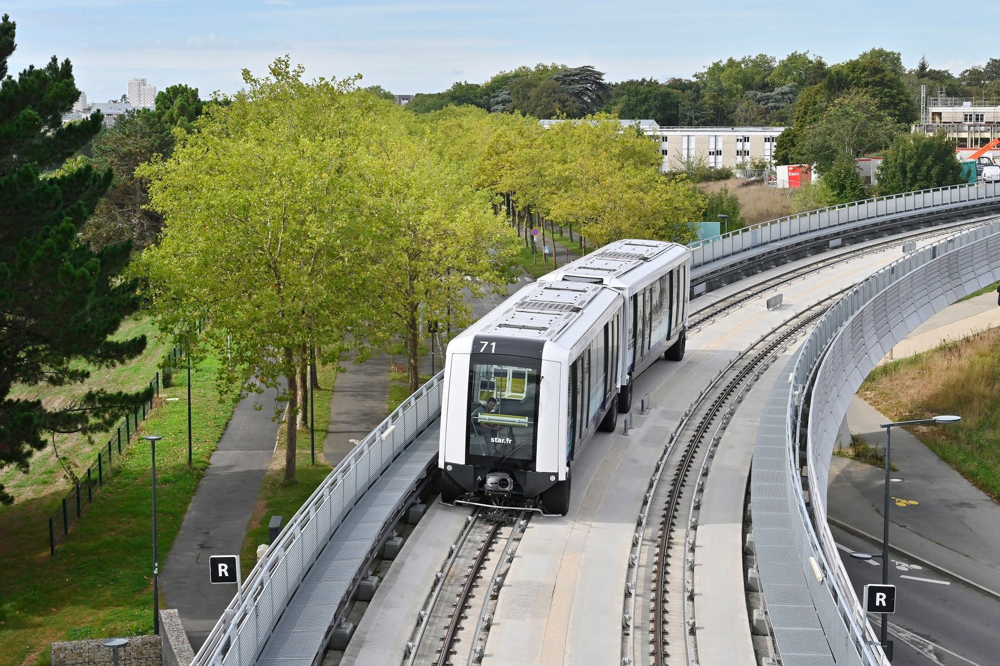
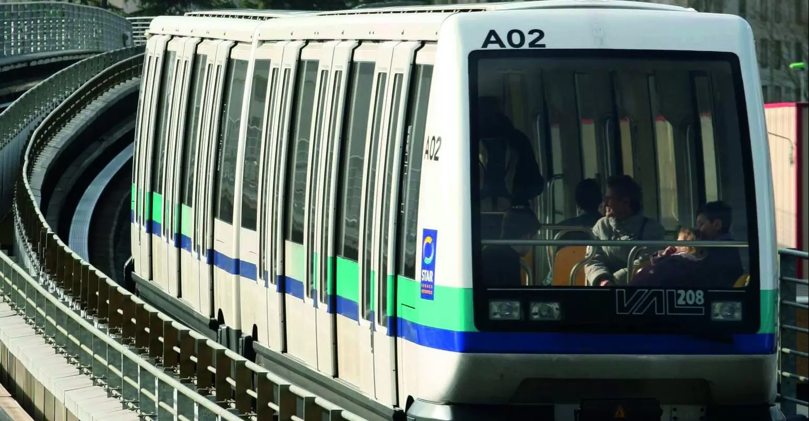
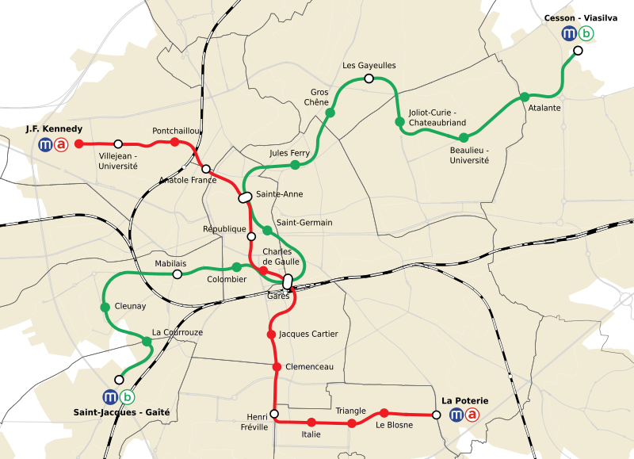
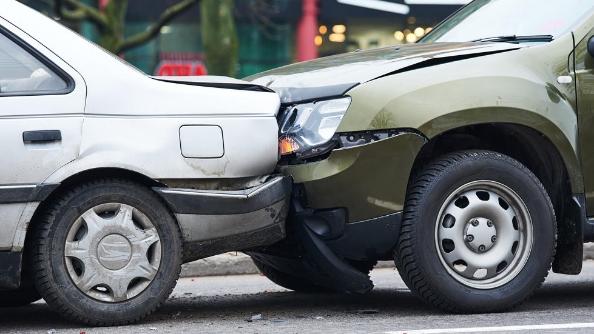
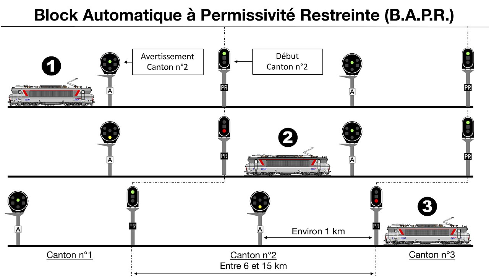
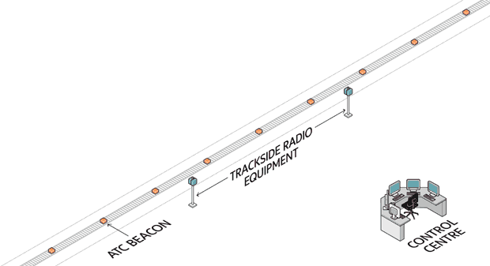

# RTOS - Étude de cas : VAL Néoval

_BTS CIEL_

--------------------------------------------------------------------------------

# Présentation du métro de Rennes

- Ligne A (VAL 206/208) – mise en service 2002
- Ligne B (Néoval CBTC) – mise en service 2022
- Métro 100 % automatique sans conducteur
- Un système temps réel complexe : sécurité, confort, supervision

--------------------------------------------------------------------------------

# Lignes A & B – Chiffres clés

- Deux lignes fréquentés par ~ 59 millions de passagers (2023).
- 55 rames en service
- Emploie ~ 200 personnes

Ligne | Matériel roulant | Longueur | Stations | Mise en service | Technologie
----- | ---------------- | -------- | -------- | --------------- | ----------------------
**A** | VAL 208          | 9.4 km   | 15       | 2002            | Cantons fixes
**B** | Néoval (Siemens) | 14.1 km  | 15       | 2022            | CBTC (cantons mobiles)

--------------------------------------------------------------------------------

--------------------------------------------------------------------------------

# Gestion des collisions

**Canton fixe (Ligne A – VAL 208)**

- Voie divisée en **sections isolées (cantons)**
- 1 seule rame par canton
- Détection de présence par circuit de voie
- Communication unidirectionnelle (tapis de transmission)
- Espacement constant = débit limité

**Canton mobile (Ligne B – Cityval Communication Based Train Control)**

- Chaque rame connaît sa **position exacte** (odométrie, balises)
- Communication radio bidirectionnelle en continu
- "Bulle de sécurité" adaptative (f(v))
- Espacement variable = débit optimisé

--------------------------------------------------------------------------------

## Gestion des collisions - Canton fixe

--------------------------------------------------------------------------------

## Gestion des collisions - Canton mobile

--------------------------------------------------------------------------------

# Temps réel dur VS souple

Exemple            | Type     | Temps réel | Délai max | Conséquence si dépassé
------------------ | -------- | ---------- | --------- | --------------------------
Freinage d'urgence | Sécurité | **Dur**    | < 100 ms  | Collision possible
Ouverture portes   | Sécurité | **Dur**    | < 200 ms  | Risque chute passager
Contrôle vitesse   | Traction | **Dur**    | < 100 ms  | Dérive position/espacement
Info voyageurs     | Confort  | **Souple** | 1–2 s     | Affichage erroné
Climatisation      | Confort  | **Souple** | 10 s      | Inconfort passager

--------------------------------------------------------------------------------

# Capteurs et actionneurs Néoval

Élément                        | Type       | Temps réel | Rôle
------------------------------ | ---------- | ---------- | --------------------------
Tachymètre / Odométrie         | Capteur    | Dur        | Calcul vitesse et position
Capteurs portes                | Capteur    | Dur        | Vérif avant départ
Capteurs obstacle / collision  | Capteur    | Dur        | Détection sécurité
Capteurs pression pneus        | Capteur    | Dur        | Détection dégonflement
Accéléromètres / inclinomètres | Capteur    | Souple     | Confort, diagnostic
Actionneur traction / freinage | Actionneur | Dur        | Commande de mouvement
Actionneurs portes             | Actionneur | Dur        | Synchronisation quai
Éclairage, climatisation       | Actionneur | Souple     | Confort passager

--------------------------------------------------------------------------------

# Gestion centralisée

L'ensemble de ces capteurs et actionneurs sont gérés par un **système centralisé**.

Ce système doit communiquer à l'aide de **protocoles** avec :

- les capteurs et actionneurs présents dans la rame

  - portes, traction, freinage, etc.

- les capteurs et actionneurs présents en dehors de la rame (sur les quais et la voie)

  - détection collision chasse-corps, positions des portes du quais, vitesse, etc.

- les autres rames (système CBTC)

- le **P**oste de **C**ontrôle **C**entralisé (PCC)

  - surveillance vidéo, énergie, position des rames, incidents, etc.

--------------------------------------------------------------------------------

# Gestion centralisée

--------------------------------------------------------------------------------

# Protocoles de communication

Niveau                    | Protocole                             | Usage
------------------------- | ------------------------------------- | --------------------------------------------
**Embarqué (rame)**       | MVB / CAN                             | Liaison automates, capteurs, traction, frein
**Rame et voie (Néoval)** | CBTC (Wi‑Fi industriel redondé)       | Position, vitesse, autorisations
**Rame et PCC**           | Ethernet industriel / TCP‑IP sécurisé | Supervision, télémesures
**Infodivertissement**    | Ethernet / Wi‑Fi local                | Écrans, audio

--------------------------------------------------------------------------------

# Références

- Wikipédia – _Métro de Rennes_, _VAL_, _Neoval_
- Siemens Mobility – _Cityval automated metro system_
- Keolis Innovation – _Cadencement capacitif à Rennes_
- ENSAM – _Thèse J.-N. Verhille sur le VAL 206_
- IEC 61375 – _Train Communication Network (WTB/MVB)_
- What is CBTC ? <https://www.youtube.com/watch?v=_1Bgmugve5M>
