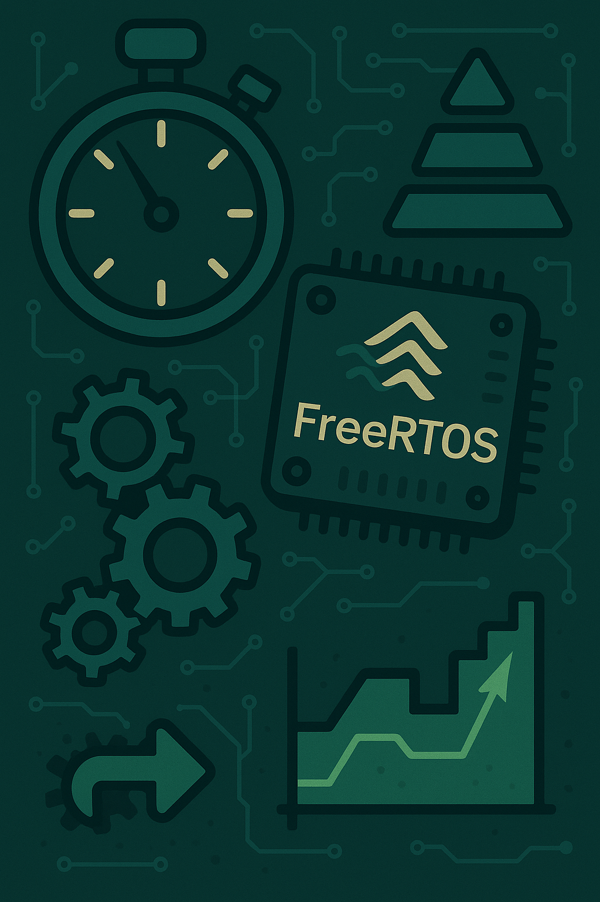
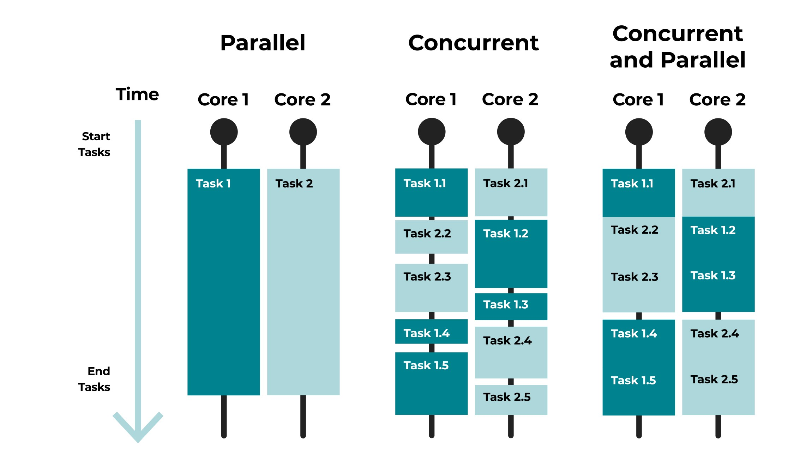
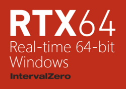
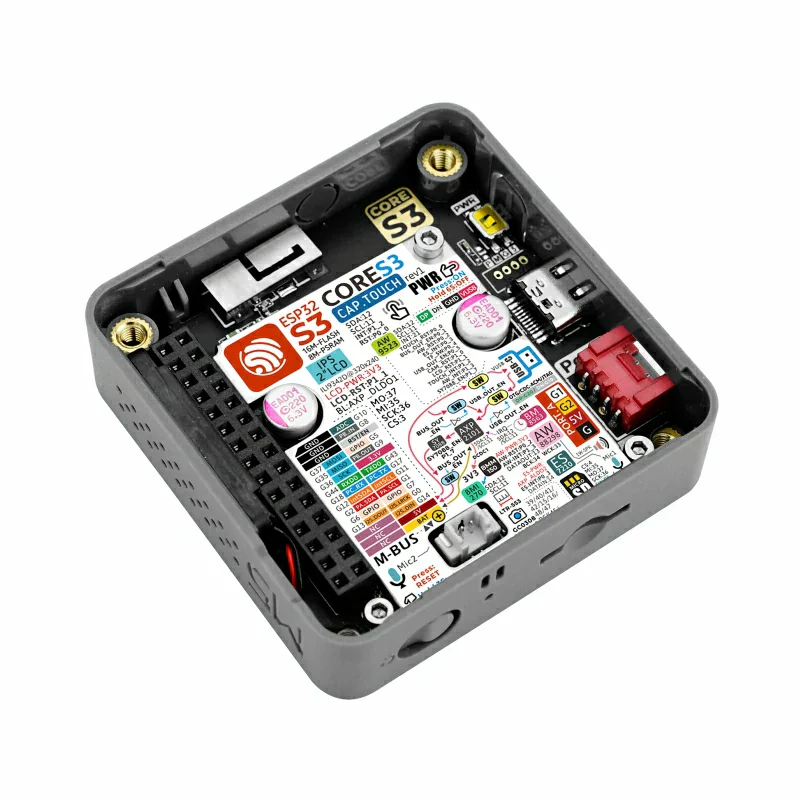
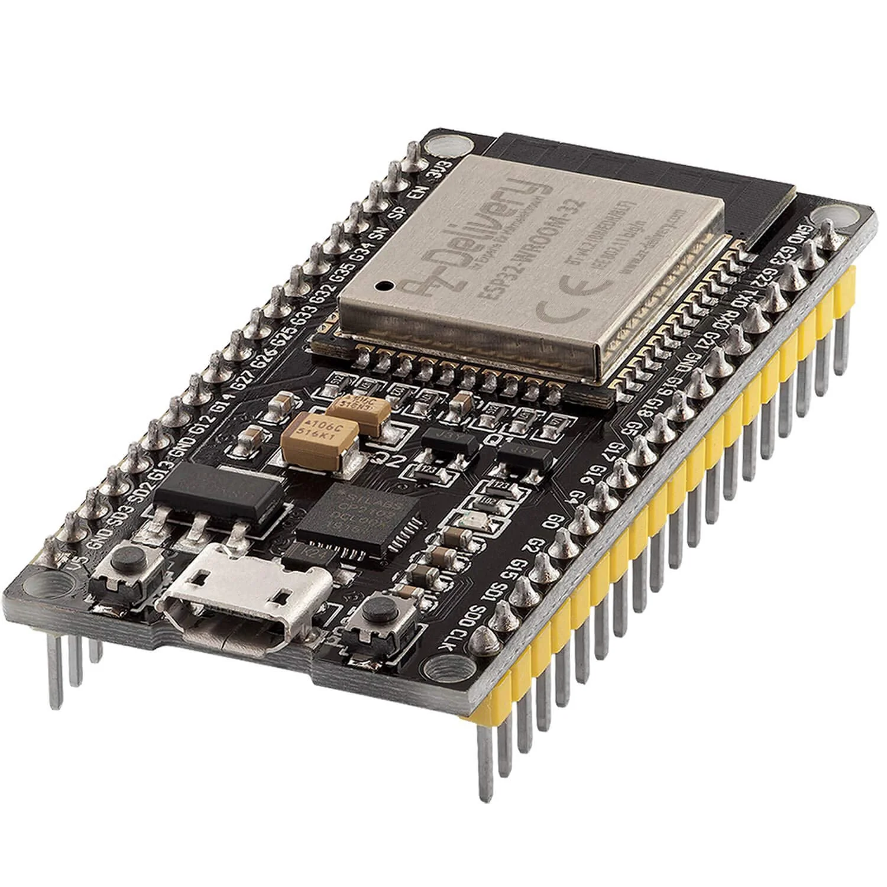
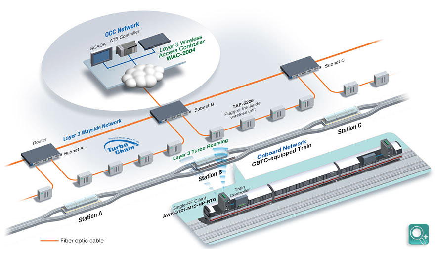

# RTOS - Introduction à FreeRTOS

_BTS CIEL_

--------------------------------------------------------------------------------

## Sommaire

- Programmation et système temps réel
- Illustration : commande `time`
- FreeRTOS
- ESP32 et M5Stack
- Cybersécurité

--------------------------------------------------------------------------------

## Programmation et système temps réel

La programmation temps réel est un moyen de garantir le respect du temps d'exécution d'une tâche.

Ce type de programmation est nécessaire dans certains secteurs :

- l'industrie de production
- l'aéronautique
- l'automobile
- le médical

> Wikipédia : Les systèmes temps réel prennent en compte des contraintes temporelles dont le respect est aussi important que l'exactitude du résultat.

--------------------------------------------------------------------------------

## Programmation et système temps réel

### Concurrence VS Parallélisme

--------------------------------------------------------------------------------

## Programmation et système temps réel

### Concurrence VS Parallélisme

- Concurrence : le CPU alterne les instructions de plusieurs tâches pour **simuler l'exécution de deux tâches en même temps**. Le CPU ne peut exécuter qu'une seule instruction à la fois.
- Parallélisme : pour que deux tâches s'exécutent réellement en parallèle il faut **au minimum deux CPUs** (cœur / thread).

> ℹ️ Le vrai parallélisme est utilisé (et nécessaire) uniquement pour des enjeux de performances (répartir la charge de travail).

--------------------------------------------------------------------------------

## Illustration : commande `time`

La commande `time` sous Linux permet d'obtenir le temps d'exécution d'un programme :

- `real` : c'est le temps total écoulé (du point de vue de l'utilisateur)
- `user` : temps passé dans l'espace utilisateur (le code du programme que l'on exécute)
- `sys` : temps passé en mode noyau (kernel mode), les appels systèmes.

--------------------------------------------------------------------------------

## Illustration : commande `time`

**I/O Bound :** le programme prend du temps à se terminer car il attend les périphériques tiers (disque dur, réseau, etc.)

**CPU Bound :** le programme prend du temps à se terminer car il exécute des instructions complèxe (calcul 3D, grande compléxité, etc.)

--------------------------------------------------------------------------------

## Programmation et système temps réel

Les "Real-Time Operating System" (RTOS) sont des OS spécialisés offrant un environnement simple et **déterministe**.

Ils intègrent **moins de fonctionnalités** (beaucoup moins !) que les OS généralistes (GPOS), mais, garentissent le respect des priorités des différentes tâches que doit réaliser le système.

> ℹ️ Un **système déterministe** est un système qui réagit toujours de la même façon à un événement

--------------------------------------------------------------------------------

## Programmation et système temps réel

### Ordonnancement et préemption

La majorité des OS modernes ont un ordonnancement préemptif : L'ordonnanceur choisit la tâche / le processus qui est en cours d'exécution à un instant T.

La différence entre un RTOS et un GPOS se trouve au niveau du choix de la tâche :

- RTOS : une tâche peut être interrompue si une tâche **plus prioritaire** devient prête (la priorisation des tâches est à la main du programmeur)

- GPOS : tous les processus sont mis en concurrence via un ordonnanceur complexe qui garantit à la fois **équité et réactivité**

> ℹ️ Sur un GPOS il est très compliqué de prédire la tâche qui sera en cours d'exécution à un instant T.

--------------------------------------------------------------------------------

## Programmation et système temps réel

Deux niveaux de temps réel :

- **le temps réel strict (hard)** : la contrainte de temps est associée à une situation critique voire catastrophique.

  - système de freinage d'urgence
  - surveillance de capteurs (avion, centrale nucléaire)

- **le temps réel souple (soft)** : la contrainte de temps est associée à de la pénibilité / mauvaise expérience pour l'utilisateur.

  - IHM (attention un bouton d'arrêt d'urgence correspond à la catégorie strict)
  - latence réseaux

--------------------------------------------------------------------------------

## Programmation et système temps réel

Concrètement :

1. On définit la liste

  - des tâches que doit réaliser le système
  - des événements aux quels le système doit réagir

2. On définit la priorité de chaque tâche / événement

3. On partage le temps (time-slicing) que doit accorder l'OS à chaque tâche

4. On programme le système en utilisant un RTOS

--------------------------------------------------------------------------------

## Programmation et système temps réel

![center ](https://mermaid.ink/svg/pako:eNp1VNtu2zgQ_ZUBH7YuEHtNyTfpzem6RYFkk1puswgMFIw0tbiRKJWksnaCAP2IfkAfm-_wn_RLOlRkR063eiDEy5kzc-aQdywuEmQhszLHTCpcKgArbYYwX5xF8AecSFWtwWJeGtDbB8zgx5evoLHcftdoIJXGFlp-rui_k2iRC9iFerlULhoPJh6E8O7vf2pkqTGXDgs3qI0sFHTeVULZKoeo-GT_E7QTbQwRmpcNfNSlYUwxPqwvCn1tfhfnQqoE5pLmDTIYh7BINYrkt9yzNS0aAyfFSsY1zOv3vS4NPhG-1oi1Dg4dU_nbByiFJpI4FTqBY6H1pgGNHGjsJvUXwqtUXsmz6M_54v_JW0ej99GsUXqmLOpSS0MdQJHBgtQE3q9DXAlDCZhKw_l8Njs9X3ycLxr2iWMPnmn0JAhoEadom_TfEkf2COR9AnLeatDByeNMxNfHSFVCB9fd-dvTRiM-cLgh4Vok8yK-RrtLFZ1L6kLKglImS5W6-Jf2L7FMN_osaiI54XhbuN1-HUgoVai4SScTjUqvi0olwh6qeNCtaS5uqcGZUDHuJvsDnelFBOQxcltiUlnuinIq8gD2MQ_Lq02wfUjaKsL2GyzO37QR09uKmtz2nZNUWEheHLitDnIqY10YMj5BH5PwnPs8v1XXsxRE_LmSpkZPSytvWidncSZLc0heCmPECgEVUOUrNE61Gr073QrgLNd1FxjeX1V0KcHzev0BnCyiZx5-MwVxg_EvRvScLzzni6edGioVeWpFVwhEBarY0PjYyg4pSNlYqSFB1-FRj3vUEHbEVlomLPwkMoNHLEedCzdnd45qyWyKOS5ZSL-ZXKV2yZbqnlClUJdFkbPQ6opwuqhW6T5KVZJt8C8pVvRW7VdFZYtoo-L9AsVg4R1bs7A7HI17Iz4cehOPewEf-kdsw8Jg3POHwWjscz4Z-35_cn_EbmtW3gu4z4f94WAS-IPAH_k71lki6a3cc2A9PX18f-tnmJJFlaB-Re62LPQGI37_E7Ty35c)

Anciens systèmes – Enjeux modernes: <https://www.windriver.com/>

--------------------------------------------------------------------------------

## Programmation et système temps réel

### What about Windows ?

--------------------------------------------------------------------------------

## FreeRTOS

FreeRTOS est un système d'exploitation temps réel open source distribué sous licence **MIT**.

Rachat par **Amazon AWS** en 2017 : Stratégie "From Cloud to IoT"

> FreeRTOS : <https://www.freertos.org/>

> Amazon AWS : <https://aws.amazon.com/fr/freertos/>

> Mesurer l'importance d'AWS (2025) : <https://info.flexera.com/CM-REPORT-State-of-the-Cloud?lead_source=Organic%20Search>

--------------------------------------------------------------------------------

## FreeRTOS

Principales fonctionnalités :

- Ordonnancement préemptif ou coopératif
- Attribution de priorités aux tâches
- Files d'attente (queues)
- Sémaphores binaires et à compteurs
- Mode sans tick pour les applications à très basse consommation (sur certaines architectures)

> AWS ajoute d'autres fonctionnalités liées au cloud par le biais de bibliothèques optionnelles <https://www.freertos.org/Documentation/03-Libraries/04-AWS-libraries/01-Introduction>

--------------------------------------------------------------------------------

## FreeRTOS

- FreeRTOS se présente sous la forme de sources (fichiers) écrits en langage C.

- L'OS est entièrement téléversé sur la mémoire de la carte embarquée comme un programme "classique".

- FreeRTOS nécessite très peu de ressources pour fonctionner :

  - 25 MHz CPU
  - 64 KB RAM

--------------------------------------------------------------------------------

## ESP32 et M5Stack

**ESP32** est un microcontrôleur offrant des capacités inégalées pour son prix (< 3€) :

- Processeur

  - Dual-core Xtensa LX6 (jusqu'à 240 MHz)
  - Versions plus récentes avec RISC-V (ex. ESP32-C3, ESP32-C6)

- 520 KB SRAM interne

- Flash externe typiquement 4 MB (SPI NOR Flash)

- **Wi-Fi 802.11 b/g/n**

- **Bluetooth 4.2 / BLE 5.0 (selon versions)**

- GPIO (jusqu'à 34)

- ADC, DAC, PWM

- **UART, SPI, I2C, I2S, CAN**
- Capteurs capacitifs tactiles intégrés

--------------------------------------------------------------------------------

## ESP32 et M5Stack

Comparaison avec d'autres modèles :

Puce                       | Points forts                                 | Points faibles
-------------------------- | -------------------------------------------- | ------------------------------------------------------
ESP32                      | Wi-Fi + BT intégrés, puissant, pas cher      | Consommation plus élevée qu'un STM32 ultra-low power
STM32                      | Large gamme, très fiable, faible conso       | Pas de Wi-Fi/BT natif, prix plus élevé pour équivalent
Arduino (AVR)              | Simplicité, communauté historique            | Très limité en puissance et connectivité
Raspberry Pi Pico (RP2040) | Très flexible, double core ARM M0+, pas cher | Pas de Wi-Fi/BT intégré (sauf version W)

> En détails : <https://www.ic-components.fr/blog/What-Makes-RP2040,ATMEGA328,ESP32,and-STM32-Unique.jsp>

--------------------------------------------------------------------------------

## ESP32 et M5Stack

M5Stack (Core 2) est un kit de développement basé sur la plateforme ESP32.

C'est un ESP32 avec des capteurs et actionneurs en plus.

Caractéristique   | **ESP32**                                   | **M5Stack Core2**
----------------- | ------------------------------------------- | ----------------------------------
Nature            | Puce / SoC (**S**ystem **O**n **C**hip) MCU | Kit tout-en-un basé sur ESP32
Connectivité      | Wi-Fi + Bluetooth                           | Wi-Fi + Bluetooth
Mémoire           | ~520 KB SRAM interne             s           | 16 MB Flash + 8 MB PSRAM
Écran             | N/A                                         | LCD tactile 2.0"
Batterie intégrée | N/A                                         | 390 mAh
Capteurs intégrés | N/A                                         | Accéléro, RTC, micro, haut-parleur
Prix              | 3–5 €                                       | 40–50 €
Usage typique     | Intégration embarquée / produit final       | Prototypage, démo, éducation, IoT

--------------------------------------------------------------------------------

## ESP32 et M5Stack

  

  

  

  

  

--------------------------------------------------------------------------------

## Cybersécurité

