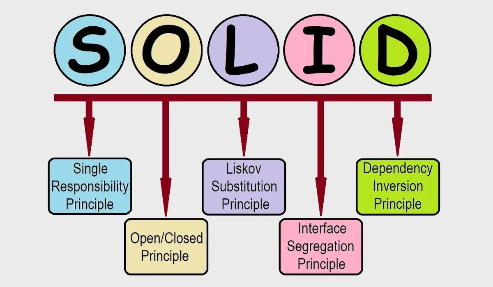
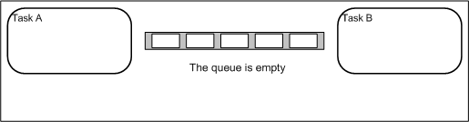
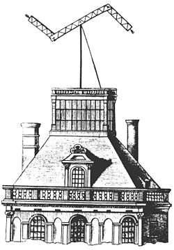
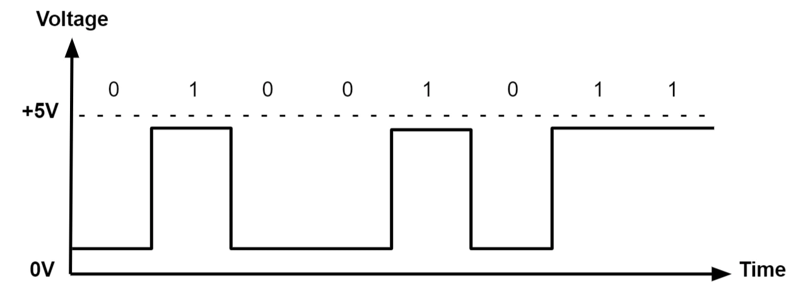

# FreeRTOS - Communication inter-tâches

_BTS CIEL_


--------------------------------------------------------------------------------

## Single Responsibility Principle



> **SOLID** est un acronyme regroupant cinq principes de conception destinés à produire des architectures logicielles plus **compréhensibles, flexibles et maintenables**

--------------------------------------------------------------------------------

## Single Responsibility Principle

_Définition :_

Le principe de responsabilité unique (**SRP**) encourage à structurer votre programme en unités ou modules dont chacun possède **une seule raison de changer**, c'est-à-dire une responsabilité clairement définie.

Un exemple que vous connaissez bien :

- **TaskRed, TaskBlue** : doivent changer uniquement si l'on souhaite modifier la **fréquence de clignotement**.
- **TaskDraw** : doit changer uniquement si l'on souhaite modifier la manière dont sont **représentés les carrés à l'écran** (couleur, forme, ...).

> Autrement dit : si vous souhaitez que votre code gagne en maintenabilité il faut correctement isoler chaque élément.

--------------------------------------------------------------------------------

<style scoped="">section{font-size:24px;}</style>

## Architecture distribuée

_Définition :_

Une architecture distribuée est un **système où plusieurs composants** d'un **même programme** s'exécutent sur des **machines ou dispositifs différents** pour accomplir une **tâche commune**.

À l'heure de l'IoT, votre code peut s'exécuter sur :

- la carte principale,
- un processeur dédié (**edge computing**),
- le cloud ou un backend distant,
- ou encore une autre carte MCU.

Votre application devient alors **distribuée**.

Comment préparer votre programme à **ces évolutions** ? → En appliquant le principe de responsabilité unique (SRP) (entre autre).


--------------------------------------------------------------------------------

## Problématique

L'architecture distribuée introduit une nouvelle problématique centrale : **la communication entre les différents composants du système**.

- _Comment faire communiquer des tâches entre elles ?_

- _Comment faire communiquer des noeuds d'un système distribué entre eux ?_


--------------------------------------------------------------------------------

## Mémoire partagée

La solution primaire, pour permettre à des tâches de communiquer, est la mise en place de **variables communes**.

Si le programme fonctionne dans un **unique processus** (mono-core) il n'y a que des avantages :

- Rapidité / efficacité (stockage en RAM)
- Simplicité de mise en oeuvre

Mais, certaines **limites** existent :

- Structure du programme complexe.
- Ne convient plus en **exécution multi-coeur**.
- La gestion de la mémoire peut se complexifier (aliasing de pointeur, etc.).
- N'aide **pas** si l'on veut évoluer vers une **architecture distribuée**.


--------------------------------------------------------------------------------

## File d'attente (queue)

Les queues sont des **structures de données** fournies par FreeRTOS pour permettre la communication **inter-tâches**.

Elles servent à transmettre **des messages (données ou événements)** :

- Entre tâches
- Entre interruptions et tâches

Elles assurent :

- Un ordonnancement **FIFO**
- Une synchronisation fiable entre **producteurs et consommateurs**
- Une gestion **thread-safe** intégrée (accès concurrent sécurisé)

Il s'agit d'une **mémoire partagée et contrôlée**, conçue pour éviter **les erreurs classiques de synchronisation**.

--------------------------------------------------------------------------------

## File d'attente

Fonctionnement schématisé :



--------------------------------------------------------------------------------

## File d'attente

### Producteur et consommateur

Les files d'attentes FreeRTOS (`xQueueCreate`) sont généralement utilisées dans un modèle **producteur-consommateur** :

- Le producteur est une tâche qui **crée des données** : lecture d'un capteur, appui sur un bouton, ...
- Le consommateur **utilise les données** : transfère vers un autre système, activation d'un actionneur, ...

> Une tâche peut très bien avoir le rôle de consommateur et de producteur (transformeur ? )


--------------------------------------------------------------------------------

## File d'attente

### Gestion de la mémoire

La mémoire utilisée par la file d'attente est **automatiquement gérée par le kernel FreeRTOS**.

Les messages envoyés dans la file d'attente sont **copiés** dans un espace mémoire dédié :

- Le producteur et le consommateur **ne partagent pas la mémoire**.
- Les messages d'une taille importante peuvent causer des problèmes de performance.
- Pour optimiser, on peut **transmettre un pointeur** plutôt que les données complètes.

> En fait c'est exactement la même problématique que le passage de paramètres d'une fonction en C 🙃

--------------------------------------------------------------------------------

## File d'attente

### Exemple : capteur de température


**SRP** est respecté :

- La **TaskTemp** se concentre sur la mesure via le capteur.
- La **TaskSendCloud** se concentre sur l'envoi vers la BDD.

--------------------------------------------------------------------------------

## File d'attente

### Exemple : capteur de température


Grâce à la file d'attente il est trivial d'ajouter un **traitement intermédiaire** sans briser le **SRP**.

--------------------------------------------------------------------------------

## File d'attente

### Exemple : capteur de température


Il est aussi plus simple de mettre en place des architectures plus complèxes.

--------------------------------------------------------------------------------

<style scoped="">section{font-size:22px;}</style>

## API FreeRTOS

### Créer une file d'attente avec `xQueueCreate`

Les _queues_ (files d'attente) permettent d'échanger des données entre tâches de manière **contrôlée** en **FIFO**.

```c
QueueHandle_t xQueueCreate(
    UBaseType_t uxQueueLength,
    UBaseType_t uxItemSize
);
```

Exemple : créer une file d'attente de 10 entiers :

```c
QueueHandle_t xQueue = xQueueCreate(10, sizeof(int));
```

> ℹ️ Si la file d'attente ne peut pas être allouée (manque de RAM), `xQueueCreate` retourne `NULL`.

> ## ℹ️ La création de la file d'attente doit se faire une seule fois.

--------------------------------------------------------------------------------

<style scoped="">section{font-size:20px;}</style>

## API FreeRTOS

### Envoyer un message avec`xQueueSend`

Permet d'envoyer une donnée dans la file d'attente (depuis une tâche).

```c
BaseType_t xQueueSend(
    QueueHandle_t xQueue,
    const void *pvItemToQueue,
    TickType_t xTicksToWait
);
```

Exemple :

```c
int value = 42;
xQueueSend(xQueue, &value, portMAX_DELAY);
```

La tâche appelante (**productrice**) peut :

- attendre que la file d'attente ait de la place,
- ou échouer immédiatement si `xTicksToWait = 0`.

> ℹ️ Une file d'attente pleine régule naturellement les tâches productrices (_back-pressure_).

--------------------------------------------------------------------------------

<style scoped="">section{font-size:18px;}</style>

## API FreeRTOS

### Recevoir un message avec`xQueueReceive`

Permet à une tâche de lire un élément de la file d'attente (blocant ou non).

```c
BaseType_t xQueueReceive(
    QueueHandle_t xQueue,
    void *pvBuffer,
    TickType_t xTicksToWait
);
```

Exemple :

```c
int value;
xQueueReceive(xQueue, &value, portMAX_DELAY);
```

Si la file d'attente est vide, la tâche (**consommatrice**) peut :

- **bloquer** en attente d'un message,
- ou retourner immédiatement si `xTicksToWait = 0`.

> ℹ️ Les files d'attente font office de **mécanisme de synchronisation** : une tâche consommatrice dort tant qu'un message n'est pas disponible.

--------------------------------------------------------------------------------

<style scoped="">section{font-size:18px;}</style>

## API FreeRTOS

### Utilisation depuis une **ISR** avec `xQueueSendFromISR`

Pour envoyer un message depuis une **interruption**, il faut utiliser une version dédiée :

```c
BaseType_t xQueueSendFromISR(
    QueueHandle_t xQueue,
    const void *pvItemToQueue,
    BaseType_t *pxHigherPriorityTaskWoken
);
```

Exemple :

```c
void ISR_Handler(void)
{
    int event = 1;
    BaseType_t xWoken = pdFALSE;

    xQueueSendFromISR(xQueue, &event, &xWoken);

    portYIELD_FROM_ISR(xWoken);
}
```

> ⚠️ Important : une interruption n'est pas encaspulée dans une tâche FreeRTOS, il ne faut pas y mettre de traitement bloquant.

> ⚠️ Important : les versions _FromISR_ sont non bloquantes et doivent être utilisées exclusivement dans les interruptions.

--------------------------------------------------------------------------------

<style scoped="">section{font-size:22px;}</style>

## API FreeRTOS

### Vider, consulter ou supprimer une file d'attente

**Vider la queue :**

```c
xQueueReset(xQueue);
```

**Voir si elle est pleine ou vide :**

```c
unsigned int nb_messages = uxQueueMessagesWaiting(demo_queue);
unsigned int nb_spaces = uxQueueSpacesAvailable(xQueue);
```

**Supprimer la queue :**

```c
vQueueDelete(xQueue);
```

> ⚠️ Toute file d'attente supprimée ne doit plus jamais être utilisée ensuite.

> ⚠️ Les files d'attente sont coûteuses en RAM : attention aux tailles d'items et à la profondeur.

--------------------------------------------------------------------------------

<style scoped="">
  section {
    font-size: 18px;
    display: grid;
    grid-template:
      "title title" auto
      "center center" auto
      "left   right" 1fr
      / 1fr 1fr;
    gap: 0 1rem;
    align-items: start;
  }

  section > h2 {
    grid-area: title;
  }

  section > pre:nth-of-type(1) {
    grid-area: center;
  }

  section > pre:nth-of-type(2) {
    grid-area: left;
  }

  section > pre:nth-of-type(3) {
    grid-area: right;
  }
</style>

## API FreeRTOS - Exemple : capteur de température

```c
static QueueHandle_t xTempQueue;

void main_app(void) {
    xTempQueue = xQueueCreate(10, sizeof(float));

    xTaskCreate(vTaskTempSensor,  "TempRead",  256, NULL, 2, NULL);
    xTaskCreate(vTaskSendTemp,"TempSend", 256, NULL, 1, NULL);

    vTaskStartScheduler();
}
```

```c
static void vTaskTempSensor(void *pvParameters) {
    float temp;

    for (;;) {
        temp = PollTempSensor();

        xQueueSend(
          xTempQueue, 
          &temp, 
          pdMS_TO_TICKS(10)
        );

        vTaskDelay(pdMS_TO_TICKS(2000));
    }
}
```

```c
static void vTaskSendTemp(void *pvParameters) {
    float temp;

    for (;;) {
        BaseType_t result = xQueueReceive(
          xTempQueue, 
          &temp, 
          portMAX_DELAY
        );

        if (result == pdPASS) {
          SendTempToCloud(temp);
        }
    }
}
```

--------------------------------------------------------------------------------

## Interruption (rappel)

L'interruption est une **suspension temporaire** de l'exécution d'un programme afin d'exécuter un **programme prioritaire** lors d'un événement :

- Tick d'horloge (timer)
- Changement d'état sur une broche GPIO
- Réception de données (UART, SPI, I2C...)
- Détection d'erreurs (watchdog, mémoire...)

Le programme exécuté se nomme **ISR** (**I**nterrupt **S**ervice **R**outine).

Les interruptions sont un mécanisme clé du temps réel : elles garantissent une réaction rapide aux événements externes.

> Sur FreeRTOS le changement tâche (tick interrupt) est basé sur ce même principe.

--------------------------------------------------------------------------------

## Interruption (rappel)


--------------------------------------------------------------------------------

## Sémaphore

Le sémaphore est un autre mécanisme de **synchronisation** permettant de **coordonner l'exécution de plusieurs tâches**.

Contrairement à une file d'attente, il n'est **pas destiné à transporter des données**, mais uniquement à **signaler des événements** ou **garantir l'accès exclusif** à une ressource partagée.

Un sémaphore peut être utilisé pour protéger une **zone critique** :

- Seule la tâche qui parvient à le prendre peut accéder à la ressource.
- Une fois l'opération terminée, la tâche doit le libérer afin de permettre aux autres tâches de poursuivre.



--------------------------------------------------------------------------------

## Sémaphore

### Deferred interrupt handling

Le "Deferred interrupt handling" est un schéma d'usage courant avec FreeRTOS :

- Une interruption matérielle exécute une **ISR**
- L'ISR se contente de lever un sémaphore
- Une tâche, **en attente sur ce sémaphore** (bloquée), est débloquée et **réalise le traitement associé**

Ce modèle présente deux avantages majeurs :

- Le traitement de l'interruption hérite d'une **priorité contrôlée par l'ordonnanceur**
- Le code métier peut être écrit dans une tâche plutôt que dans l'ISR, réduisant le temps passé en interruption

--------------------------------------------------------------------------------

<style scoped="">section{font-size:22px;}</style>

## API Arduino

### Interruption avec `attachInterrupt`

Permet d'appeler une **ISR** lorsqu'un événement matériel survient sur une broche d'interruption.

```c
attachInterrupt(digitalPinToInterrupt(pin), isrFunction, mode);
```

Mode peut prendre une des valeurs suivantes : `LOW`, `FAILLING`, `RISING`, `CHANGE`.

Exemple :

```c
void onButtonPress() { 
  // Code pour traiter l'appui sur le bouton 

}
// Dans la fonction d'initialisation 
attachInterrupt(digitalPinToInterrupt(2), onButtonPress, RISING);
```

> ⚠️ Dans une ISR, il faut à tout prix éviter un traitement bloquant.

--------------------------------------------------------------------------------

## API Arduino

### Interruption avec `attachInterrupt`



--------------------------------------------------------------------------------

## API FreeRTOS

### Créer un sémaphore binaire `xSemaphoreCreateBinary`

Permet de créer un **sémaphore binaire** pour synchroniser des tâches ou une tâche avec une ISR.

```c
SemaphoreHandle_t xSemaphoreCreateBinary(void);
```

Exemple :

```c
SemaphoreHandle_t xSem;

xSem = xSemaphoreCreateBinary();
```

> ℹ️ Le sémaphore est initialement **non donné** : la tâche devra attendre qu'il soit libéré.

--------------------------------------------------------------------------------

<style scoped="">section{font-size:22px;}</style>

## API FreeRTOS

### Prendre un sémaphore avec `xSemaphoreTake`

Permet à une tâche d'attendre qu'un sémaphore soit disponible (blocant ou non).

```c
BaseType_t xSemaphoreTake(
    SemaphoreHandle_t xSemaphore,
    TickType_t xTicksToWait
);
```

Exemple :

```c
xSemaphoreTake(xSem, portMAX_DELAY);
```

Si le sémaphore n'est pas donné, la tâche peut :

- **bloquer** en attente (`portMAX_DELAY`)
- **retourner immédiatement** (`xTicksToWait = 0`)

> `xSemaphoreGiveFromISR()` dans une ISR → réveille la tâche qui attendait l'évènement matériel

--------------------------------------------------------------------------------

<style scoped="">
  section {
    font-size: 18px;
    display: grid;
    grid-template:
      "title title" auto
      "center center" auto
      "left   right" 1fr
      / 1fr 1fr;
    gap: 0 1rem;
    align-items: start;
  }

  section > h2 {
    grid-area: title;
  }

  section > pre:nth-of-type(1) {
    grid-area: center;
  }

  section > pre:nth-of-type(2) {
    grid-area: left;
  }

  section > pre:nth-of-type(3) {
    grid-area: right;
  }
</style>

## API FreeRTOS - Exemple : Deferred interrupt handling

```c
SemaphoreHandle_t xBinSemaphore;

const int PIN_SENSOR = 2;

void main_app(void) {
    xBinSemaphore = xSemaphoreCreateBinary();

    xTaskCreate(vTaskSensor, "TaskSensor", 256, NULL, 3, NULL);

    attachInterrupt(digitalPinToInterrupt(PIN_SENSOR), ISR_Sensor, FALLING);

    vTaskStartScheduler();
}
```

```c
void ISR_Sensor(void)
{
    BaseType_t xHigherPriorityTaskWoken = pdFALSE;

    xSemaphoreGiveFromISR(
      xBinSemaphore, 
      &xHigherPriorityTaskWoken
    );

    portYIELD_FROM_ISR(xHigherPriorityTaskWoken);
}
```

```c
static void vTaskSensor(void *pvParameters)
{
    for (;;)
    {
        BaseType_t result = xSemaphoreTake(xBinSemaphore, portMAX_DELAY);
        if (result == pdTRUE)
        {
            ProcessSensorData();
        }
    }
}
```
