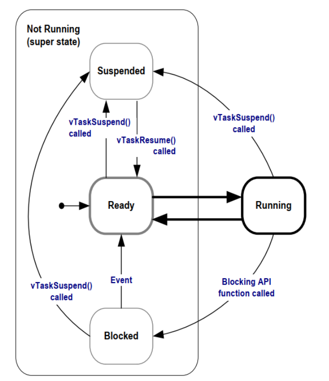
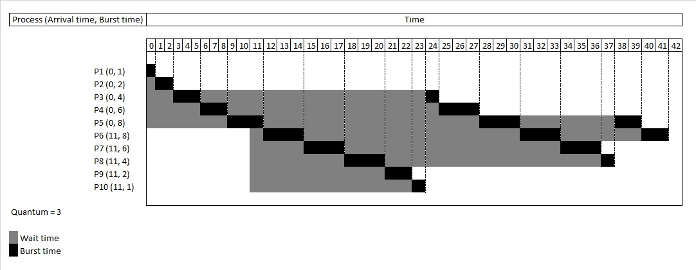

# FreeRTOS - Gestion des tâches

_BTS CIEL_


--------------------------------------------------------------------------------

## Sommaire

- Architecture Super Loop
- Instruction bloquante
- Tâche et ordonnancement

  - Tick interrupt
  - Événement externe
  - Blocage volontaire

- API FreeRTOS

  - `xTaskCreate`
  - `vTaskSuspend` / `vTaskResume`
  - `vTaskDelay`
  - `vTaskDelete`


--------------------------------------------------------------------------------

<style scoped="">
  section {
    display: grid;
    grid-template:
      "title title" auto
      "resume resume" auto
      "left   right" 1fr
      "bq bq" auto
      / 1fr 1fr;
    gap: 0 1rem;
    align-items: start;
  }

  section > h2 {
    grid-area: title;
  }

  section > p {
    grid-area: resume;
  }

  section > pre:nth-of-type(1) {
    grid-area: left;
  }

  section > pre:nth-of-type(2) {
    grid-area: right;
  }

  section > blockquote {
    grid-area: bq;
  }
</style>

## Architecture Super Loop

Il s'agit de l'architecture la plus simple à mettre en place lorsque l'on développe sans OS (_Bare-metal_) :

```c
int main()
{
  // 1 - initialisation
  for(;;) // boucle infinie
  {
    // 2 - traitement en continu
  }

  return 0;
}
```

```c
// Framework Arduino
void setup()
{
  // 1 - initialisation
}

void loop()
{
  // 2 - traitement en continu
}
```

> Convient pour les cas d'usages les plus simples. Attention de ne pas "bloquer" la boucle.

--------------------------------------------------------------------------------

## Instruction bloquante

Une instruction bloquante est une instruction dont l'évolution n'est pas directement liée au calcul effectué par le CPU, mais par des **événements extérieurs**.

Quelques exemples :

- Attendre un délai (`delay(2000)`)
- Attendre une réponse à une requête HTTP
- Attendre le traitement d'un processeur tier ou d'un périphérique (GPU, réponse I2C, ...)
- Attendre l'écriture d'une donnée en mémoire ou sur le disque

Attendre **==** le CPU ne fait rien (**cycles perdus**)

> ℹ️ Beaucoup de programmes sont en réalité limités par les I/O du système et non pas par les performances du CPU.

--------------------------------------------------------------------------------

## Instruction bloquante

Parfois c'est explicite :

```c++
void loop() {
    // delay()
    digitalWrite(led, HIGH);
    delay(1000);  // bloque 1 seconde
    digitalWrite(led, LOW);
    delay(1000);  // bloque encore 1 seconde

    // attente active ---
    Serial.println("Appuie sur le bouton pour continuer...");
    while (digitalRead(button) == HIGH) {
        // tant que le bouton n'est pas appuyé => tout est bloqué
        // les tours de boucles sont des cycles CPU perdus !
    }
}
```

--------------------------------------------------------------------------------

## Instruction bloquante

Parfois ça l'est moins :

```c++
void loop() {
    // un appel HTTP sur M5Stack

    HTTPClient http;
    http.setTimeout(8000);
    logLine("HTTP GET: " + String(TEST_URL));

    if (!http.begin(TEST_URL)) {
        return;
    }

    int code = http.GET();  // appel bloquant (attend connexion, envoi, reponse)
    if (code > 0) {
        String payload = http.getString(); // aussi bloquant jusqu’a lecture complète
    }

    http.end();
}
```

--------------------------------------------------------------------------------

<style scoped="">section{font-size:18px;}</style>

## Instruction bloquante

C'est un problème récurrent (en informatique) :

```javascript
function appelHttpBloquant() {
  const xhr = new XMLHttpRequest();

  xhr.open("GET", "https://httpbin.org/delay/3", false);

  // cet appel va bloquer tout le navigateur pendant 3s
  xhr.send(null);

  if (xhr.status === 200) {
    console.log(xhr.responseText);
  } else {
    console.log(xhr.status);
  }
}

// la solution ici : la programmation asynchrone (c'est devenu la norme)
async function appelHttpAsynchrone() {
  try {
    const response = await fetch("https://httpbin.org/delay/3");
    if (!response.ok) {
      return;
    }

    const data = await response.json();
    console.log(data);
  } catch (err) {
    console.log(err);
  }
}
```

--------------------------------------------------------------------------------

## Notion de tâche

Afin de gérer correctement plusieurs traitements concurrents. **FreeRTOS** propose "d'isoler" chaque traitement dans une **tâche** :

- Chaque tâche est un petit programme à part entière :

  - elle possède un point d'entrée ;
  - s'exécute généralement en boucle infinie et ne se termine pas.

- Les tâches sont executées de manières **concurrentes** (le kernel alterne les tâches).

- Une seule et unique tâche est en cours d'exécution à un instance **T** (état `RUNNING`).

- Elles peuvent aussi être executées en parallèles sur des processeurs **multi-coeurs** (ESP32 possède 2 coeurs).

--------------------------------------------------------------------------------

## Notion de tâche


--------------------------------------------------------------------------------

## Tâche et ordonnancement

Sur **FreeRTOS**, le **kernel** permet de créer des tâches et se charge de **l'ordonnancement** (en mode **préemptif**) :

- La tâche la plus prioritaire à l'état `READY` est choisie par l'OS pour s'exécuter (préemption).
- Le temps CPU est partagé pour chaque tâche (time slicing).
- Une tâche bloquée laisse la main à une autre tâche.

> ℹ️ Ce mode d'ordonnacement se nomme précisement : **"Prioritized Preemptive Scheduling with Time Slicing"**


--------------------------------------------------------------------------------

## Tâche et ordonnancement

Une tâche est définie par :

- Un état :

  - `READY` prête à être exécutée, en attente du CPU
  - `RUNNING` en cours d'exécution
  - `SUSPENDED` désactivée volontairement
  - `BLOCKED` en attente d'un événement extérieur (délai, sémaphore, etc.)

- Une priorité (par rapport aux autres tâches) _(valeur max définie par `configMAX_PRIORITIES`)_

> ℹ️ Une seule tâche peut être en état `RUNNING` à un instant T.


--------------------------------------------------------------------------------

## Tâche et ordonnancement



--------------------------------------------------------------------------------

<style scoped="">section{font-size:18px;}</style>

## Tâche et ordonnancement

**3 raisons** de changer de tâche :

- **Tick interrupt et time slicing** :

  - Le temps est découpé en morceaux (**quantum**) réparti **équitablement entre tâches de même priorité** (Round-robin).
  - À chaque tick interrupt :

    - Le kernel met à jour les délais des tâches bloquées.
    - Si une tâche devient `READY` et qu'elle est plus prioritaire que la tâche courante → **préemption immédiate**.

- **Événement externe (synchronisation de contexte)**

  - Une **ISR** (**I**nterrupt **S**ervice **R**outine) peut réveiller une tâche (ex : sémaphore donné, message en queue, notification).

- **La tâche courante se bloque volontairement** (raisons vues précédemment)

  - L'ordonnanceur choisit alors la tâche `READY` **la plus prioritaire**.
  - Si aucune tâche prête → tâche **IDLE** tourne par défaut (jamais bloquée, priorité 0).


--------------------------------------------------------------------------------

## Tâche et ordonnancement

### Round-robin



> Source : <https://en.wikipedia.org/wiki/Round-robin_scheduling>

--------------------------------------------------------------------------------

## Tâche et ordonnancement


--------------------------------------------------------------------------------

<style scoped="">section{font-size:18px;}</style>

## Tâche et ordonnancement

### Tick interrupt (horloge)


--------------------------------------------------------------------------------

<style scoped="">section{font-size:18px;}</style>

## Tâche et ordonnancement

### Événement externe (ISR)


--------------------------------------------------------------------------------

<style scoped="">section{font-size:18px;}</style>

## Tâche et ordonnancement

### Blocage de la tâche


--------------------------------------------------------------------------------

## Tâche et ordonnancement

### Tâche continue et tâche périodique

**Tâche continue :**

- Exécutée en boucle infinie, **sans délai ni attente d'événement**.
- Elle consomme tout le temps CPU qui lui est attribué et ne rend la main que si une tâche de priorité supérieure devient prête.

**Tâche périodique :**

- Tâche qui s'exécute à intervalles réguliers grâce à `vTaskDelay` ou `vTaskDelayUntil`.
- Elle libère **volontairement le CPU entre deux exécutions**, permettant au scheduler de faire tourner les autres tâches.

> ⚠️ Une tâche continue trop prioritaire, peut bloquer l'ordonnancement et empêcher les autres tâches de s'exécuter (starvation).

--------------------------------------------------------------------------------

## Tâche et ordonnancement

### Tâche IDLE

Lorsque FreeRTOS n'a aucune tâche applicative à exécuter, la tâche **IDLE** prend la main.

Cette tâche est essentielle au bon fonctionnement de FreeRTOS :

- Elle réalise le nettoyage des ressources.
- Elle assure la mise en veille du système.


--------------------------------------------------------------------------------

## API FreeRTOS

### Créer une tâche avec `xTaskCreate`

```c
void xTaskCreate(
    TaskBlue,         // Fonction contenant le code de la tâche.
    "La tâche bleue", // Nom de la tâche.
    10000,            // Taille de la stack allouée à la tâche (en nb de mots)*/
    NULL,             // Paramètres de la tâche
    1,                // Priorité de la tâche
    NULL              // Un gestionnaire (handle) de la tâche (meta-programming)
);
```

5 autres procédures permettent de créer des tâches avec un paramétrage plus spécifique.

--------------------------------------------------------------------------------

## API FreeRTOS

### Structure de base (framework Arduino)

```c
void TaskBlue(void *pvParameters) 
{
    int period; // variable allouée dans la pile (*stack*) de la tâche et unique pour chaque instance de tâche
    for( ;; ) // boucle infinie (~= loop)
    {
      Serial.printf("I'm blue and this is my core: %d\n", xPortGetCoreID());
      vTaskDelay(pdMS_TO_TICKS(1000));
    }
}

void setup()
{
  Serial.begin(115200);
  xTaskCreate(TaskBlue, "La tâche bleue", 1000, NULL, 1, NULL);
}

void loop()
{
  vTaskDelay(pdMS_TO_TICKS(1000));
}
```

--------------------------------------------------------------------------------

<style scoped="">section{font-size:18px;}</style>

## API FreeRTOS

### Tâche paramétrable

Il est possible de passer un paramètre à une tâche (ici on veut rendre la période configurable) :

```c
void TaskBlue(void *pvParameters) 
{
  unsigned int periodInMs = *((unsigned int *)pvParameters);
  unsigned int periodInTicks = pdMS_TO_TICKS(periodInMs);
  for( ;; ) 
    {
      Serial.printf("I'm blue and this is my core: %d\n", xPortGetCoreID());
      vTaskDelay(periodInTicks);
    }
}

void setup()
{
  unsigned int period = 1000; /* période en ms */

  xTaskCreate(TaskBlue, "La tâche bleue", 1000, (void*) ., 1, NULL);
}
```

--------------------------------------------------------------------------------

<style scoped="">section{font-size:18px;}</style>

## API FreeRTOS

### Tâche paramétrable

Grâce aux **structures** (`struct`) on peut passer un ensemble de paramètres :

```c
typedef struct TaskColorParams
{
    unsigned int period;
    char * message;
} TaskColorParams_t;

void TaskColor(void *pvParameters) 
{
  TaskColorParams_t* params = (TaskColorParams_t *) pvParameters;
  int periodInTicks = pdMS_TO_TICKS(params->period);
  for( ;; ) 
  {
    Serial.printf(params->message, xPortGetCoreID());
    vTaskDelay(periodInTicks);
  }
}

void setup()
{
  TaskColorParams params = {1000, "I'm blue and this is my core: %d\n"};
  xTaskCreate(TaskBlue, "La tâche bleue", 1000, (void*) &params, 1, NULL);
}
```

--------------------------------------------------------------------------------

## API FreeRTOS

### Suspendre une tâche avec `vTaskSuspend`

`vTaskSuspend` permet de susprendre une tâche (la mettre en pause) :

```c
void vTaskSuspend(TaskHandle_t xTaskToSuspend);
```

Cette fonction nécessite un `TaskHandle_t`. Il faut voir ce type comme une référence vers une tâche.

Un `TaskHandle_t` peut-être obtenu lors de la création d'une tâche :

```c
TaskHandle_t handle = NULL;

xTaskCreate(TaskBlue, "La tâche bleue", 10000, NULL, 1, handle /* pas besoin d'utiliser '&' car TaskHandle_t est déjà un pointeur */);
```

--------------------------------------------------------------------------------

<style scoped="">section{font-size:18px;}</style>

## API FreeRTOS

### Suspendre une tâche avec `vTaskSuspend`

Exemple contrôleur de tâche (une tâche qui contrôle une autre) :

```c
void vTaskController(void *pvParameters)
{
    TaskHandle_t xTargetHandle = (TaskHandle_t) pvParameters;

    for(;;)
    {
        printf("Suspension de Task Blue...\n");
        vTaskSuspend(xTargetHandle);

        vTaskDelay(pdMS_TO_TICKS(3000));

        printf("Reprise de Task Blue !\n");
        vTaskResume(xTargetHandle);

        vTaskDelay(pdMS_TO_TICKS(3000));
    }
}

void setup()
{
  TaskHandle_t blueHandle = NULL;
  xTaskCreate(TaskBlue, "La tâche bleue", 1000, NULL, 1, blueHandle);
  xTaskCreate(TaskController, "Le contrôleur", 1000, blueHandle, 1, NULL);
}
```

--------------------------------------------------------------------------------

## API FreeRTOS

### Attendre et bloquer une tâche `vTaskDelay` et `taskYIELD`

La procédure `vTaskDelay` permet de faire attendre une tâche (passage à l'état `BLOCKED`) :

```c
void vTaskDelay(const TickType_t xTicksToDelay);
```

- Le délai (temps à attendre) doit être fourni en **nombre de ticks**.

- La macro `pdMS_TO_TICKS(xTimeInMs)` permet de **convertir des ms en nombres de ticks**.

--------------------------------------------------------------------------------

<style scoped="">section{font-size:22px;}</style>

## API FreeRTOS

### Attendre et bloquer une tâche `vTaskDelay` et `taskYIELD`

Exemple :

```c
void vTask(void *pvParameters)
{
    for(;;)
    {
      vTaskDelay(pdMS_TO_TICKS(3000));
    }
}
```

La tâche étant bloquée pendant 3 secondes, la main est laissée à une autre tâche.

L'instance de `vTask` ne fait plus partie des tâches exécutables pendant 3 secondes.

> ℹ️ Pour réduire la consommation énergétique d'une tâche il est préférable d'avoir une instruction `vTaskDelay` dans la boucle principale pour cadencer le traitement et éviter des cycles inutiles.

--------------------------------------------------------------------------------

## API FreeRTOS

### Stopper / tuer une tâche `vTaskDelete`

Une tâche est implémentée sous la forme d'une fonction.

Il est cependant interdit de sortir de cette fonction via le mot clé `return` :

```c
void vTask(void *pvParameters)
{
    int stop_task = 0;

    for(;;)
    {
      // ...
      if (stop_task)
      {
        return; // Erreur
      }
    }
}
```

--------------------------------------------------------------------------------

<style scoped="">section{font-size:22px;}</style>

## API FreeRTOS

### Stopper / tuer une tâche `vTaskDelete`

Pour correctement stopper une tâche il faut utiliser la procédure `vTaskDelete` :

```c
void vTaskDelete(TaskHandle_t xTask);
```

```c
void vTask(void *pvParameters)
{
    int stop_task = 0;
    for(;;)
    {
      if (stop_task)
      {
        vTaskDelete(NULL); // Passer "NULL" comme TaskHandle_t permet d'agir sur la tâche en cours
      }
    }
}
```

> ⚠️ Les opérations de suppression et de création de tâches sont coûteuses pour l'OS.

--------------------------------------------------------------------------------

## Exercices


--------------------------------------------------------------------------------

## Références

- Mastering the FreeRTOS Real Time Kernel - A Hands On Tutorial Guide

  - <https://www.freertos.org/Documentation/02-Kernel/07-Books-and-manual/01-RTOS_book>

- Documentation officielle de FreeRTOS

  - <https://www.freertos.org/Documentation/00-Overview>

- Images sous Licence Unsplash

  - <https://unsplash.com/>
