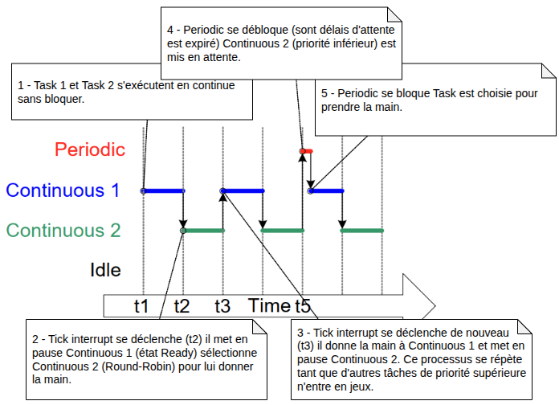
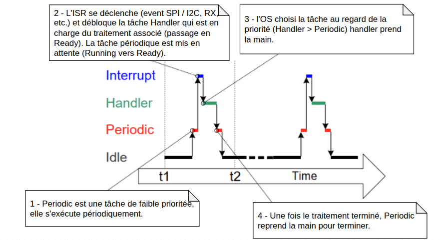
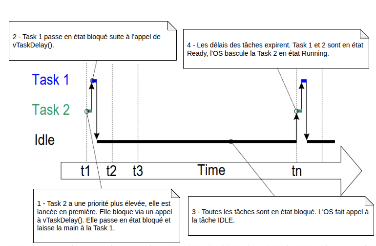

# FreeRTOS - Gestion des tâches

_BTS CIEL_


---

## Sommaire

- Instruction bloquante
- Tâche et ordonnancement
  - Tick interrupt
  - Événement externe
  - Blocage volontaire
- API FreeRTOS
  - `xTaskCreate()`
  - `vTaskSuspend()` / `vTaskResume()`
  - `vTaskDelay()`


---

## Instruction bloquante

Une instruction bloquante est une instruction dont l'évolution n'est pas directement liée au calcul effectué par le CPU ,mais, par des **événements extérieur**.

Exemples :

- attendre un délais (`delay(2000)`)
- attendre une réponse à une requête HTTP
- attendre le traitement d'un processeur tier ou d'un périphérique (GPU, Capteur)
- attendre l'écriture d'une donnée en mémoire ou sur le disque

Attendre **==** le CPU ne fait rien (**cycle perdu**)

> ℹ️ Beaucoup de programmes sont en réalités limités par les I/O du système et non par les performances du CPU.

---

## Instruction bloquante

Parfois c'est explicite :

```cpp
void loop() {
    // --- 1. delay() ---
    digitalWrite(led, HIGH);
    delay(1000);  // Bloque 1 seconde
    digitalWrite(led, LOW);
    delay(1000);  // Bloque encore 1 seconde

    // --- 2. Attente active ---
    Serial.println("Appuie sur le bouton pour continuer...");
    while (digitalRead(button) == HIGH) {
        // Tant que le bouton n'est pas appuyé → tout est bloqué
        // Les tours de boucles sont des cycles CPU perdus !
    }
}
```

---

## Instruction bloquante

Parfois ça l'est moins :

```cpp
void loop() {
    // --- 1. un appel HTTP sur M5Stack

    HTTPClient http;
    http.setTimeout(8000);
    logLine("HTTP GET: " + String(TEST_URL));

    if (!http.begin(TEST_URL)) {
        return;
    }

    int code = http.GET();  // <- APPEL BLOQUANT (attend connexion, envoi, reponse)
    if (code > 0) {
        String payload = http.getString(); // <- aussi bloquant jusqu’a lecture complète
    }

    http.end();
}
```

---

<style scoped>section{font-size:18px;}</style>

## Instruction bloquante

C'est un problème récurrent (en informatique):

```js
function appelHttpBloquant() {
  const xhr = new XMLHttpRequest();

  xhr.open("GET", "https://httpbin.org/delay/3", false);

  // Cet appel va BLOQUER tout le navigateur pendant 3s
  xhr.send(null);

  if (xhr.status === 200) {
    console.log(xhr.responseText);
  } else {
    console.log(xhr.status);
  }
}

// La solution ici : la programmation asynchrone (c'est devenu la norme)
async function appelHttpAsynchrone() {
  try {
    const response = await fetch("https://httpbin.org/delay/3");
    if (!response.ok) {
      return;
    }

    const data = await response.text(); // ou response.json()
    console.log(data);
  } catch (err) {
    console.log(err);
  }
}
```

---

## Tâche et ordonnancement

Pour permettre des traitements bloquants, FreeRTOS permet de créer des tâches et se charge de l'ordonnancement :

- Une tâche bloquée laisse la main à une autre tâche
- La tâche non-bloquée aillant la plus haute priorité et choisie par l'OS pour s'éxecuter

---

## Tâche et ordonnancement

Une tâche est définie par :

- Un état :
  - `READY` prête à être exécutée, en attente du CPU
  - `RUNNING` en cours d'execution
  - `SUSPENDED` désactivée volontairement
  - `BLOCKED` en attente d'un événement exterieur (délai, sémaphore, etc.)
- Une priorité (par rapport aux autres tâches)
  _(valeur max définie par `configMAX_PRIORITIES`)_

> ℹ️ Une seule tâche peut être en état `RUNNING` à un instant T.

---

## Tâche et ordonnancement


---

## Tâche et ordonnancement

3 raisons de changer de tâche :

- **Tick interrupt** :

  - Le kernel met à jour les délais des tâches bloquées.
  - Si une tâche devient `READY` et qu’elle est plus prioritaire que la tâche courante, → préemption immédiate.

- **Événement externe (interruption matérielle)**
  - Une ISR (Interrupt Service Routine) peut réveiller une tâche (ex : sémaphore donné, message en queue, notification).
- **La tâche courante se bloque volontairement** (raison vu précedemment)
  - L’ordonnanceur choisit alors la tâche prête la plus prioritaire.
  - Si aucune tâche prête → tâche Idle tourne par défaut (jamais bloquée, priorité 0).

---

<style scoped>section{font-size:18px;}</style>

## Tâche et ordonnancement

### Tick interrupt (horloge)



---

<style scoped>section{font-size:18px;}</style>

## Tâche et ordonnancement

### Événement externe (ISR)



---

<style scoped>section{font-size:18px;}</style>

## Tâche et ordonnancement

### Blocage de la tâche



---

## API FreeRTOS
### Créer une tâche avec `xTaskCreate()`

---

## API FreeRTOS
### Suspendre une tâche avec `vTaskSuspend()`

---

## API FreeRTOS
### Attendre et bloquer une tâche `vTaskDelay()` et `taskYIELD()`