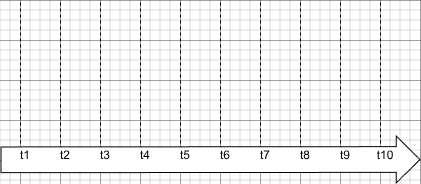

---
title: Exercices - ordonnancement préemptif à priorité
author: BTS CIEL 2 - Système temps réel
geometry: margin=1in
...

Pour chaque exercice, complétez le diagramme en sachant que l’ordonnanceur est **préemptif**, à **priorités**, et utilise un algorithme de **round-robin** pour répartir le temps entre les tâches de même priorité. 

# Exercice 1

**Tâches :**

- **Task 1** : exécution continue, priorité **1**
- **Task 2** : périodique, priorité **2**, période **3 ticks**, durée **1 tick**, première activation à **t = 0**

# Exercice 2

**Tâches :**

- **Task 1** : périodique, priorité **3**, période **2 ticks**, durée **1 tick**
- **Task 2** : périodique, priorité **2**, période **3 ticks**, durée **1 tick**
- **Task 3** : périodique, priorité **1**, période **6 ticks**, durée **2 ticks**

Toutes les tâches activent leur première instance à **t = 0**.

\pagebreak

# Exercice 3

**Tâches et ISR :**

- **ISR_Button** : durée **0.5 tick**, déclenchements à **t = 1.5** et **t = 4.5**
- **Task 1** : événementielle, priorité **3**, durée **2 ticks**, réveillée par un sémaphore donné dans l'ISR
- **Task 2** : périodique, priorité **2**, période **4 ticks**, durée **2 ticks**
- **Task 3** : exécution continue, priorité **1**

# Exercice 4

**Tâches :**

- **Task 1** : périodique, priorité **3**, période **3 ticks**, durée **1 tick**
- **Task 2** : événementielle, priorité **2**, durée **2 ticks**, réveillée à **t = 1.5**, **t = 3.5**, **t = 6.5**
- **Task 3** : exécution continue, priorité **1**
- **Idle Task** : priorité **0**
