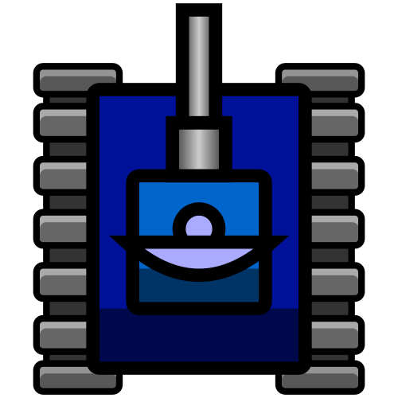
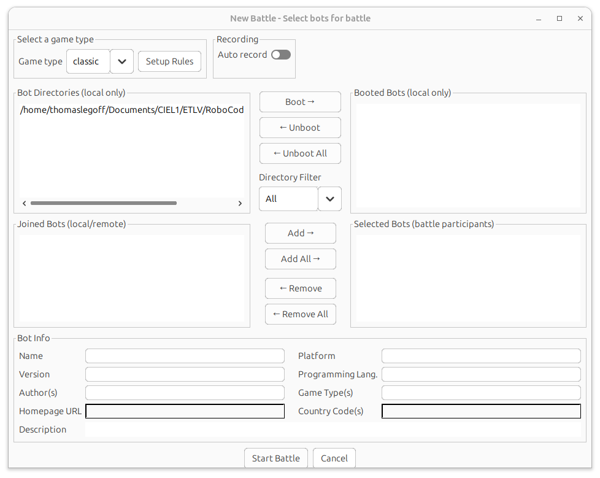
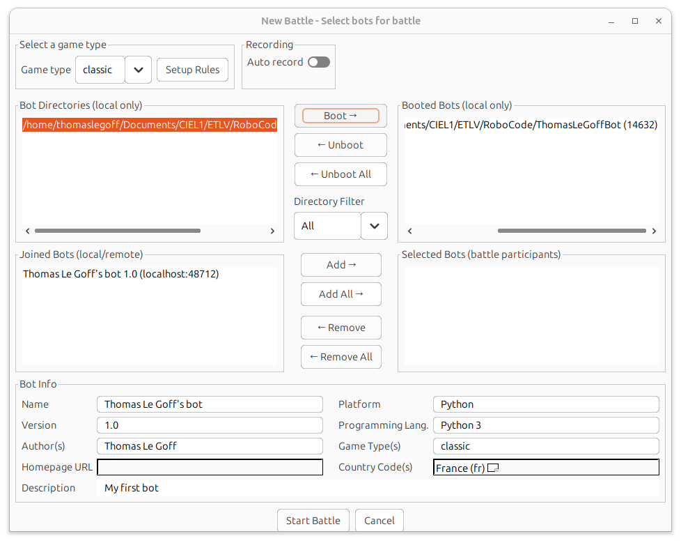
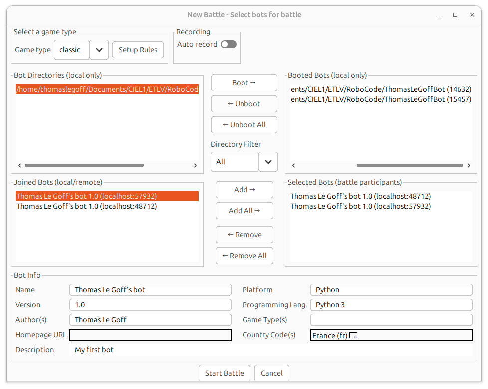

# Débuter avec Robocode

## Robocode

Robocode est un jeu de programmation multijoueur dont l'objectif est de vous faire développer un robot (bot) qui pilote un tank et combat les autres joueurs.

Les jeux de programmation sont un moyen intéressant d'apprendre à coder en s'amusant. Voici quelques autres titres connus du genre :

- Human Resource Machine
- The Farmer Was Replaced : <https://thefarmerwasreplaced.com/terms/>
- CodeCombat : <https://codecombat.com/>

### Liens utiles

- Site officiel de Robocode : <https://robocode.dev>
- Tutoriel de mise en place d'un bot : <https://robocode.dev>
- Anatomie d'un bot : <https://robocode.dev/articles/anatomy.html>
- Système de coordonnées : <https://robocode.dev/articles/coordinates-and-angles.html>
- Physique : <https://robocode.dev/articles/physics.html>
- Gestion des collisions : <https://robocode.dev/articles/collision-mechanics.html>
- Score : <https://robocode.dev/articles/scoring.html>

## Découverte pas à pas

Le jeu Robocode est composé des éléments suivants :

- le serveur, qui se charge du matchmaking et des échanges avec les bots
- les bots, sous forme de scripts autonomes qui échangent avec le serveur via le protocole WebSocket

Robocode fournit un SDK (Software Development Kit) dans des langages comme Python, C# et Java afin de faciliter le développement de bots.

### Mise en place du script

Dans notre cas, nous allons utiliser le langage Python. Pour créer votre bot, suivez les étapes suivantes :

- Créez un dossier destiné à contenir votre programme Python. Vous pouvez le nommer `PrenomNom`. Voici les commandes permettant de créer un dossier valide et correctement nommé :

```shell
cd ~/Documents
mkdir RoboCode && cd RoboCode
mkdir PrenomNom && cd PrenomNom
```

> Il est primordial de nommer les fichiers de la même manière que le dossier qui les contient. Dans le cas contraire, le serveur Robocode ne détectera pas correctement votre bot et votre programme ne fonctionnera pas.

Dans ce dossier, créez un fichier `PrenomNom.json` avec le contenu suivant (pensez à remplacer certaines valeurs) :

```json
{
  "name": "My First Bot",
  "version": "1.0",
  "authors": [ "«enter your name»" ],
  "description": "My first bot",
  "homepage": "",
  "countryCodes": [ "fr" ],
  "platform": "Python",
  "programmingLang": "Python 3"
}
```

Ensuite, créez un fichier `PrenomNom.py` avec le contenu suivant :

```python
from robocode_tank_royale.bot_api.bot import Bot
from robocode_tank_royale.bot_api.events import ScannedBotEvent, HitByBulletEvent


class MyFirstBot(Bot):
    def run(self) -> None:
        """Called when a new round is started -> initialize and do some movement."""
        while self.running:
            self.forward(100)
            self.turn_gun_left(360)
            self.back(100)
            self.turn_gun_left(360)

    def on_scanned_bot(self, e: ScannedBotEvent) -> None:
        """We saw another bot -> fire!"""
        del e
        self.fire(1)

    def on_hit_by_bullet(self, e: HitByBulletEvent) -> None:
        """We were hit by a bullet -> turn perpendicular to the bullet."""
        bearing = self.calc_bearing(e.bullet.direction)
        self.turn_right(90 - bearing)


def main() -> None:
    bot = MyFirstBot()
    bot.start()


if __name__ == "__main__":
    main()
```

Afin d'installer le SDK Python, il est nécessaire de créer un environnement virtuel avec le module `venv` (dans le dossier de votre projet) :

```shell
python3 -m venv .venv
source .venv/bin/activate # Cette commande est à exécuter à chaque utilisation du projet
```

Une fois l'environnement virtuel activé, installez le SDK avec la commande :

```shell
pip install robocode-tank-royale==0.37.0
```

Enfin, créez un fichier `PrenomNom.sh` contenant le script permettant au serveur de démarrer le bot :

```shell
#!/bin/sh
set -e

cd -- "$(dirname -- "$0")"

if [ -x ".venv/bin/python" ]; then
    exec ".venv/bin/python" "PrenomNom.py" # Pensez à adapter cette ligne
else
    echo "Error: venv not found, please create and install deps in Python venv" >&2
    exit 1
fi
```

Voici un exemple de structure de dossier valide :

```shell
.
└── ThomasLeGoffBot
    ├── ThomasLeGoffBot.json
    ├── ThomasLeGoffBot.py
    ├── ThomasLeGoffBot.sh
    └── .venv
```

### Mise en route du serveur

Pour lancer le serveur, cherchez le programme **robocode-tank-royale** ayant l'icône suivante :

{ .center width=40% height=30% }

Dans le menu **Server**, cliquez sur **Start Local Server**. Une fois le serveur démarré, vous devez créer une bataille et choisir les bots qui vont s'affronter.

Dans le menu **Battle**, cliquez sur **Start battle**. Vous devriez voir la fenêtre suivante :

{ .center width=80% height=50% }

Un message vous indique qu'il est nécessaire de configurer un dossier de bots. Ce dossier permet au serveur de charger différentes configurations de bots (boot) et de les faire combattre dans différentes batailles (il est possible de créer plusieurs bots à partir d'un seul script).

Vous devez configurer le dossier parent contenant votre bot. Exemple avec la hiérarchie suivante :

```
└── RoboCode
    └── ThomasLeGoffBot
        ├── ThomasLeGoffBot.json
        ├── ThomasLeGoffBot.py
        ├── ThomasLeGoffBot.sh
        └── .venv
```

Le dossier à configurer comme **Bot root directory** est donc `RoboCode` (par exemple `~/Documents/RoboCode`), et non `~/Documents/RoboCode/ThomasLeGoffBot`.

Une fois le dossier configuré, vous pouvez choisir les bots à faire combattre :

1 - Lancez (boot) votre bot (vous pouvez lancer plusieurs fois le même bot) :

{ .center width=80% height=50% }

2 - Ajoutez vos bots à la bataille :

{ .center width=80% height=50% }

Une fois vos combattants choisis, vous pouvez démarrer la bataille en cliquant sur **Start battle**.

> Si vous rencontrez des difficultés lors de la mise en place du serveur ou d'une bataille, consultez le document suivant : <https://robocode.dev/articles/gui.html>

Voici une version corrigée en français, suivie de sa traduction anglaise.

## Présentation de l'activité

### Créer votre bot (en équipe de 3)

Par équipe de trois, vous allez devoir réaliser un bot en Python. Chacun devra travailler sur une partie distincte :

- un script dédié à **la gestion de la tourelle et des tirs**
- un script dédié **aux déplacements et aux esquives**
- un script dédié **à la gestion du scanner**

> Inspiré des recommandations suivantes : <https://robocode.dev/tutorial/beyond-the-basics.html#strategy-types>

Vous devez chacun travailler sur **une seule des trois parties**, puis fusionner vos scripts afin de constituer un bot complet. Celui-ci affrontera les bots des autres étudiants lors d'un tournoi (pendant la dernière séance).

Même si vous travaillez sur des parties différentes, il est important de définir une stratégie commune et d'anticiper l'intégration de vos trois programmes.

Afin de bien comprendre le développement d'un bot, il est recommandé de lire les pages suivantes :

- <https://robocode.dev/tutorial/getting-started.html>
- <https://robocode.dev/tutorial/beyond-the-basics.html>
- <https://robocode.dev/articles/anatomy.html>
- <https://robocode.dev/articles/coordinates-and-angles.html>
- <https://robocode.dev/articles/physics.html>
- <https://robocode.dev/articles/collision-mechanics.html>
- <https://robocode.dev/articles/scoring.html>

--------------------------------------------------------------------------------

### Combattre les autres

À la fin de la séquence, un tournoi sera organisé afin que votre bot affronte ceux des autres équipes. Le mode de jeu sera **"melee"**, avec l'ensemble des bots de la classe dans un même match. L'équipe gagnante sera celle ayant obtenu le meilleur score à la fin du match.

Pour bien comprendre les mécaniques d'un match, vous devez lire le document suivant : <https://robocode.dev/tutorial/getting-started.html#rounds-and-turns>

## Plannification

Séance | Objectif
------ | -----------------------------------------------------------------------------------------------
24/03  | Découverte de l'activité et de Robocode (lecture des documents) + constitution des groupes (1h)
27/03  | Début du développement des scripts (2h)
31/03  | Rédaction d'un document expliquant la stratégie de votre bot + présentation orale (~5 min) (1h)
03/04   | Développement des scripts (2h)
05/04   | Présentation orale de la stratégie (~5 min) + match final (1h)
