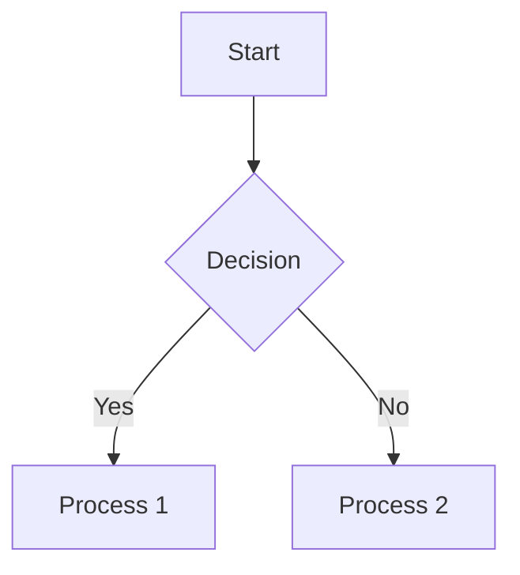

# 🎭 Démo des Layouts MARP

> Explore différents styles de disposition pour vos présentations

---

<!-- _class: lead -->

# ✨ Slide "lead"

Texte centré verticalement et horizontalement
Parfait pour une slide d'intro ou un concept clé

---

<!-- _layout: center -->

## 📌 Layout : Center

Cette slide est **centrée verticalement**
Utile pour mettre un contenu unique en valeur

---

## 🎨 Layout standard avec image à droite

- Texte à gauche
- Image alignée à droite (45%)
- Adapté aux illustrations de concepts

---

## 💡 Deux colonnes (manuel)

| À gauche             | À droite             |
|---------------------|----------------------|
| ✅ Liste             | 🎯 Idée clé           |
| 💬 Citation          | 📸 Image              |
| 🧠 Info technique   | 💡 Résumé rapide     |

> On peut simuler un layout en colonnes avec des tableaux

---

<!-- _layout: true -->

## 📐 Layout activé manuellement

Ici on force le layout par défaut avec `_layout: true`

- Compatible avec d'autres options
- Peut être désactivé par `_layout: false`

---

<!-- _class: invert -->

# 🌓 Mode sombre (invert)

Ajoutez `class: invert` pour inverser les couleurs
💡 Pratique pour varier le rythme visuel

---

# Mermaid

---

<!-- _backgroundColor: #fef9e7 -->

# 🎨 Fond personnalisé

Avec `backgroundColor` vous pouvez changer l’ambiance !
Ici un fond jaune clair #fef9e7

---

## 🖼️ Fond image plein écran

Texte en **overlay** sur image plein écran
Pensez à utiliser des contrastes lisibles !

---

# 📚 Conclusion

- MARP offre beaucoup de flexibilité avec peu de syntaxe
- Pensez à jouer avec :
  - `_layout: center`
  - `class: lead / invert`
  - `backgroundImage / backgroundColor`

---

# 🙏 Merci pour votre attention !

Note: Démo terminée. Vous pouvez maintenant tester vos propres mises en page.