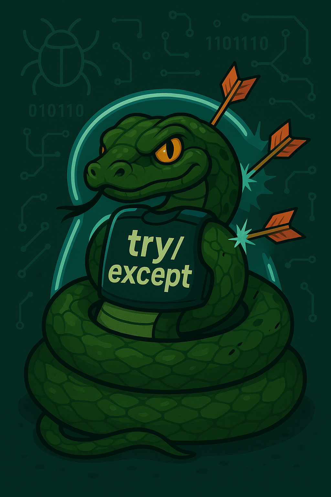

# Python - Gestion des exceptions

_BTS CIEL_ 



---

## Sommaire

- Qu'est-ce qu'une exception ?
- Comment font les autres ?
- Exception en Python
  - Mot clé `raise`
  - Stacktrace
  - Structure `try` / `except`
  - Structure `else` / `finally` et `with`
  - Exceptions de la bibliothèque standard
  - Exceptions sur-mesures
- Bien gérer les exceptions


---

<style scoped>section{font-size:24px;}</style>

## Qu'est-ce qu'une exception ?

### Définition

En programmation, une exception est un **évènement inattendu** (non-souhaité) qui a lieu lors de l'exécution d'une instruction.

Lorsqu'une exception a lieu, il est généralement **préférable de stopper l'exécution du programme**, mais, dans certains cas il est possible de **proposer une alternative** et de faire fonctionner l'opération autrement.

---

## Qu'est-ce qu'une exception ?

### Exemples d'exceptions

Liées au programme lui-même :

- Manque de validation (ensemble incorrect)
- Mauvais usage d'une méthode / fonction
- Opération impossible (division par zéro etc.)

Liées à l'environnement d'exécution :

- Traiter un fichier dans un format incorrect (JSON par exemple)
- Écrire dans un fichier alors que le disque dure est plein
- Communiquer sur le réseau en hors ligne

---

## Qu'est-ce qu'une exception ?

### Gestion intégrée

Les langages de haut niveau, comme Python, intègrent des **mécanismes de gestion des exceptions**. Ils permettent aux développeurs de traiter les erreurs de manière **structurée et naturelle**, comme une composante essentielle du développement.

Python propose l'utilisation de la structure `try` / `except` :

```python
try:
    x = int(input("Please enter a number: "))
except ValueError:
    print("Oops!  That was no valid number.  Try again...")
```

---
<!-- _class: gridify -->

## Comment font les autres ?

```c
int main() {
    FILE *f = fopen("filename.ext", "r");

    if (f == NULL) {
        perror("Erreur");
        exit(EXIT_FAILURE);
    }

    return 0;
}
```

```php
try {
    $f = fopen("filename.ext", "r");
    if ($f === false) {
        throw new Exception("Impossible d'ouvrir le fichier");
    }
} catch (Exception $e) {
    die("Erreur: " . $e->getMessage());
}
```

```python
try:
    f = open("filename.ext")
except Exception as err:
    raise SystemExit(err)
```

```go
f, err := os.Open("filename.ext")
if err != nil {
    log.Fatal(err)
}
```

---

## Exceptions en Python

Une exception est une instance de la classe `BaseException`.

Les exceptions qui héritent de `BaseException` sont divisées en deux familles (héritage):

- `Exception` généralement faites pour être traitées (catch)
- les autres (qui héritent directement de `BaseException`) comme `KeyboardInterrupt` qui ne sont pas faites pour être gérées

---

## Exceptions en Python

### Mot clé `raise`

Le mot clé `raise` permet de lever une exception.

En levant (émettant) une exception le programme bascule en **mode exception** jusqu'à ce que l'exception soit "attrapée".

Si l'exception n'est **pas attrapée**, le programme **est terminé en erreur**.

---

## Exceptions en Python

### Mot clé `raise`

Il est possible d'utiliser le mot clé `raise` depuis n'importe quel endroit du programme.

Il est utilisé pour indiquer que l'opération ne se passe pas comme prévu.

```python
raise Exception("voilà une exception")
```

Dans une méthode/fonction :

```python
def est_positif(n: str):
    if n.isnumeric():
        return int(n) > 0
    raise Exception("n doit être un entier.")
```

---

## Exceptions en Python

### Stacktrace (traceback)

```python
def est_positif(n: str):
    if n.isnumeric():
        return n > 0
    else:
        raise Exception("n doit être un entier.")

if __name__ == "__main__":
	est_positif("t")
```

```shell
Traceback (most recent call last):
  File "/tmp/est_positif.py", line 7, in <module>
    est_positif("t")
  File "/tmp/est_positif.py", line 4, in est_positif
    raise Exception("n doit être un entier.")
Exception: n doit être un entier.
```

---

<style scoped>section{font-size:22px;}</style>

## Exceptions en Python

### Stacktrace (traceback)

```python
def division(a, b):
    return a / b

def calcul():
    return division(10, 0)

if __name__ == "__main__":
	calcul()
```

```shell
Traceback (most recent call last):
  File "/tmp/calcul_exception.py", line 8, in <module>
    calcul()
  File "/tmp/calcul_exception.py", line 5, in calcul
    return division(10, 0)
           ^^^^^^^^^^^^^^^
  File "/tmp/calcul_exception.py", line 2, in division
    return a / b
           ~~^~~
ZeroDivisionError: division by zero
```

---

## Structure `try` / `except`

La structure `try` / `except` permet d'attraper une exception.

Elle doit être placée sur une portion de code bien précise dans laquelle une exception est susceptible de survenir **et que l'on souhaite traiter le cas d'exception**.

> Certains langages comme Java obligent le développeur à traiter les cas d'exception ou préciser explicitement qu'ils sont ignorés. En Python il n'y a aucune obligation.

---

## Structure `try` / `except`

```python
import argparse

def division(a, b):
    return a / b

if __name__ == "__main__":
    args = argparse.ArgumentParser()
    args.add_argument("a", type=float)
    args.add_argument("b", type=float)
    a, b = args.parse_args().a, args.parse_args().b

    try:
        result = division(a, b)
    except ZeroDivisionError:
        result = 0
        print("Attention : division par zéro détectée. Résultat forcé à 0.")

    print(f"Résultat : {result}")
```

---

<style scoped>section{font-size:22px;}</style>

## Structure `try` / `except`

```python
import argparse

def division(a, b):
    try:
        return a / b
    except ZeroDivisionError:
        return 0

if __name__ == "__main__":
    # ...
    try:
        # L'exception ne sera jamais levée car déjà gérée dans la fonction division
        result = division(a, b)
    except ZeroDivisionError:
        result = 10 # Valeur par défaut 

    print(f"Résultat : {result}")
```

> Il est souvent préférable de laisser l'exception s'échapper pour ne pas altérer d'autres éléments du programme qui appelleraient une fonction. Si on ne sait pas vraiment quoi faire d'une erreur c'est qu'il n'y a sûrement rien à faire !

---

## Structure `try` / `catch`

### Gérer plusieurs exceptions

```python
import sys

try:
    f = open('myfile.txt')
    s = f.readline()
    i = int(s.strip())
except OSError as err:
    print("OS error:", err)
except ValueError:
    print("Could not convert data to an integer.")
except Exception as err:
    print(f"Unexpected {err=}, {type(err)=}")
    raise
```

---

## Structure `try` / `catch`

### Utiliser une exception comme un cas alternatif

Parfois, il est plus simple de tenter une opération et de traiter l'exception comme un **cas alternatif** plutôt que de valider les données en amont.
Attention : utiliser ce mécanisme uniquement si vous n'avez pas d'autres choix

```python
def is_number(s):
    try:
        float(s)
    except ValueError:
        return False
    else:
        return True
```

---

## Bien gérer les exceptions

Quelques questions à se poser avant d'utiliser le mécanisme d'exception : 

- Est-ce qu'un pattern `with` standard est associé avec l'objet / méthode que j'utilise ?
- Est-ce que la méthode/fonction appelée est susceptible de générer des exceptions (voir la documentation) ?
- Suis-je capable de traiter le cas d'exception ? 
- Est-ce nécessaire de donner plus d'informations à l'utilisateur (faut-il spécialiser l'exception) ?
- Ais-je une autre option si je souhaite représenter un cas alternatif ?