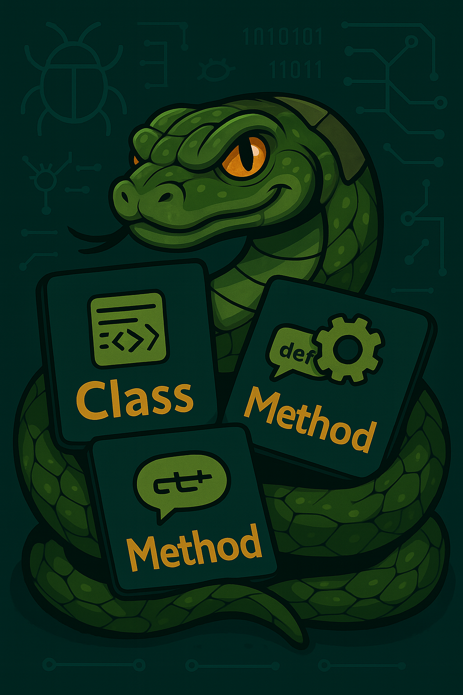
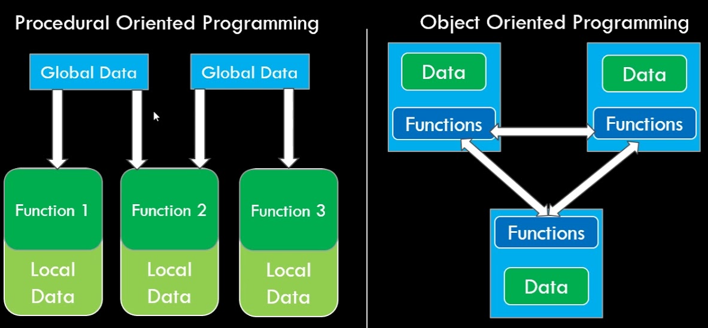
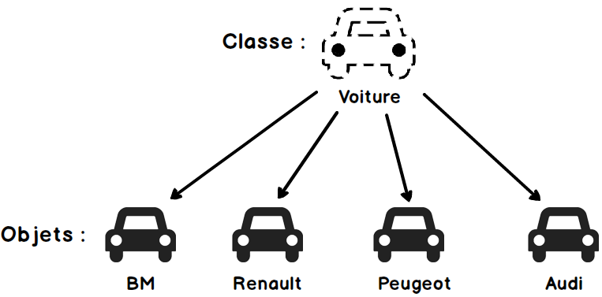

# Python - Programmation orientée objet

_BTS CIEL_



--------------------------------------------------------------------------------

## Sommaire

- Le paradigme objet
- La POO en Python
- Classe et instance
- Encapsulation
- Héritage et polymorphisme
- Todo: propriété dérivée (single state)


--------------------------------------------------------------------------------

<style scoped="">section{font-size:24px;}</style>

## Le paradigme objet

La programmation orientée objet est un **paradigme de programmation** c.-à-d une manière de formaliser une solution logique dans un programme informatique.

Les principaux langages orientés objet (par ordre d'apparition):

- Simula (1967)
- Smalltalk (1972)
- C++ (1979)
- Python (1991)
- Java (1995)
- C#, Swift, Kotlin etc. (> 2000)

> Ce paradigme est devenu un standard de l'industrie. Attention cependant, aujourd'hui beaucoup de langages sont multi-paradigme.

--------------------------------------------------------------------------------

<style scoped="">section{font-size:24px;}</style>

## Le paradigme objet

### Principe

La POO consiste à structurer le code autour d'objets qui représentent des **entités**, combinant **données** et **comportements**, et qui **interagissent** entre eux à l'aide de messages pour réaliser les fonctionnalités du programme.



--------------------------------------------------------------------------------

## La POO en Python

Python est langage multi-paradigme, cependant, il met la POO au coeur de son fonctionnement :

- Tout est un objet (un entier, une liste, une fonction, etc.)
- Python permet de définir des **classes** qui permettent de décrire le **comportement des objets**
- Héritage et le polymorphisme sont possibles par **rédéfinition de méthodes**

--------------------------------------------------------------------------------

## La POO en Python

### Exemple de classe

```python
class Voiture:
    def __init__(self, marque, modele):
        self.marque = marque  # attribut
        self.modele = modele  # attribut

    def demarrer(self):  # méthode
        print(f"La {self.marque} {self.modele} démarre.")


# Création d'un objet (instance)
ma_voiture = Voiture("Toyota", "Corolla")

# Appel d'une méthode
ma_voiture.demarrer()
```

--------------------------------------------------------------------------------

## Classe et instance

Une classe permet de définir les données et le comportement d'un objet. En Python la définition d'une classe se fait en utilisant le mot clé `class`

Vous en connaissez déjà :

Classe              | Description courte
------------------- | -----------------------------------------------------------------------------------------
`str`               | Chaîne de caractères (ex. `"bonjour".upper()` utilise une méthode OOP).
`list`              | Liste modifiable (ex. `append`, `pop`, etc.).
`dict`              | Dictionnaire clé-valeur, avec des méthodes (`get`, `items`, etc.).
`file` (via `open`) | Fichier ouvert, instance de `TextIOWrapper`, avec méthodes comme `.read()` ou `.write()`.

--------------------------------------------------------------------------------

## Classe et instance

```python
with open("exemple.txt", "r", encoding="utf-8") as fichier:
    contenu = fichier.read()
```

- `open` permet de récupérer **une instance** de la classe `TextIOWrapper`
- `TextIOWrapper` est la **classe** dédiée à la manipulation de fichier
- `fichier` est **une** instance de `TextIOWrapper` pour manipuler `exemple.txt` en lecture
- `.read()` est une **méthode** de `TextIOWrapper` appelée sur l'instance `fichier`

--------------------------------------------------------------------------------

## Classe et instance

- La **classe** peut-être vue comme **un schéma / une recette**.

- L'**instance** est **une version / réalisation** de ce schéma.

- La classe permet d'isoler dans un même endroit les données et le traitement (comportement) associé tout en évitant qu'ils soient perturbés par d'autres éléments du programme (principe d'encapsulation).



--------------------------------------------------------------------------------

## Classe et instance

### Exemples

```python
class CompteBancaire:
    def __init__(self, titulaire: str, solde: float, numero_compte: str):
        self.titulaire = titulaire
        self.solde = solde
        self.numero_compte = numero_compte

    def deposer(self, montant: float):
        pass

    def retirer(self, montant: float):
        pass

    def afficher_solde(self):
        pass


# Une fois la classe définie, on peut créer des instances :

compte1 = CompteBancaire("Jean-Michel Riche", 1_000_000.0, "FR76 3000 4000 5000 6000 0000 001")
compte2 = CompteBancaire("Lucie Débit", 3.42, "FR76 3000 4000 5000 6000 0000 002")
compte3 = CompteBancaire("Zéro Euro", 0.00, "FR00 0000 0000 0000 0000 0000 000")
```

--------------------------------------------------------------------------------

## Classe et instance

### Exemples

```python
class Etudiant:
    def __init__(self, nom: str, prenom: str, matricule: str, notes: list[float]):
        self.nom = nom
        self.prenom = prenom
        self.matricule = matricule
        self.notes = notes

    def calculer_moyenne(self):
        pass

    def afficher_profil(self):
        pass
```

--------------------------------------------------------------------------------

## Classe et instance

### Exemples

```python
class Port:
    def __init__(self, numero: int, protocole: str, statut: str = "fermé"):
        self.numero = numero  # ex : 80, 443
        self.protocole = protocole  # ex : "TCP", "UDP"
        self.statut = statut  # "ouvert", "fermé", "filtré"

    def ouvrir(self):
        pass

    def fermer(self):
        pass

    def est_ouvert(self) -> bool:
        pass


port1 = Port(80, "TCP", "ouvert")
port2 = Port(443, "TCP", "filtré")
```

--------------------------------------------------------------------------------

## Classe et instance

### Exemples

```python
class Fichier:
    def __init__(self, nom: str, extension: str, taille_en_octets: int):
        self.nom = nom
        self.extension = extension
        self.taille_en_octets = taille_en_octets

    def lire(self):
        pass

    def ecrire(self, contenu: str):
        pass

    def supprimer(self):
        pass


fichier1 = Fichier("rapport_de_stage", "docx", 51200)
fichier4 = Fichier("cours_reseau", "pdf", 1048576)
```

--------------------------------------------------------------------------------

<style scoped="">section{font-size:20px;}</style>

## Classe et instance

### Éléments d'une classe

Élément                   | Description                                     | Exemple
------------------------- | ----------------------------------------------- | ------------------------------------------
Attribut d'instance       | Variable propre à chaque objet                  | `self.nom = "Alice"`
Méthode d'instance        | Fonction liée à un objet, accède à `self`       | `def afficher(self):`
Constructeur (`__init__`) | Appelé à la création d'une instance             | `def __init__(self, nom):`
Héritage                  | Classe qui hérite d'une autre                   | `class Fille(Parent):`
Surcharge (override)      | Redéfinition d'une méthode héritée              | `def afficher(self):` dans une sous-classe
Attribut de classe        | Variable partagée par toutes les instances      | `nb_instances = 0`
Méthode de classe         | Reçoit `cls`, agit au niveau de la classe       | `@classmethod def creer(cls):`
Méthode statique          | Méthode indépendante de l'objet et de la classe | `@staticmethod def est_pair(x):`

--------------------------------------------------------------------------------

<style scoped="">section{font-size:20px;}</style>

## Classe et instance

### Éléments d'une classe : attributs et méthodes d'instance (objet)

```python
class Compteur:

    def __init__(self, nom: str, valeur_initiale: int = 0):
        # Attributs
        self.nom = nom

        self._valeur = max(0, valeur_initiale)  # attribut "protégé"
        self.__verrouille = False  # attribut privé

    # Méthodes
    def incrementer(self, pas: int = 1):
        if not self.__verrouille:
            self._valeur += pas
            print(f"{self.nom} +{pas} → {self._valeur}")
        else:
            print(f"{self.nom} est verrouillé. Incrément impossible.")

    def decrementer(self, pas: int = 1):
        pass
```

--------------------------------------------------------------------------------

<style scoped="">section{font-size:20px;}</style>

### Classe et instance

### Éléments d'une classe (suite)

Élément                 | Description                                                          | Exemple
----------------------- | -------------------------------------------------------------------- | -------------------------------------------
Encapsulation           | Convention pour masquer des détails internes (`_`, `__`)             | `_interne`, `__prive`
Propriété (`@property`) | Accès contrôlé à un attribut                                         | `@property def age(self):`
Méthodes spéciales      | Méthodes magiques : comportement intégré (`__str__`, `__eq__`, etc.) | `def __str__(self):`
Destructeur (`__del__`) | Appelé à la destruction de l'objet (peu courant)                     | `def __del__(self):`
Polymorphisme           | Méthodes communes à plusieurs classes                                | `obj.afficher()` sur divers objets
Docstring               | Documentation intégrée de la classe ou méthode                       | `"""Classe représentant un utilisateur."""`
