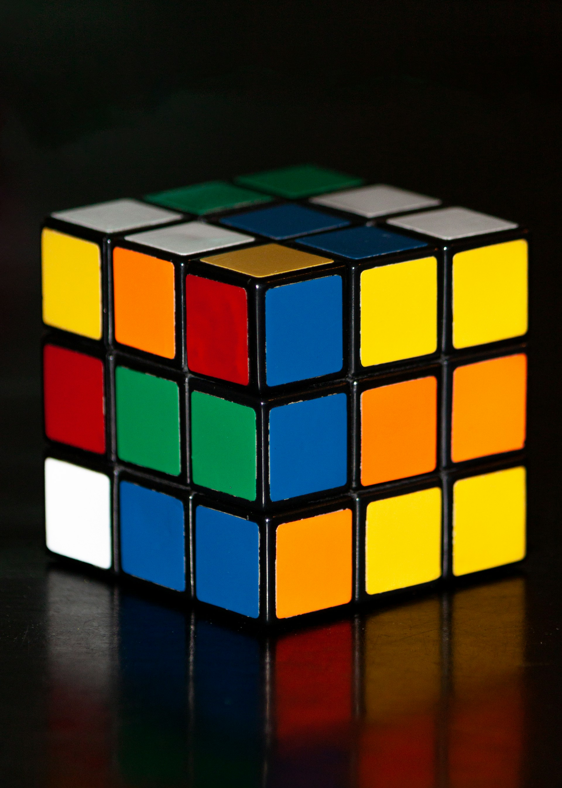

# Python - Programmation orientée objet (introduction)

_BTS CIEL_


--------------------------------------------------------------------------------

# Retour sur les fonctions en Python

## Principe

Pour rappel, la fonction est une construction du langage qui permet de **regrouper** et **réutiliser** un ensemble d'instructions.

à retenir :

- Une fonction est un **bloc de code** (nommé) **qui est exécuté lorsqu'il est appelé**
- Une fonction peut avoir des **arguments** et retourner un **résultat**
- Une fonction sert à éviter la **duplication de code**

--------------------------------------------------------------------------------

# Retour sur les fonctions en Python

## Définition et appel de fonction

Le mot-clé `def` permet de définir une fonction.

Le nom de la fonction, suivi de parenthèses permet d'appeler la fonction.

```python
def affiche_un_texte():
    print("Ma super fonction")

def somme(x, y):
    # On peut appeler une autre fonction
    affiche_un_texte()

    # Retourner un résultat
    return x + y

print("Résultat = " + str(somme(10, 12)))
`
```

--------------------------------------------------------------------------------

## Structure dynamique : le dictionnaire

Une structure dynamique, comme le **dictionnaire en Python**, est un élément du langage qui permet de stocker des données en mémoire avec un schéma **flexible**.

```python
personne = {
    "prenom": "Thomas",
    "nom": "Le Goff",
    "age": 27,
    "nationalite": "Française"
}
```

--------------------------------------------------------------------------------

## Structures de données et fonctions

Les fonctions sont faites pour travailler avec des données. Dans les cas non triviaux, il devient nécessaire d'utiliser en entrée des fonctions des **structures de données plus avancées** (comme les dictionnaires) plutôt que des types primitifs.

```python
personne = {
    "prenom": "Thomas",
    "nom": "Le Goff",
    "age": 27,
    "nationalite": "Française"
}

def est_majeur(personne):
    if "age" not in personne:
        return False
    else:
        return personne["age"] >= 18

print(est_majeur(personne))
```

--------------------------------------------------------------------------------

## Problème des structures dynamiques

Cet exemple pose deux problèmes :

- La nécessité de vérifier la présence de la clé `age` (valider la structure avant de l'utiliser)
- La possibilité d'utiliser un autre dictionnaire (perte de sémantique)

```python
personne = {
    "prenom": "Thomas",
    "nom": "Le Goff",
    "age": 27,
    "nationalite": "Française"
}

vin = {
    "nom": "Château Margaux",
    "annee": 2015,
    "age": 9
}

print(est_majeur(vin)) # n'a pas vraiment de sens...
```

--------------------------------------------------------------------------------

## Objet = Structure + fonctions

L'objectif de la programmation orientée objet est de regrouper les **structures de données** et les **algorithmes associés** (les fonctions) dans un seul et même élément : **un objet**.

Il s'agit d'un outil permettant au développeur de **modéliser des éléments complexes**, inspirés (ou non) de la vie réelle.



--------------------------------------------------------------------------------

## Classe

Python utilise la notion de **classe** (`class`) pour permettre au développeur de définir ses propres objets :

```python
class Personne:

    def __init__(self, prenom, nom, age, nationalite):
        self.prenom = prenom
        self.nom = nom
        self.age = age
        self.nationalite = nationalite

    def est_majeur(self):
        # Il n'est plus nécessaire de valider la structure :
        # est_majeur fonctionne uniquement avec des objets Personne
        return self.age >= 18

thomas = Personne("Thomas", "Le Goff", 27, "Française")

print(thomas.est_majeur()) # équivalent de est_majeur(thomas)
```
