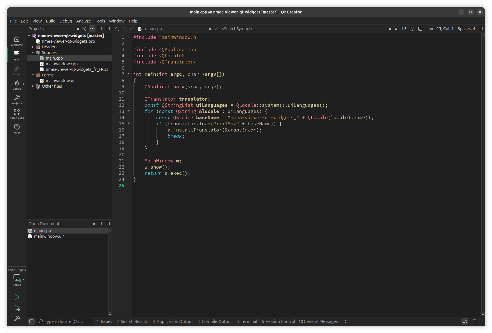
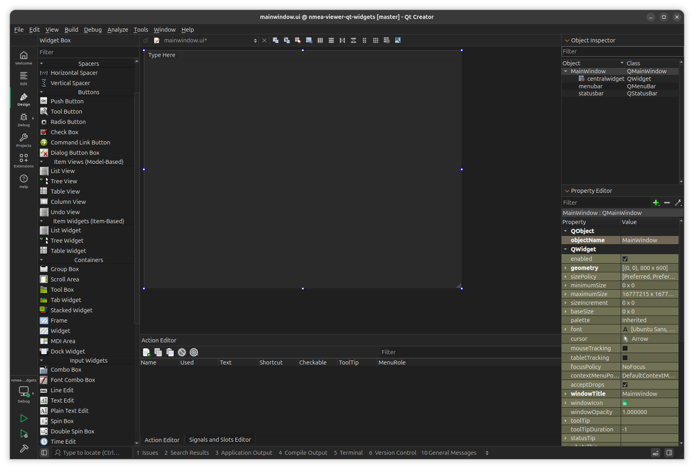
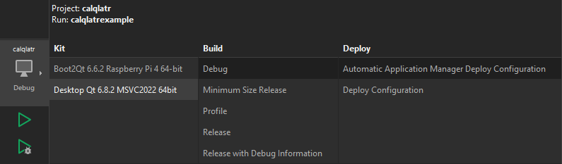

# SCADA de suivi de navires en temps réel

Ce TP a pour objectif de vous faire réaliser un logiciel SCADA complet.

**SCADA** (**S**upervisory **C**ontrol and **D**ata **A**cquisition) est une architecture permettant la gestion centralisée et distante d’un ou plusieurs systèmes industriels.

Le système SCADA n’a pas vocation à se substituer entièrement à l’humain : le pilotage et la prise de décision restent dévolus à l’opérateur. C’est pourquoi les logiciels SCADA sont principalement destinés à la surveillance et à la gestion des alarmes.

Imaginons, par exemple, une API pilotant l’écoulement de l’eau de refroidissement d’un processus industriel. Le système SCADA permet :
- à un opérateur de modifier la consigne d’écoulement (litres par seconde) ;
- d’enregistrer et d’afficher l’évolution des mesures ;
- de détecter et d’afficher des conditions d’alarme (perte d’écoulement, etc.).

Le système SCADA que nous allons mettre en place a pour objectif de superviser une flotte de navires de commerce.

Pour chaque navire nous souhaitons visualiser ses données de navigation : son **trajet**, sa **vitesse** ainsi que sa **direction** ainsi que d'autre données qui seront étudiées par la suite. 

## Introduction

### Architecture globale

Pour mener à bien ce projet, l’architecture suivante a été retenue :
- Les équipements de navigation embarqués (dans chaque navire) exposent leurs données de géolocalisation grâce à la norme **NMEA 0183**, accessible sur le réseau local en **UDP**.
- Un script **Python** a pour rôle de transporter les trames **NMEA 0183** du réseau local vers un broker **MQTT** (accessible sur un réseau **WAN/Internet**).
- Le broker **MQTT** centralise les informations de navigation de chaque navire et les distribue en temps réel aux clients abonnés.
- Enfin, l’application de supervision (dashboard), écrite en **C++** avec le framework **Qt**, présente les informations de localisation à l’aide d’une carte, ainsi que les autres données (niveau de carburant, niveau d’huile, etc.) via des jauges adaptées.

Le diagramme suivant illustre l’architecture globale du projet :


### Protocole NMEA 0183

La norme **NMEA 0183** est une spécification pour la communication entre équipements marins, y compris les GPS. Elle est définie et contrôlée par la **N**ational **M**arine **E**lectronics **A**ssociation.

Cette norme utilise une communication série simple pour transmettre une « phrase » à un ou plusieurs récepteurs. Une trame NMEA utilise tous les caractères ASCII.

**Exemple de trame :**
```
$GPRMC,053740.000,A,2503.6319,N,12136.0099,E,2.69,79.65,100106,,,A*53
```

**Décodage :**
```
$GPRMC       : type de trame
053740.000   : heure UTC exprimée en hhmmss.sss : 5 h 37 min 40 s
A            : état A=données valides, V=données invalides
2503.6319    : Latitude exprimée en ddmm.mmmmm: 25° 03.6319' = 25° 03' 37,914"
N            : indicateur de latitude N=nord, S=sud
12136.0099   : Longitude exprimée en dddmm.mmmmm: 121° 36.0099' = 121° 36' 00,594"
E            : indicateur de longitude E=est, W=ouest
2.69         : vitesse sur le fond en nœuds (2,69 nd = 3,10 mph = 4,98 km/h)
79.65        : route sur le fond en degrés
100106       : date exprimée en format « jjmmaa » : 10 janvier 2006
,            : déclinaison magnétique en degrés (souvent vide pour un GPS)
,            : sens de la déclinaison E=est, W=ouest (souvent vide pour un GPS)
A            : mode de positionnement A=autonome, D=DGPS, E=DR
*            : séparateur de checksum
53           : somme de contrôle de parité au format hexadécimal
```

> Pour en savoir plus : [NMEA 0183 sur Wikipédia](https://fr.wikipedia.org/wiki/NMEA_0183).

### Protocole MQTT

**MQTT** (_**Message** **Q**ueuing **T**elemetry **T**ransport_) est un protocole de messagerie *publish-subscribe* basé sur TCP/IP. Il est particulièrement adapté à l’IoT et à notre besoin : centraliser les messages contenant les données maritimes d’un grand nombre de clients.

Nous utilisons le broker **HiveMQ** pour ses qualités :
- maturité du projet ;
- version communautaire (licence Apache-2.0) ;
- interface de suivi des clients intégrée ;
- support TLS/SSL ;
- documentation complète.

Voir : [Documentation HiveMQ](https://docs.hivemq.com/hivemq/latest/user-guide/getting-started.html)

**Bibliothèques utilisées :**
- [Qt MQTT](https://doc.qt.io/qt-6.8/qtmqtt-index.html) pour la partie C++ ;
- [Paho-MQTT](https://pypi.org/project/paho-mqtt/) pour la partie Python.

### Simulation du navire

Afin de travailler avec des données de navigation cohérentes, nous allons utiliser un simulateur NMEA.

Chaque étudiant doit installer un simulateur sur son poste, ainsi, la classe permettra de constituer une flotte d’une dizaine de navires (chaque étudiant simule un navire).

[Les sources du projet sur GitHub - nmea-sim](https://github.com/pturner1989/nmea-sim)

**Étapes**
1. Téléchargez l’exécutable (disponible ici : TODO).
2. Lancez-le avec la commande (après l’avoir rendu exécutable) :
   ```shell
   ./route-sim
   ```
3. Choisissez le mode **« Manual »** et utilisez les paramètres par défaut (vous pourrez les modifier par la suite afin d'avoir des données plus cohérentes).
4. Le simulateur émet des trames **NMEA 0183** sur le port **10110**.

**Test de fonctionnement**

Le programme netcat permet de lire le flux de données d'un socket :

```shell
nc -u -l 10110
```
*Exemple de sortie attendue :*
```
$GPGGA,154414.13,5052.9898,N,00123.2328,W,1,08,1.2,0.0,M,0.0,M,,*4F
$GPRMC,154414.13,A,5052.9898,N,00123.2328,W,12.0,90.0,270126,5.0,E*4F
```

## Transfert des trames NMEA 0183 vers le broker MQTT

Le simulateur expose ses trames **NMEA 0183** via un **socket UDP** local. 

La première partie consiste à développer un programme Python pour transférer ces trames vers le broker **MQTT**.

Une trame **GPRMC** comme :
```
$GPRMC,185424.43,A,5052.9898,N,00123.2381,W,12.0,90.0,280126,5.0,E*49
```
doit être convertie en **JSON** :
```json
{
    "type": "GPRMC",
    "timestamp": "280126T185424.43Z",
    "latitude": 50.883163333333336,
    "longitude": -2.053968333333333,
    "speed": "12.0",
    "course": "90.0",
    "status": "A"
}
```

puis publié via **MQTT** sur le **topic** `vessels/{{vessel-id}}/gprmc`. (`vessel-id` correspond au numéro du navire).

> Seules les trames **GPRMC** sont concernées pour l’instant.

### Réalisation du programme Python

1. Créez un dossier et un environnement virtuel :
   ```shell
   mkdir nmea-to-mqtt
   python3 -m venv ./nmea-to-mqtt/.venv
   ```
2. Activez-le :
   ```shell
   cd ./nmea-to-mqtt
   source .venv/bin/activate
   ```
3. Installez la dépendance `paho-mqtt` pour la communication MQTT :
   ```shell
   pip install paho-mqtt
   ```

> Pour une introduction aux environnements virtuels et à `pip`, consultez ce [guide](https://blog.stephane-robert.info/docs/developper/programmation/python/environnements-virtuels/).

**Fonctionnement attendu du programme à réaliser:**
- Réception des trames **NMEA 0183** via **UDP** ;
- Décodage des messages **GPRMC** ;
- Conversion en **JSON** ;
- Publication sur le broker **MQTT**.

Pour vous aider, voici deux programmes Python, l'un écoute sur un socket UDP, l'autre envoie des messages sur un broker **MQTT**.

```python
#!/usr/bin/env python3

import socket
import argparse

DEFAULT_HOST = "127.0.0.1"
DEFAULT_PORT = 10110

def main():
    parser = argparse.ArgumentParser(description="UDP Receiver")
    parser.add_argument("--host", default=DEFAULT_HOST)
    parser.add_argument("--port", type=int, default=DEFAULT_PORT)

    args = parser.parse_args()

    print(f"Listening on UDP {args.host}:{args.port}")

    sock = socket.socket(socket.AF_INET, socket.SOCK_DGRAM)
    sock.bind((args.host, args.port))

    try:
        while True:
            data, addr = sock.recvfrom(1024)
            message = data.decode(errors="ignore")

            print(f"[FROM {addr}] {message}")

    except KeyboardInterrupt:
        print("\nStopping UDP receiver...")
    finally:
        sock.close()


if __name__ == "__main__":
    main()
```

```python
#!/usr/bin/env python3

import paho.mqtt.client as mqtt
import argparse
import time

DEFAULT_BROKER = "127.0.0.1"
DEFAULT_PORT = 1883
DEFAULT_TOPIC = "test/topic"


def main():
    parser = argparse.ArgumentParser(description="MQTT Sender")
    parser.add_argument("--broker", default=DEFAULT_BROKER)
    parser.add_argument("--port", type=int, default=DEFAULT_PORT)
    parser.add_argument("--topic", default=DEFAULT_TOPIC)
    parser.add_argument("--message", default="Hello MQTT")

    args = parser.parse_args()

    client = mqtt.Client()
    client.connect(args.broker, args.port, 60)

    print(f"Connected to MQTT broker {args.broker}:{args.port}")
    print(f"Publishing to topic: {args.topic}")

    try:
        while True:
            client.publish(args.topic, args.message)
            print(f"Sent: {args.message}")
            time.sleep(1)

    except KeyboardInterrupt:
        print("\nStopping MQTT sender...")
    finally:
        client.disconnect()


if __name__ == "__main__":
    main()
```

_✍️ En vous appuyant sur les deux programmes, écrivez un programme Python qui correspond au cahier des charges et aux normes de développement industrielles_

> Documentation sur l'utilisation des socket en Python : https://docs.python.org/3/library/socket.html.
> 
> Documentation de paho-mqtt : https://pypi.org/project/paho-mqtt/.

## Valorisation des données de navigation

Le programme qui exploite les données de navigation (l'interface de supervision SCADA) est écrit en utilisant le framework C++ Qt.

Qt est une API orientée objet et développée en C++, conjointement par The Qt Company et Qt Project. Qt offre des composants d'interface graphique, d'accès aux données, de connexions réseaux, de gestion des fils d'exécution, d'analyse XML, etc. Il s'agit d'un framework C++ complet pour le développement d'application cross-platform (voir : https://www.qt.io/) 

Afin de développer un logiciel utilisant les composants Qt, il est recommandé d'utiliser l'EDI (**E**nvironnement de **D**éveloppement **I**ntégré) Qt Creator. Cet outil offre, notamment, un éditeur de formulaire "wysiwyg" pour les composants Qt Widgets.






> Avant de commencer, il est recommandé d'utiliser un fichier RTZ dans le simulateur pour simuler une route plus "réaliste".
> Vous pouvez télécharger une collection de fichier RTZ ici à utiliser dans le mode "Route File" de NMEA Simulator.

Pour réaliser notre application nous avons choisi la version 6.8.3 (la version LTS)de Qt et le framework Qt Widgets pour construire l'interface graphique.

_✍️ Téléchargez le projet Qt ici. Les modifications à apporter dans la suite du TP se font dans ce projet._

_✍️ Ouvrez le projet dans l'EDI Qt Creator (suivre le guide [ici](https://doc.qt.io/qtcreator/fr/creator-project-opening.html) au besoin)._

_✍️ Compilez et exécutez le projet en utilisant le bouton vert en bas à gauche (cf figure suivante)._



>Vous devriez avoir le programme lancé avec une carte à gauche et un espace vide à droite. 

### Structure du programme et architecture Vue-Modèle

> Plus d'informations sur cette architecture : https://doc.qt.io/qt-6/fr/model-view-programming.html.

### Récupération des données auprès du broker

_✍️ Avec vos connaissances de MQTT et la documentation du module MQTT de Qt, adaptez le code de la classe `MainWindow` pour connecter notre programme au broker dès le démarrage de l'application._

> Documentation du module MQTT de QT : https://doc.qt.io/qt-6.8/fr/qtmqtt-index.html.

Les méthodes `OnMqttConnected`, `OnMqttDisconnected` et `OnMqttMessageReceived` sont des **slots**, il s'agit de méthodes à appeller lors d'evénements particuliers.

_✍️ En utilisant la méthode `connect(Object *sender, Func1 signal, ContextType *context, Func2 &&slot)` connecté les **slots** aux signaux correspondant du client MQTT `QMqttClient *mClient` (n'hésitez pas à vous appuyer sur la documentation du module MQTT)._

Le slot `OnMqttMessageReceived` est appellé lors de la reception d'un message correspondant aux topics auquels le client est abonné.

_✍️ à partir du diagramme suivant, implémenté le contenu de la méthode `OnMqttMessageReceived` pour écrire les coordonnées reçus dans le modèle `FleetModel *fleet` (via la méthode `FleetModel::addWaypoint(const QString &vesselId, double latitude, double longitude)`, sur l'instance `FleetModel *fleet` de la classe `MainWindow`).

[](https://mermaid.live/edit#pako:eNpVj91OwkAQhV9lMjdeiKTUlkIvNApoYuJPwMREysXIDmVNu9ssuwoS3kefwxdzWzTqXs2Zc76Z2S3OtWBMcVHo1_mSjIX7YaYyBf6dTcefH3OurNQKSl6tKGc4BKsrOZ_B0dEJnG8bAbyycHk3vh7A6e6HPvcJuPFkHXycXkg1-2fdOtlYg-lobQ1Jw1AQFFrl0jrLwLbRZL0UDMLB1eT2ZrafMGjQ4R_0QApWVi4kKVuHn8gyubra37vnhg03mp49a7_DQMFQaanq6yfg46UWn----SIJSIgH2jT2Nz369xdsYW6kwNQaxy0s2ZRUS9zW6QztkkvOMPWl4AW5wmaYqZ3HKlKPWpc_pNEuX2K6oGLllauEP30oKTf0G2El2Ay0UxbTbtRpZmC6xTWmUdhpB90gSqLO8XEc1ObGd5N2PwjDOInCftwLkmTXwrdmadDuJT0fD6J-EMVxN0x2X8NKokM)


> à ce stade vous devriez avoir un point rouge qui représente les bateaux sur la carte ainsi que le tracet en bleue.

### Affichage de la liste des coordonnées

Sur la partie de droite, nous souhaitons afficher une liste contenant les coordonnées GPS du bateau selectionné.

## Sécuriser la communication avec TLS

TODO