# C++ - IHM avec Qt

_BTS CIEL_

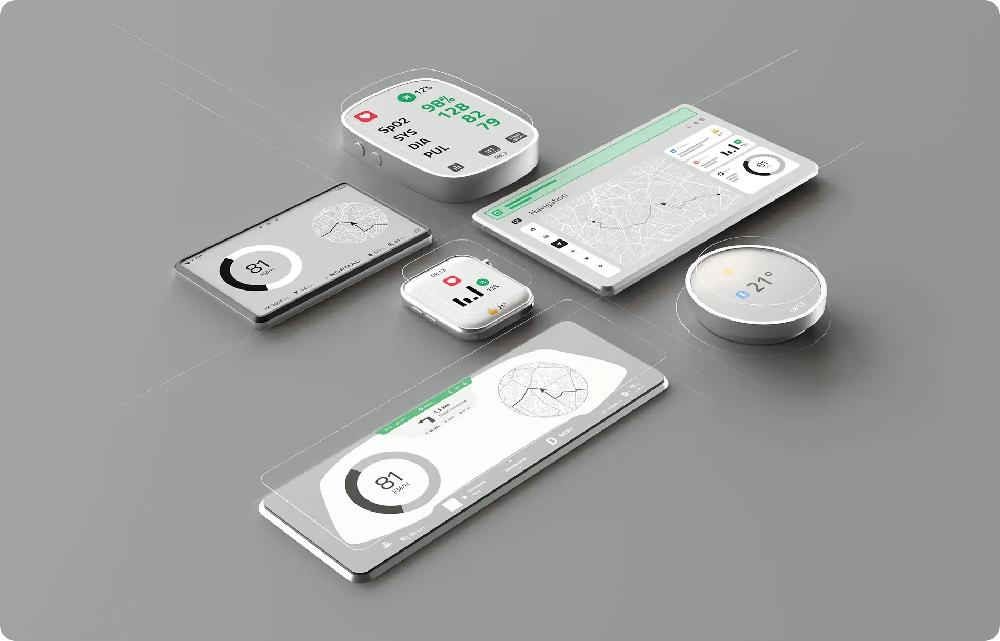

--------------------------------------------------------------------------------

## Présentation de Qt

Qt est un framework C++ cross-platform qui s'appuie fortement sur la programmation orienté objet.

- **Modules importants** :

  - **Qt Widgets** : Interfaces classiques (boutons, fenêtres, etc.).
  - **Qt Quick** : Interfaces modernes (QML/JavaScript).
  - **Qt Core** : Conteneurs, threads, fichiers, etc.
  - **Qt Network** : Réseau (TCP, HTTP, WebSocket).
  - **Qt SerialBus** : Communication CAN, Modbus.

--------------------------------------------------------------------------------

## Présentation de Qt


--------------------------------------------------------------------------------

## Présentation de Qt


--------------------------------------------------------------------------------

## Présentation de Qt

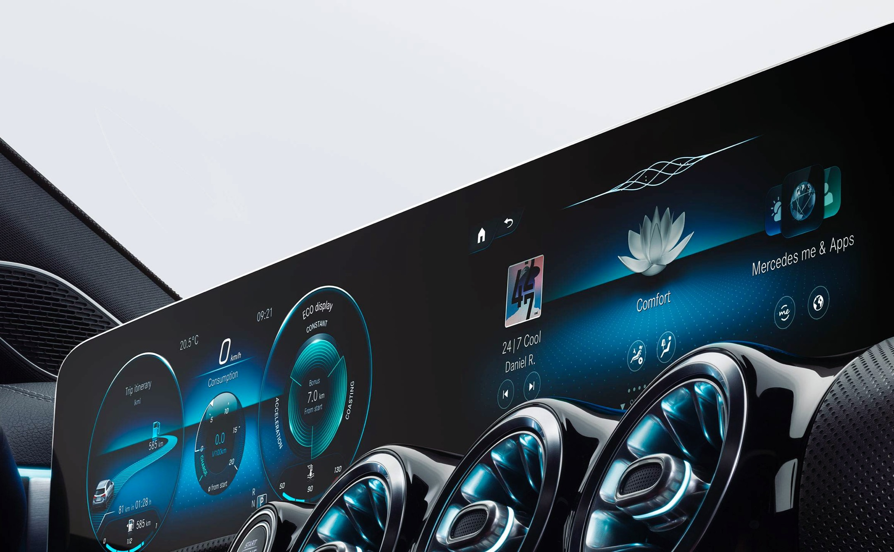

--------------------------------------------------------------------------------

## Cross-platform ?

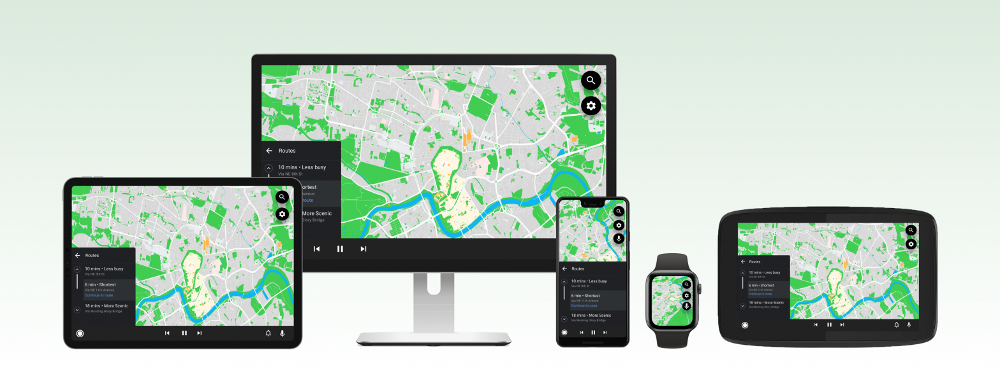

--------------------------------------------------------------------------------

## Qt Widget VS Qt Quick

**Critère**           | **Qt Widgets**          | **Qt Quick**
--------------------- | ----------------------- | ------------------------------
**Langage**           | C++ (POO)               | QML / C++
**Style d'interface** | Classique (bureautique) | Moderne et fluide (animations)
**Rendu graphique**   | Logiciel (CPU)          | Accéléré (GPU)
**Cible embarquée**   | Économe en ressources   | Riche en fonctionnalités

--------------------------------------------------------------------------------

## Qt Widget VS Qt Quick

### Exemple de programme QML

```qml
import QtQuick

Rectangle {
    id: canvas
    width: 250
    height: 200
    color: "blue"

    Image {
        id: logo
        source: "pics/logo.png"
        anchors.centerIn: parent
        x: canvas.height / 5
    }
}
```

--------------------------------------------------------------------------------

## Qt Widget

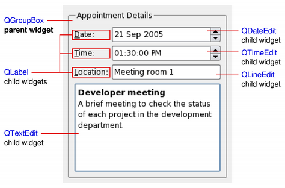

--------------------------------------------------------------------------------

## Architecture Vue-Modèle

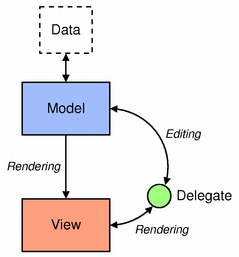

--------------------------------------------------------------------------------

## Architecture Vue-Modèle

### Modèle

Le modèle prend la forme d'une **instance de classe**.

Cette classe doit **hériter** de `QAbstractItemModel` ou de l'un de ses héritiers :

- `QAbstractListModel` pour les ensembles **unidimensionnels** (une liste)
- `QAbstractTableModel` pour les ensembles **multidimensionnels** (un tableau)

Qt offre des modèles plus avancés pour travailler avec des sources de données standards :

- `QStringListModel` pour stocker une liste de chaînes de charactères
- `QFileSystemModel` pour stocker des informations du système de stockage local (arborescence)
- `QSqlqueryModel` pour l'accès aux bases de données relationnelles (SQL)

--------------------------------------------------------------------------------

## Architecture Vue-Modèle

### Modèle

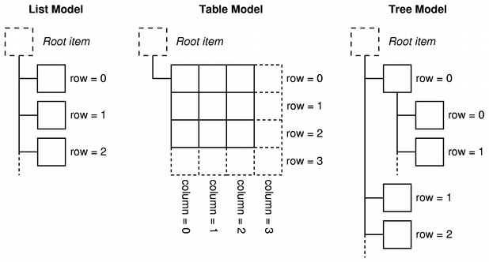

--------------------------------------------------------------------------------

## Architecture Vue-Modèle


--------------------------------------------------------------------------------

## Architecture Vue-Modèle

### Vue

La vue prend la forme d'une **instance de classe**.

Cette classe doit hériter de `QAbstractItemView` ou de l'un de ses héritiers :

- `QListView` pour représenter les données sous forme de liste
- `QTableView` pour représenter les données sous forme de tableau
- `QTreeView` pour représenter les données sous forme d'arbre

--------------------------------------------------------------------------------

## Architecture Vue-Modèle

### Vue

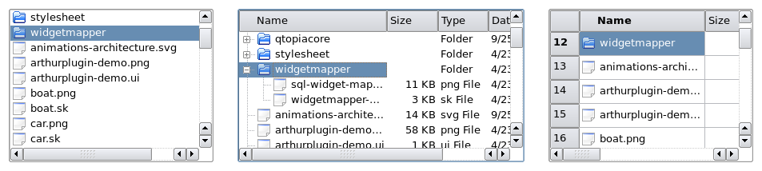

--------------------------------------------------------------------------------

## Architecture Vue-Modèle


--------------------------------------------------------------------------------

## Architecture Vue-Modèle

### Délégué (delegate)

Le délégué prend la forme d'une **instance de classe**.

Cette classe doit hériter de `QAbstractItemDelegate`.

La classe généralement utilisée est `QStyledItemDelegate`.

--------------------------------------------------------------------------------

<style scoped="">section{font-size:20px;}</style>

## Architecture Vue-Modèle

### Exemple complet

```c++
int main(int argc, char *argv[])
{
    QApplication app(argc, argv);
    QSplitter *splitter = new QSplitter;

    // Model
    QFileSystemModel *model = new QFileSystemModel;
    model->setRootPath(QDir::currentPath());

    // View
    QTreeView *tree = new QTreeView(splitter);
    tree->setModel(model);
    tree->setRootIndex(model->index(QDir::currentPath()));

    QListView *list = new QListView(splitter);
    list->setModel(model);
    list->setRootIndex(model->index(QDir::currentPath()));

    splitter->setWindowTitle("Two views onto the same file system model");
    splitter->show();
    return app.exec();
}
```

--------------------------------------------------------------------------------

## Architecture Vue-Modèle

### Exemple complet

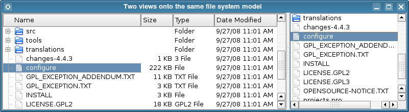

--------------------------------------------------------------------------------

## Architecture Vue-Modèle

### Signals et slots (programmation événementielle)

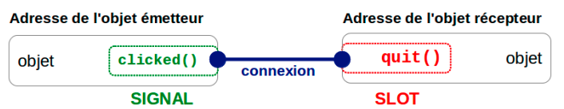

--------------------------------------------------------------------------------

## Architecture Vue-Modèle

### Signals et slots

```c++
#include <QApplication>
#include <QPushButton>

int main(int argc, char *argv[])
{
    QApplication app(argc, argv);

    QPushButton bouton("Quitter");

    QObject::connect(&bouton, &QPushButton::clicked, &app, &QApplication::quit);

    bouton.show();

    return app.exec();
}
```

--------------------------------------------------------------------------------

## Architecture Vue-Modèle

### Signals et slots

```c++
#include <QApplication>
#include <QPushButton>
#include <iostream>

void onClick()
{
    std::cout << "Bouton cliqué !" << std::endl;
}

int main(int argc, char *argv[])
{
    // ...
    QObject::connect(&bouton, &QPushButton::clicked, &onClick);
    // ...
}
```

--------------------------------------------------------------------------------

## Architecture Vue-Modèle

### Signals et slots

- Les signaux émis par **le modèle** informent la vue **des modifications** apportées aux données détenues par la source de données.
- Les signaux émis par **la vue** fournissent des informations sur **les interactions** de l'utilisateur avec les éléments affichés.
- Les signaux émis par **le délégué** sont utilisés pendant l'édition pour informer le modèle et la vue de **l'état de l'éditeur**.

--------------------------------------------------------------------------------

## Architecture Vue-Modèle

### Notion de widget

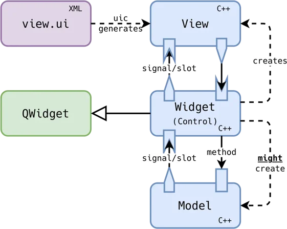

--------------------------------------------------------------------------------

<style scoped="">section{font-size:20px;}</style>

## Gestion de la mémoire dans Qt

Il n'y a pas un problème ?

```c++
int main(int argc, char *argv[])
{
    QApplication app(argc, argv);
    QSplitter *splitter = new QSplitter;

    // Model
    QFileSystemModel *model = new QFileSystemModel;
    model->setRootPath(QDir::currentPath());

    // View
    QTreeView *tree = new QTreeView(splitter);
    tree->setModel(model);
    tree->setRootIndex(model->index(QDir::currentPath()));

    QListView *list = new QListView(splitter);
    list->setModel(model);
    list->setRootIndex(model->index(QDir::currentPath()));

    splitter->setWindowTitle("Two views onto the same file system model");
    splitter->show();
    return app.exec();
}
```

--------------------------------------------------------------------------------

## Les outils

### Qt Creator

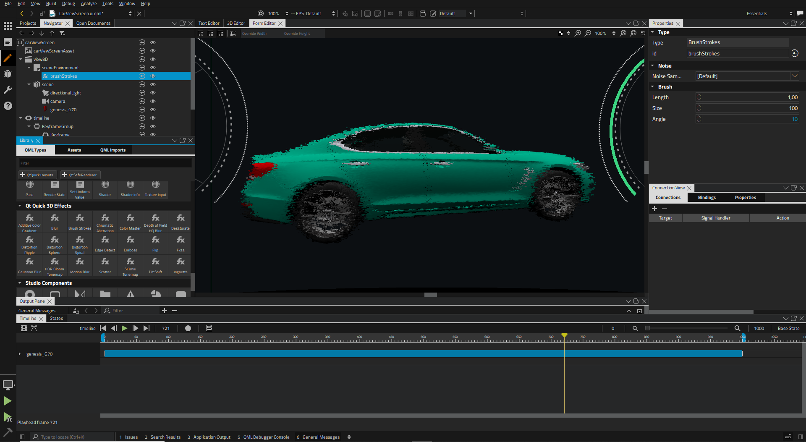

--------------------------------------------------------------------------------

## Les licences Qt

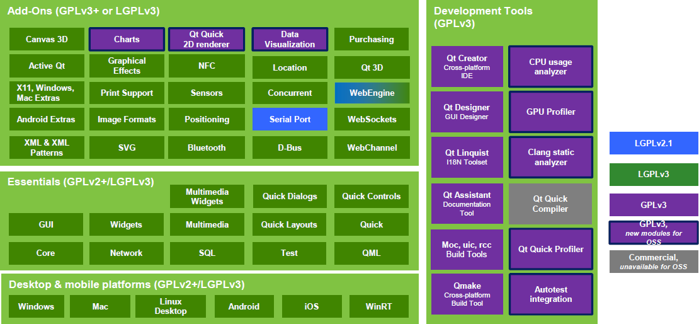
