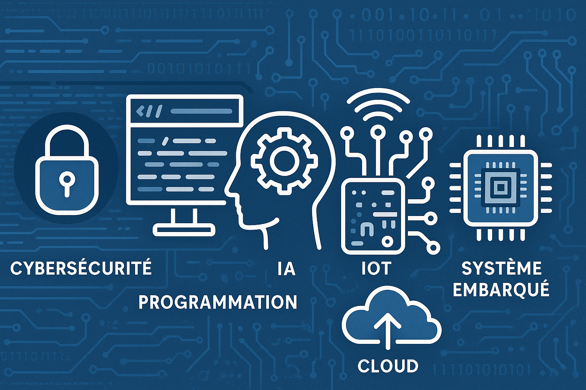
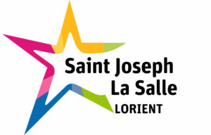
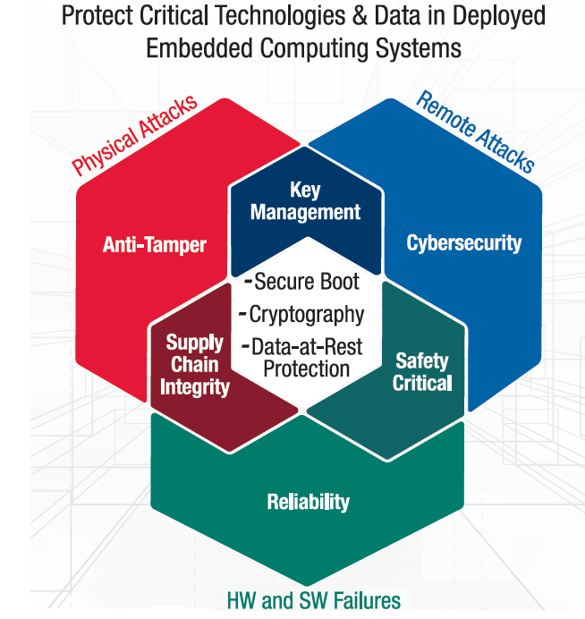

# Introduction à la 2ème année

_BTS CIEL_

--------------------------------------------------------------------------------

## Thomas Le Goff

  

  <figure>
  
  <figcaption>BTS SNIR</figcaption>
</figure>

  

  <figure>
  
  <figcaption>Diplôme ingénieur IMR</figcaption>
</figure>

  

  <figure>
  
  <figcaption>Ingénieur logiciel</figcaption>
</figure>

  

  <figure>
  
  <figcaption>Lead Developer solutions SaaS et Mobile</figcaption>
</figure>

  

> Pour me contacter : _legoff.t1@stjolorient.fr_

--------------------------------------------------------------------------------

## Aujourd'hui : Enseignant en informatique

Développement et programmation :

- Programmation réseaux
- Programmation sur système embarqué
- Développement et sécurité logicielle
- IoT & Cloud computing

--------------------------------------------------------------------------------

## Différence entre développement et programmation ?

--------------------------------------------------------------------------------

## Différence entre développement et programmation ?

Programmation :

- Instruction machine
- Langage
- Code / encodage
- Mémoire
- Paradigme (programmation)
- Style de programmation
- Programmation web / réseau / système / ...

--------------------------------------------------------------------------------

## Différence entre développement et programmation ?

Développement :

- Génie logiciel
- Test et qualité logicielle
- Chaîne d'outils Devops
- Industrialisation
- Logiciel métier
- Cahier des charges
- Besoin utilisateur
- Produit

--------------------------------------------------------------------------------

## Demain : Développement sans programmation 🤖 ?

- Croissance de l'IA
- IHM simplifiée
- Disparition du logiciel ?

--------------------------------------------------------------------------------

# Cybersécurité ?

--------------------------------------------------------------------------------

## 🔗 Connexion croissante

- Les **systèmes embarqués** (capteurs, automates, objets intelligents...)
- **Se connectent entre eux** → **IoT (Internet of Things)**

--------------------------------------------------------------------------------

## ⚠️ Risques accrus

- Plus d'**interconnexion**
- Plus de **surfaces d'attaque**
- → **CyberSécurité devient critique !** 🔐

--------------------------------------------------------------------------------

# Informatique de confiance

